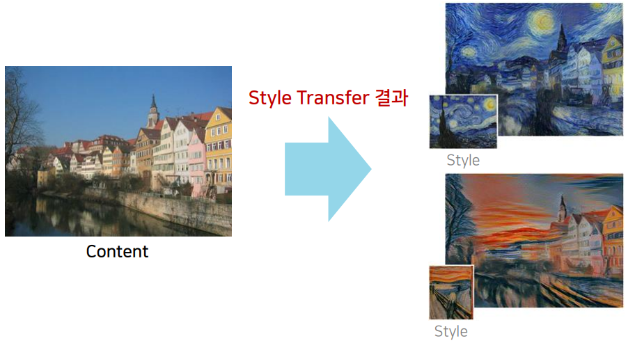
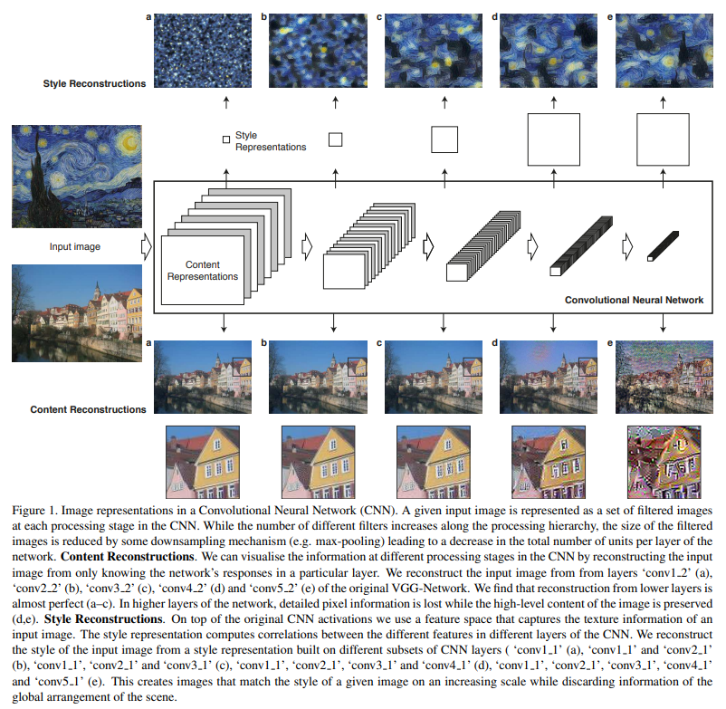
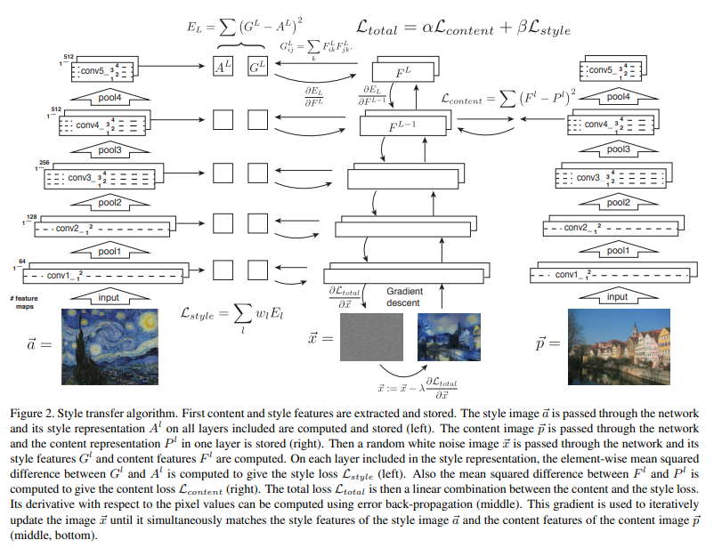
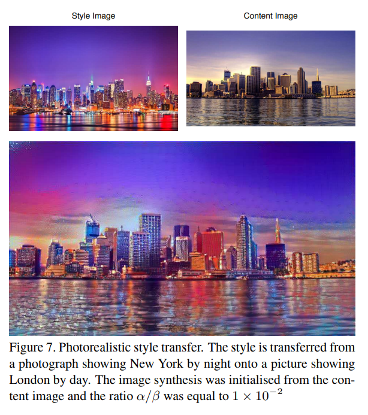

# Image Style Transfer Using Convolutional Neural Networks 논문 리뷰

https://youtu.be/va3e2c4uKJk

## Background
 CNN을 활용해 이미지의 스타일(style)을 전송하는 방법을 제안함.
    

## Abstract
- Here we use image representations derived from Convolutional Neural Networks optimised for object recognition, which make high level image information explicit.
- We introduce A Neural Algorithm of Artistic Style that can separate and recombine the image content and style of natural images.
- 이 algorithm은 우리가 기존의 artwork의 appearance와 임의의 사진의 content을 결합시켜 새로운 이미지를 만드는 것이다.

## introduction
- 기존의 한이미지에서 다른 이미지로 style을 엄기는 문제를 texture transfer이라는 분야로 연구되어 있었는데
아직 parametric algorithm은 없었다.(CNN 기반 모델은 없었다)
- 앞선 style transfer model들의 공통점인 한계는 오직 target image의 low-level image features만을 사용했다는 것이다.
- - low-level image features : image에 존재하는 edge나 corner같은 feature
- 그러나 style transfer의 경우에는 low-level image feature이 아니라 target image의 high level feater 즉 image에 존재하는 object의 일부분이나 혹은 젖체 이미지를 포괄하는 feature 정보가 더 필요하다. 
- 이 논문이 탄생하게 된 아이디어는 다음과 같다.
- - the recent advance of Deep Convolutional Neural Networks has produced powerful computer vision systems that learn to extract high-level semantic information from natural images.
- - 즉 다시말해 우리는 high-level feature이 필요한데 이 정보를 얻을 수 있는 CNN 기법이 잘 발달되어 있으므로 이를 사용해보겠다는 것이다.
- We introduce A Neural Algorithm of Artistic Style, a new algorithm to perform image style transfer.
- In fact, our style transfer algorithm combines a parametric texture model based on Convolutional Neural Networks with a method to invert their image representations.  
- 아래는 전체적인 구조이다.  
    

## Deep image representations
- We used the feature space provided by a normalised version of the 16 convo lutional and 5 pooling layers of the 19-layer VGG network.

### Content representation
- A layer with $N_l$ dis tinct filters has $N_l$ feature maps each of size $M_l$ , where $M_l$ is the height times the width of the feature map
- $F^l \in R^{N_l X M_l}$
- $F_{ij}^l$ is the activation of the $i^{th}$ filter at position j in layer l.
- Let $\overrightarrow{p}$ and $\overrightarrow{x}$ be the original image and the image that is generated, and $P_l$ and $F_l$ their respective feature representation in layer l.
- We then define the squared-error loss between the two feature representations.
- - $L_{content}(\vec{p},\vec{x},l) = \frac{1}{2}\sum_{i,j}^{}(F^l_{ij}-P^l_{ij})^2$
- The derivative of this loss with respect to the activations in layer l equals.
- $\frac{\partial L_{content}}{\partial F^l_{ij}}=\left\{\begin{matrix}
(F^l-P^l)_{ij} & if F^l_{ij}>0  \\
 0 & if F^l_{ij}<0 \\
\end{matrix}\right.$
- Thus we can change the initially random image $\vec{x}$ until it generates the same response in a certain layer of the Convolutional Neural Network as the original image $\vec{p}$.
- Thus, higher layers in the network capture the high-level content in terms of objects and their arrangement in the input image but do not constrain the ex act pixel values of the reconstruction very much (Fig 1, con tent reconstructions d, e). In contrast, reconstructions from the lower layers simply reproduce the exact pixel values of the original image (Fig 1, content reconstructions a–c).

### Style representation
- Gram matrix $G^l \in R^{N_l X N_l}$ 
- $ G_{ij}^l = \Sigma_k F_{ik}^l F _{jk}^l$
- By including the feature correlations of multiple layers, we obtain a stationary, multi-scale representation of the input image, which captures its texture information but not the global arrangement.  
    

- This is done by using gradient descent from a white noise image to minimise the mean-squared distance between the entries of the Gram matrices from the original image and the Gram matrices of the image to be generated.
- Let $\vec{a}$ and $\vec{x}$ be the original image and the image that is generated, and $A^l$ and $G^l$ their respective style representation in layer l.
- $E_l = \frac{1}{4N_l^2M_l^2}\sum_{i,j}^{}(G_{ij}^l-A_{ij}^l)^2$
- total style loss는 아래와 같다.
- $L_{style}(\vec{a},\vec{x}) = \sum_{l=0}^{L}w_lE_l$
- $E_l$ 의 미분 형태는 아래와 같다.
- $\frac{\partial E_l }{\partial F_{ij}^l} = \begin{Bmatrix}
\frac{1}{N_l^2M_l^2}((F^l)^T(G^l-A^l))_{ji} & if F_{ij}^l >0 \\
0 & if F_{ij}^l <0 \\
\end{Bmatrix}$
-
### Style transfer
- $L_{total}(\vec{p},\vec{a},\vec{x}) = \alpha L_{content}(\vec{p}, \vec{x} ) + \beta L_{style}(\vec{a},\vec{x})$
- L-BFGS를 사용했다.( Adam 이전에 사용한 optimazier이라고 한다..)
- we always resized the style image to the same size as the content im age before computing its feature representations.

## Result 
### Trade-off between content and style matching
- Of course, image content and style cannot be completely disentangled.

### Effect of different layer s of the CNN
- We find that matching the style representations up to higher layers in the network preserves local images structures an increasingly large scale, leading to a smoother and more continuous visual experience.

### initialization of grdient descent 
- 같은 white noise image로 initialized

### photorealistic style transfer
    

 ## Discussion
 - Therefore the speed of the synthesis pro cedure depends heavily on image resolution.
 - 
