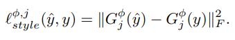

# Perceptual Losses for Real-Time Style Transfer and Super-Resolution (ECCV 2016) 리뷰
https://youtu.be/OKDaGzeUz4U

## Overview
- Propose the use of perceptual loss functions(vs. per-pixel loss functions) for training feed-forward networks for image transformation tasks
- - Per-pixel loss functions compare two images based on their ind.pixel values
- - Perceptual loss functions compare two images based on high-level rep from pretrained NN( on image classification tasks ; e.g., imageNet)   

## Abstract 
- Recent methods for such problems(image transformation problem) typically train feed-forward convolutional neural networks using a per-pixel loss between the output and ground-truth images.
    
- Parallel work has shown that high-quality images can be generated by defining and optimizing perceptual loss functions based on high-level features extracted from pretrained networks.
- We combine the benefits of both approaches, and propose the use of perceptual loss functions for training
feed-forward networks for image transformation tasks.
- Compared to the optimization-based method, our network gives similar qual itative results but is three orders of magnitude faster.(빠르다.)

## Introduction
- image transformation tasks : a system receives some input image and transforms it into an output image.
- image processing : the input is a degraded image, the output is a high-quality color image
- Computer vision : the input is a color image and the output image encodes semantic or geometric information about the scene.
- One approach for solving image transformation tasks is to train a feed forward convolutional neural network in a supervised manner, using a per-pixel loss function to measure the difference between output and ground-truth images.
- - However, the per-pixel losses used by these methods do not capture perceptual differences between output and ground-truth images.
- Recent work has shown that high-quality images can be generated using perceptual loss functions based not on differences between pixels but in stead on differences between high-level image feature representations extracted from pretrained convolutional neural networks.
- - These approaches produce high-quality images, but are slow since inference requires solving an optimization problem.
- In this paper we combine the benefits of these two approaches.
- We train feed forward transformation networks for image transformation tasks, but rather than using per-pixel loss functions depending only on low-level pixel information, we train our networks using perceptual loss functions that depend on high-level features from a pretrained loss network.
- During training, perceptual losses mea sure image similarities more robustly than per-pixel losses, and at test-time the transformation networks run in real-time.
- for style transfer there is no single correct output, and for super-resolution there are many high-resolution images that could have generated the same low-resolution input.
- - Success in either task requires semantic reasoning about the input image.
- 결론적으로 style transfer에 대해서는 속도가 빠르고 super-resolution에서는 더 좋은 해상도를 가지는 이미지를 추출할 수 있었다.

## Related Work

### Feed-forward image transformation.
- 최근에 feed-forward image transformation task는 주로 per-pixel loss function을 이용한 CNN을 주로 사용하였다. 
- 네트워크 내 downsampling을 사용하여 feature map의 크기를 줄인 다음 네트워크 내 upsampling을 사용하여 최종 출력 이미지를 생성한다.

### Perceptual optimization.
- A number of recent papers have used optimization to generate images where the objective is perceptual, depending on high level features extracted from a convolutional network.

### Style Transfer.(Image Style Transfer Using Convolutional Neural Networks 논문 리뷰)
- Their method produces high quality results, but is computationally expensive since each step of the opti mization problem requires a forward and backward pass through the pretrained network. 
- To overcome this computational burden, we train a feed-forward net work to quickly approximate solutions to their optimization problem.

### Image super-resolution.
- mage super-resolution is a classic problem for which a wide variety of techniques have been developed.

## Method
    

두개의 components로 구성되어 있다.
- image transformation network $f_W$ 와 loss network $\phi$
- 특히 loss network $\phi$ 의 경우에는 loss function($l_1, ... , l_k$)을 정의하기 위해 만들어졌다. 
- image transformation network는 deep residual convolutional neural network이다. (parameterized by weights W)
- - it transforms input images x into output images $\hat{y}$ via the mapping $\hat{y}=f_W(x)$ .
- Each loss function computes a scalar value $l_i(\hat{y},y_i)$ measuring the difference between the output image $\hat{y}$ and a target image $y_i$.
- The image transformation network is trained using stochastic gradient descent to minimize a weighted combination of loss functions:  
    

- 우리의 loss function은 per-pixel loss의 단점을 해결하고 이미지 사이의 perceptual과 semantic의 차이을 잘 측정하도록 설계하였다.
- The key insight of these methods is that convolutional neural networks pretrained for image classification have already learned to encode the perceptual
and semantic information we would like to measure in our loss functions.
- We therefore make use of a network $\phi$ which as been pretrained for image classi fication as a fixed loss network in order to define our loss functions.

- The loss network $\phi$ 는 두가지 종류가 있다.
- - feature reconstruction loss $l_{feat}^{\phi}$ 
- - style reconstruction loss $l_{style}^{\phi}$

- 각각의 input image x에 해당하는 content target $y_c$ 와 style target $y_s$가 있다. 
- style transfer을 위해 우리는 content target $y_c$와 $y_s$ 을 적절히 결합 시켜야 한다. 
- single-image super-resolution을 위해 우리는 input image x는 low-resolution input이고 content target $y_c$ 는 ground-truth high-resolution image이고 , style reconstruction loss는 사용하지 않을 것이다.

### image transformation networks
- We do not use any pooling layers, instead using strided and fractionally strided convolutions for in-network downsampling and upsampling.
- five residual block으로 network를 구성함.
- batch normalization과 ReLU 사용
- Other than the first and last layers which use 9 × 9 kernels, all convolutional layers use 3 × 3 kernels.

#### Inputs and Outputs
- For style transfer, input과 output은 3x256x256 크기이다.
- For super-resolution with an upsampling factor of f, output 3x256x255 , input 3x256/fx256/f

#### Downsampling and Upsampling
- For super-resolution with an upsampling factor of f, we use several residual blocks followed by $log_2f$ convolutional layers with stride 1/2.
- - Rather than relying on a fixed upsampling function, fractionally-strided convolution allows the upsampling function to be learned jointly with the rest of the network.
- For style transfer our networks use two stride-2 convolutions to downsample the input followed by several residual blocks and then two convolutional layers with stride 1/2 to upsample.  
- Downsampling 한 후 Upsampling하는 이점
- - The first is computational.
- - The second benefit has to do with effective receptive field sizes.

#### Residual Connections 
- They argue that residual connections make it easy for the network to learn the identify function; this is an appealing property for image transformation networks, since in most cases the output image should share structure with the input image.

### Perceptual Loss Functions
- We define two perceptual loss functions that measure high-level perceptual and semantic differences between images.
- They make use of a loss network $\phi$ pre trained for image classification, meaning that these perceptual loss functions are themselves deep convolutional neural networks.
- 이 실험에서 $\phi$ 는 VGG16 을 사용했다.(ImageNet dataset으로 pretrained된 )

#### Feature Reconstruction Loss
- Rather than encouraging the pixels of the output image $\hat{y}=f_W(x)$ to exactly match the pixels of the target image y, we instead encourage them to have similar feature representations as computed by the loss network $\phi$.
- Let $\phi_j(x)$ be the activations of the jth layer of the network $\phi$ when processing the image x : if j is a convolutional layer then $\phi_j(x)$ will be a feature map of shape $C_j x H_j x W_j$.
- The feature reconstruction loss is the (squared, normalized) Euclidean distance between feature representations
    
    

- finding an image $\hat{y}$ that minimizes the feature reconstruction loss for early layers tends to produce images that are visually indistinguishable from y. 
- As we reconstruct from higher layers, image content and overall spatial structure are preserved but color, texture, and exact shape are not.
- Using a feature reconstruction loss for training our image transformation networks encourages the output image $\hat{y}$ to be perceptually similar to the target image y, but does not force them to match exactly.

#### Style Reconstruction Loss
- The feature reconstruction loss penalizes the out put image $\hat{y}$ when it deviates in content from the target y.
- We also wish to penalize differences in style: colors, textures, common patterns, etc.
- Define the Gram matrix $G_j^{\phi}(x)$ to be the $C_j × C_j$ matrix whose elements are given by  
    

- - Gram matrix는 feature 간에 얼마나 연관성이 있는지를 파악하는 것이다. 
- If we interpret $\phi_j (x)$ as giving $C_j$ -dimensional features for each point on a $H_j × W_j$ grid, then $G^{\phi}_j (x)$ is proportional to the uncentered covariance of the $C_j$ -dimensional features, treating each grid location as an independent sample.
- It thus captures information about which features tend to activate together.
- The style reconstruction loss is then the squared Frobenius norm of the difference between the Gram matrices of the output and target images:  
    
    

- As demonstrated in [10] and reproduced in Figure 5, generating an image $\hat{y}$ that minimizes the style reconstruction loss preserves stylistic features from the target image, but does not preserve its spatial structure. Reconstructing from higher layers transfers larger-scale structure from the target image.
- To perform style reconstruction from a set of layers J rather than a single layer j, we define $l^{\phi,J}_{style}(\hat{y},y)$ to be the sum of losses for each layer j $\in$ J.

## Experiment
### Style Transfer 
- The goal of style transfer is to generate an image $\hat{y}$ that combines the content of a target content image $y_c$ with the the style of a target style image $y_s$.
    
    
    
    

### Single-Image Super-Resolution