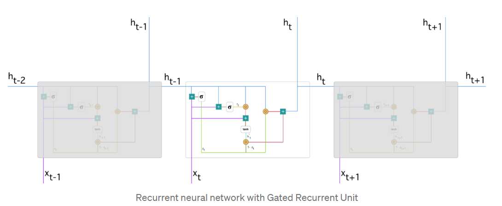
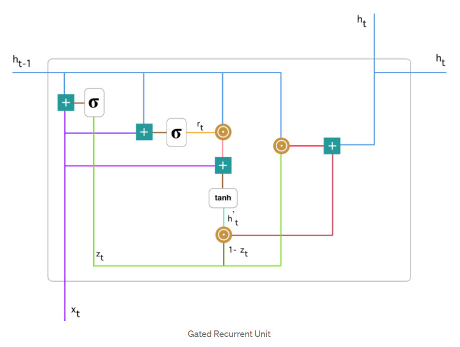
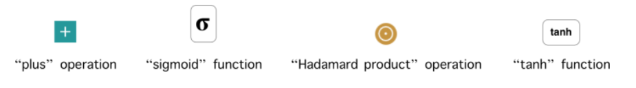
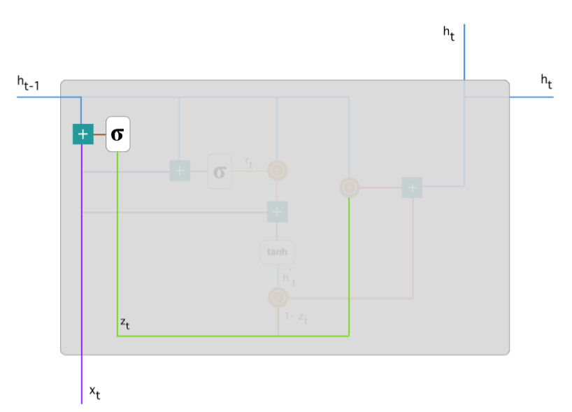
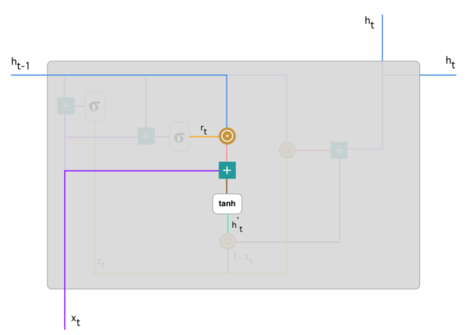
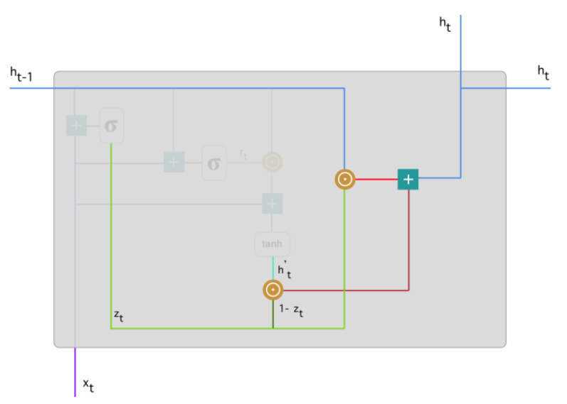

# GRU 리뷰
https://towardsdatascience.com/understanding-gru-networks-2ef37df6c9be

https://youtu.be/cs3tSnAsyRs

## Understanding GRU Networks
- GRU (Gated Recurrent Unit) aims to solve the vanishing gradient problem which comes with a standard recurrent neural network.
- GRU can also be considered as a variation on the LSTM because both are designed similarly and, in some cases, produce equally excellent results.
- 이 글에서는 GRU을 설명할 건데 GRU는 RNN의 vanishing gradient 문제를 해결할 뿐만 아니라 LSTM의 복잡한 모델을 보안하는 모델이다.

## How do GRUs work?
- To solve the vanishing gradient problem of a standard RNN, GRU uses, so-called, update gate and reset gate.
- Basically, these are two vectors which decide what information should be passed to the output.
- GRU는 update gate와 reset gate을 사용하는 기본적으로 이것들은 정보를 얼마나 output으로 흘려보낼지 결정하는 vector이다.
- The special thing about them is that they can be trained to keep information from long ago
- - 이거에 대해 추가적으로 설명하자면 LSTM의 경우에는 cell state에 어떠한 nonlinear 연산을 하지 않은 반면 GRU는 hidden state에 어떠한 nonlinear 연산을 하지 않음으로써 오래된 과거의 정보를 유지할 수 있다.   

  

  

- 위의 그림은 좀 더 확대한 그림이다. notation은 아래와 같다.  
- 여기서 Hadamard product란 Element-wise multiplication을 의미한다.
  

### Update gate
- $z_t$ 는 아래와 같은 식으로 계산한다.
$$ z_t = \sigma (W^{(z)}x_t + U^{(z)}h_{t-1})$$
  

- The update gate helps the model to determine how much of the past information (from previous time steps) needs to be passed along to the future.
- We will see the usage of the update gate later on.

### Reset gate
- this gate is used from the model to decide how much of the past information to forget.
$$ r_t = \sigma(W^{(r)}x_t + U^{(r)}h_{t-1}) $$
  

### Current memory content
- final output에 미치는 gate의 영향은 아래와 같다.
- 첫째로, reset gate를 사용할 것이다.
- - We introduce a new memory content which will use the reset gate to store the relevant information from the past.
$$ h_t' = tanh(Wx_t + r_t ) \bigodot U h_{t-1} $$
- $\bigodot $ 는 element-wise product를 의미한다.  
  

### Final memory at current time step
- 이 과정에서 update gate를 사용할 것이다.
$$ h_t = z_t \bigodot h_{t-1} + (1 - z_t) \bigodot h_t'$$
  

## Conclusion
- Now, you can see how GRUs are able to store and filter the information using their update and reset gates.
- That eliminates the vanishing gradient problem since the model is not washing out the new input every single time but keeps the relevant information and passes it down to the next time steps of the network.