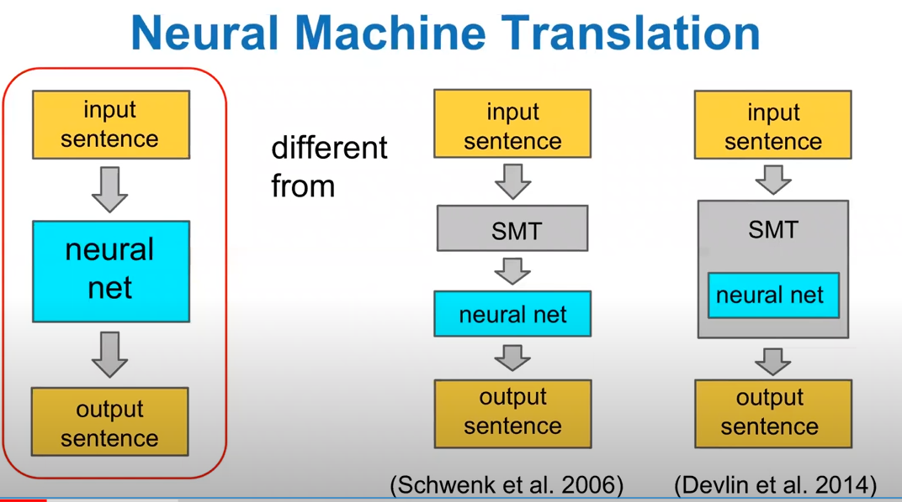
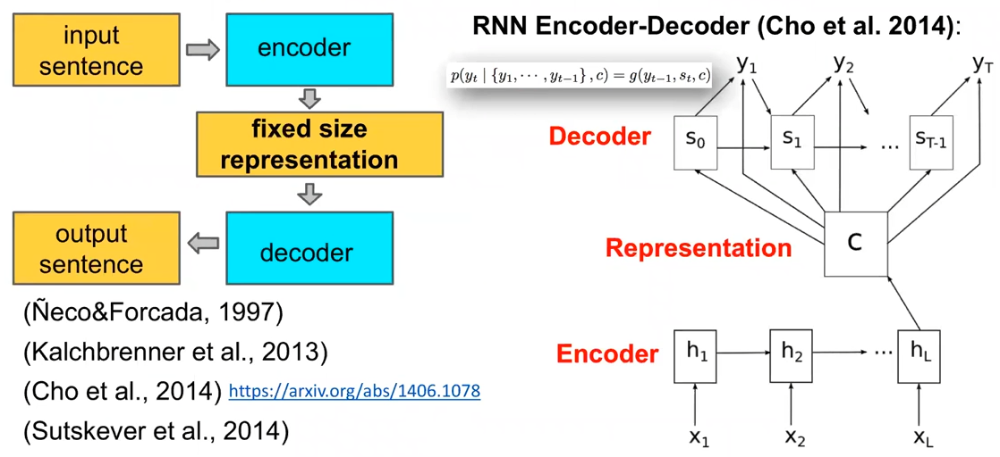
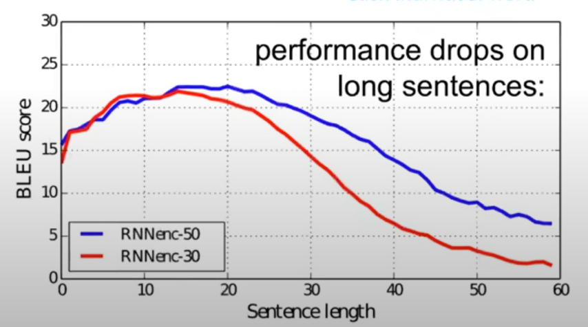
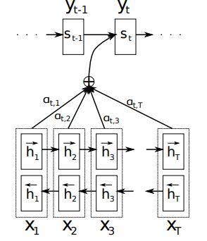
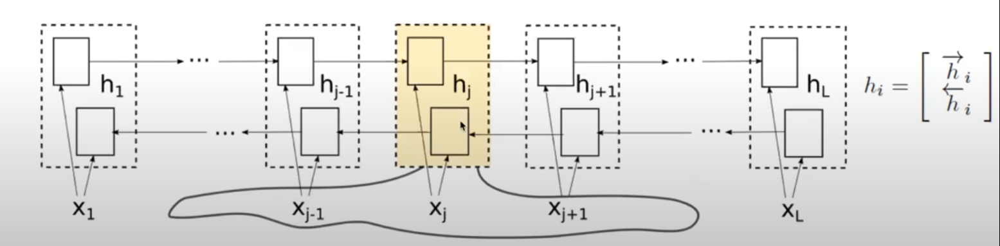
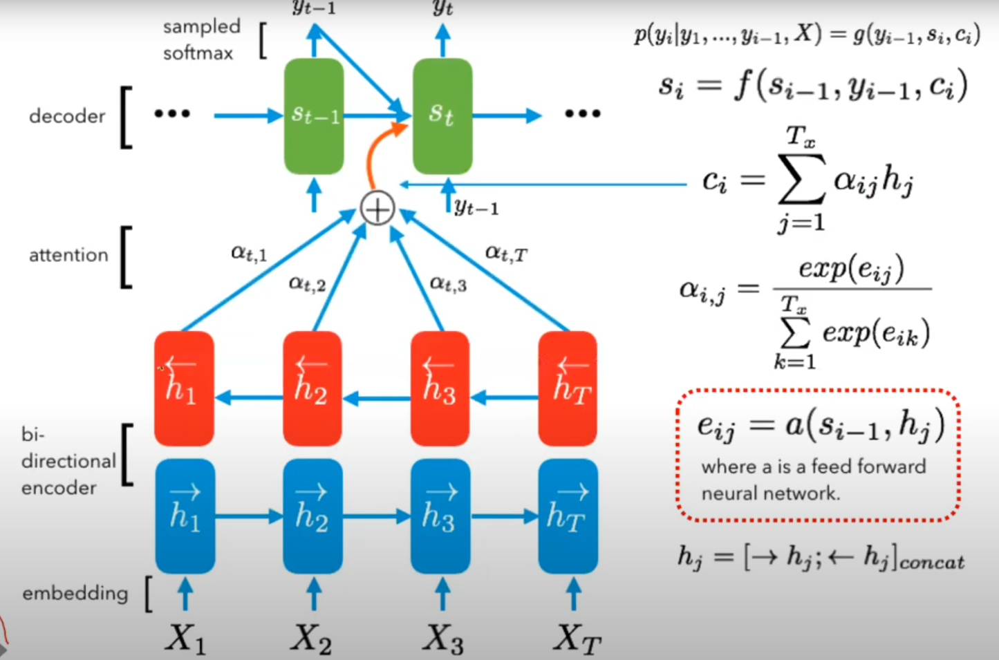
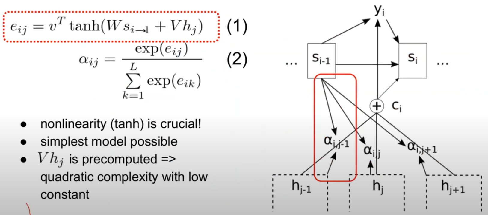
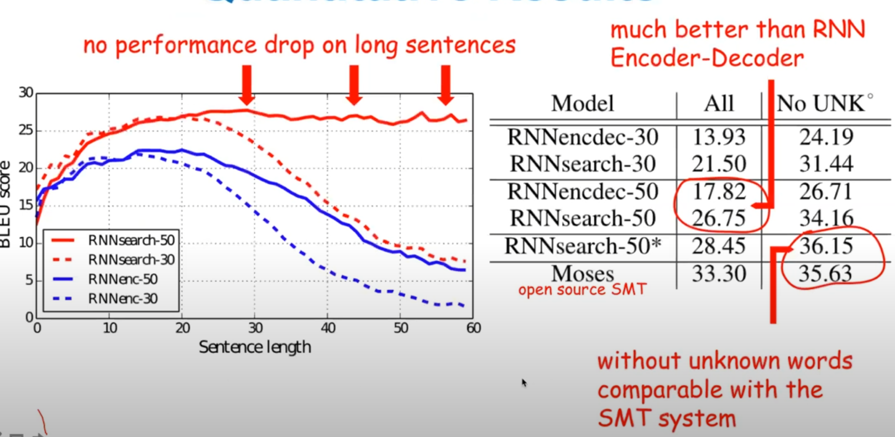
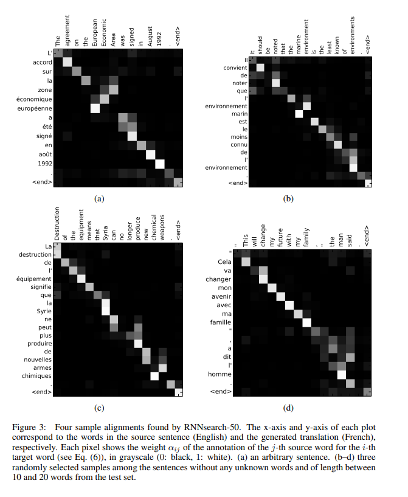

# NEURAL MACHINE TRANSLATION BY JOINTLY LEARNING TO ALIGN AND TRANSLATE 리뷰
https://youtu.be/upskBSbA9cA

이 논문은 기계 번역 분야에 attention이라는 기법을 도입한 논문으로 유명하다.

## ABSTRACT
- In this paper, we conjecture that the use of a fixed-length vector is a bottleneck in improving the performance of this basic encoder–decoder architecture, and propose to extend this by allowing a model to automatically (soft-)search for parts of a source sentence that are relevant to predicting a target word, without having to form these parts as a hard segment explicitly.
- - 앞선 seq2seq model의 단점을 의미하는 것이다. seq2seq model은 fixed length vector라는 한계점이 존재했다. 즉 가변 길이의 sequence가 들어왔음에도 이를 fixed length vector로 표현했다는 것이다.

## Introduction
-  An encoder neural network reads and encodes a source sentence into a fixed-length vector.
-  A decoder then outputs a translation from the encoded vector.
- The whole encoder–decoder system, which consists of the encoder and the decoder for a language pair, is jointly trained to maximize the probability of a correct translation given a source sentence.
- encoder-decoder approach는 soure sentence의 필수적인 정보를 fixed length vector로 압축하는 데에 문제가 있었다.
- - 이 문제는 long sentence에서 문제를 발생한다. 즉 sentence의 길이가 길어질 수록 성능 저하가 현저히 발생한다.
- In order to address this issue, we introduce an extension to the encoder–decoder model which learns to align and translate jointly
-  Each time the proposed model generates a word in a translation, it (soft-)searches for a set of positions in a source sentence where the most relevant information is concentrated.
- The model then predicts a target word based on the context vectors associated with these source positions and all the previous generated target words
- 즉 다시 말해서 align 을 찾고 그 후에 그 위치에 있는 word를 translation하는 것이다.
- 기존 논문과 가장 큰 차이는 전체 input sequence를 단일 vector로 encoding하지 않는다는 점이다.
- 대신 encode를 이용해서 input sentence를 a sequence of vector로 encoding한다. 그리고 vector의 subset 중 하나를 선택한다.

- In this paper, we show that the proposed approach of jointly learning to align and translate achieves significantly improved translation performance over the basic encoder–decoder approach

## Background
- 기계 번역에서 확률적인 관점으로 보자면 source sentence x가 주어졌을 때의 조건부 확률 y를 최대화하는 y를 찾는 것이다. 
$$ \underset{y}{argmax}p(y|x) $$
- 기존의 연구를 보면 neural machine translation 접근을 도입한 논문 들은 encoder과 decoder로 이루어져 있다.

### RNN Encoder-decoder
  

- 위의 그림과 같이 기존의 연구는 SMT를 같이 사용해서 성능을 올리기도 하였다. 하지만 이 논문은 전체과정을 neural net으로 사용한다.

  

- input이 가변 길이를 encoder를 거치면서 고정된 size의 vector로 바꿈 . 그 후 decoder을 거쳐서 가변 길이의 output sequence를 만듬.
- 그래서 저 fixed size vector를 사용해서 충분한 정보가 전달이 되지 않는 성능의 한계가 있음.
- seq2seq를 기반한 background 설명이기 때문에 앞에 요약한 논문을 봐라.
$$ h_t = f_e(x_t, h_{t-1})$$
$$ c = q({h_1 , ... , h_{T_s}}) $$
- 에서 c는 마지막 hidden state의 값을 c로 저장했다는 표현이다. 이를 context vector라고 부른다.

  

- 위의 구조의 문제점은 문장이 길어지면 성능이 급격히 떨어진다. 

## Learning to align and translate(번역하는것과 align하는 것을 함께 진행)
- 위의 문제를 해결하기 위해 생각한 논문으로써 일단 인간이 번역하는 과정을 살펴볼 필요가 있다.
- 인간은 문장을 순수하게 이해한 다음에 번역하다가 막히면 다시 돌아가서 찾아보는 과정이 있다.
- 앞선 논문의 구조는 앞쪽은 잘 맞는데 뒤에는 엉망으로 번역한 결과가 문장이 길어질 수록 많아졌다.
- 이 논문의 key idea는 fixed size vector로 input sequence를 표현하자니 문장이 길어질 수록 성능이 떨어졌으니 번역을 할때 마지막 hidden state만 사용하는 것이 아니라 모든 hidden state를 다 살려서 조합으로 지금 만들어내려는 target word와 가장 관련있을법한 곳이 어디인지 긴 source sentence에서 찾아보는 network를 추가하자는 것이다.
- 우리는 attention으로 잘 알고 있지만 이 논문에서는 align이라는 용어를 주로 쓴다.
- align : 의미가 동일한 위치를 찾는다.
- annotation : RNN의 hidden state를 의미함.

### Main Contributions

- encoder을 고쳤다.
- - 아래 두줄이 encoder이다.
- - 양뱡향 RNN을 사용했다. -> 번역을 할때 이전에 나왔던 단어 뿐만 아니라 앞으로 나올 단어에서도 정보를 추출해서 정확도를 높이겠다는 의미

- decoder을 고쳤다.
- - 중간에 attention network를 끼여넣음.
- - attention network은 hidden state의 weight sum을 계산하는 network이다.
- - 이렇게 나온 값 c가 context vector가 된다. 

### Encoder : bidirectional RNN for annotating sequences 

- 위의 그림처럼 얻은 h의 값은 단어 이전 뿐만아니라 단어 이후의 정보까지 포함하고 있을 확률이 높다.
- 즉 고정된 길이가 아닌 가변길이의 정보가 될 것이다. 
- 실제 구현은 x와 y를 one hot coding으로 만들어서 구현한다.
- RNN 구조는 GRU를 사용했다. 
-  This sequence
of annotations is used by the decoder and the alignment model later to compute the context vector

### Decoder : General description

- 위의 그림에서 $c_i$ 가 context vector이다.
- $\alpha$ 는 e 값의 softmax 이다.
- e는 출력에서 지금 만들어낸 단어와 관련된 hidden state와 encoder에서 input sentence로 만든 hidden state하고 연산한 값이다. i는 출력하는 word에 붙은 index이다.
- context vector은 내뱉는 i의 index에 따라서 매번 다시 계산된다.(weight 값만)
- $c_i$ 는 $(h_1, ... , h_{T_x})$ 의 sequence에 의존한다. 여기서 $h_i$ 의 값은 i-th word에 초점을 맞춰진 whole input sequence의 정보를 포함하고 있다.

- 여기서 alignment model인 a도 학습될 때 같이 학습되어야 한다.
- the alignment is not considered to be a latent variable. Instead, the alignment model directly com putes a soft alignment, which allows the gradient of the cost function to be backpropagated through.
- This gradient can be used to train the alignment model as well as the whole translation model jointly
-By letting the decoder have an attention mechanism, we relieve the
encoder from the burden of having to encode all information in the source sentence into a fixed-length vector.

## Experiment settings
- 여기서는 WMT'14 dataset을 이용해서 English to French translation task를 실험해보았다.

- model : hidden state를 1000개씩 사용했음(encoder, decoder 모두)
- baseline : seq2seq에 나오는 논문 RNN Encoder-Decoder , 1000 units
- Dataset 348 million words

## Results

- 본 논문에서 제시한 RNN search는 문장 길이에 대해서 성능이 유지가 된다.

- x 축으로는 input sentence를 y축은 output sentence를 차례대로 쓴다.
- 각 네모의 밝기가 context vector을 만들기 위해 weighed sum할때의 계수의 크기를 의미한다. ($a_{ij}$)
- 영어랑 불어는 언어순이 비슷해서 왠만하면 monotonic 하게 감. 

## Conclusion
-	저자들은 fixed-length context vector의 한계를 개선하고자 일반적인 encoder-decoder approach의 확장 버전을 제안하였다.
-	제안된 model은 input words의 set에서 검색하고 (혹은 encoder를 통해 words의 annotations를 계산하여), 각각의 target word를 생성하였다.
-	이 때, model을 오직 다음 target word를 생성할 때에 관련 있는 정보에 새로운 weight를 적용한다.
-	그 결과, 저자들이 제안한 model인 RNNsearch가 전통적인 encoder-decoder model (RNNencdec)보다 문장 길이에 상관 없이 더 좋은 성능을 보였으며, 또한 source sentence의 길이에 대해 더 robust함을 확인하였다.
-	또한 model이 올바른 translation을 생성하면서 source sentence에서 각 target word와 관련이 있는 words (또는 words의 annotations)에 알맞게 align할 수 있다고 주장하였다.
-	하지만 unknown이나 rare words에 대해서는 추가적으로 연구할 필요가 있음을 확인하였다.
