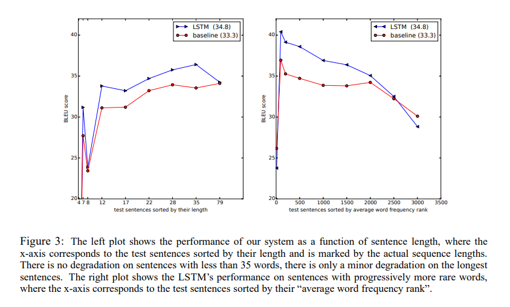

# Sequence to Sequence Learning with Neural Network
https://youtu.be/4DzKM0vgG1Y 참고함.

## Abstract
- Deep Neural Network는 large labeled training set에서 매우 강력한 model임에도 불구하고 sequence to sequence에서는 사용되지 않았다. 
- 이 논문에서는 end-to-end 접근이 가능한 sequence to sequence 모델을 제시할 것이다.
- 간략한 내용으로 요약하자면 아래의 흐름이다.
- - encoder : multilayered LSTM을 사용하여 input sequence을 하나의 고정된 dimensionality를 가지는 vector로 mapping한다. 
- - decoder : 그 후에 추가적으로 LSTM을 사용해서 vector로 부터 원하는 기계번역에 해당하는 sequence 값을 추출해낸다.
- 이 논문의 중요한 결과는 English를 French로 바꾸는 기계 번역 task에 중점을 두고 있다.(WMT'14 dataset)
- - LSTM으로 만든 모델의 성능 : BLEU 34.8
- - SMT로 만든 성능(기존의 통계적 기계 번역 방식) " BLEU 33.3
- - LSTM와 SMT을 같이 사용한 성능 : BLEU 36.5
- - 다만 현재는 통계적 기계 번역 방식과 deep learning 방법을 같이 쓰지 않고 deep learning 방식만 사용한다.
- 마지막으로 이 논문에서는 문장의 단어의 순서를 반전시켜 학습한 결과 더 성능아 좋았다.
- - 이 이유는 target source와 source sentence 사이의 short term dependencies를 더 많이 가지고 있기 떄문이다.

## Introduction
- while neural networks are related to conventional statistical models, they learn an intricate computation.
- DNN은 labeled training set이 충분하면 backpropagtion을 이용해서 model의 parameter을 찾아서 좋은 성능으로 문제를 해결할 수 있다.
- Despite their flexibility and power, DNNs can only be applied to problems whose inputs and targets can be sensibly encoded with vectors of fixed dimensionality.
- - 이 당시만 하더라도 DNN 연구의 과도기라 고정된 network가 연구가 되는 시기였기 때문에 input과 output 모두 고정된 크기의 vector만을 입력하고 추출할 수 있었다.
- It is a significant limitation, since many important problems are best expressed with sequences whose lengths are not known a-priori.
- 특히 speech recognition이나 기계번역은 sequential problem이다. 

- 이 논문에서는 LSTM architecture을 사용해서 sequence to sequence problem을 해결하였다.
- 역시 간략하게만 설명하자면 아래와 같다.
- - LSTM을 사용하여서 input sequence을 담고 있는 large fixed dimensional vector을 얻고 그 후 다른 LSTM을 이용해서 얻은 vector로 부터 원하는 번역결과가 담긴 output sequence 를 추출해낸다. 
- - LSTM은 lone range temporal dependencies가 있는 데이터에도 좋은 성능을 낸다는 장점이 있다.
- - 아래 그림을 참고하자.  
  

- 이 논문의 main result는 기계 번역이다.
- - WMT'14 English to French translation task에서 좋은 성능을 내었다.
- - 5 deep LSTM을 ensemble함으로써 BLEU score을 34.81까지 달성할 수 있었다.
- - 위에서 말했듯이 통계적 모델을 사용한 SMT은 BLEU score가 33.30이었다.
- -  The 34.81 BLEU score was achieved by an LSTM with a vocabulary of 80k words, so the score was penalized
whenever the reference translation contained a word not covered by these 80k.
- - 마지막으로 STM의 1000-best list를 재평가하기 위해 LSTM를 사용함으로써 BLEU를 36.5까지 늘렸다.

- Surprisingly, the LSTM did not suffer on very long sentences,
- We were able to do well on long sentences because we reversed the order of words in the source sentence but not the target sentences in the training and test set.
- - 위와 같은 방법은 optimization problem을 보다 간단하게 만든다.
-  The simple trick of reversing the words in the source sentence is one of the key  technical contributions of this work

- A useful property of the LSTM is that it learns to map an input sentence of variable length into
a fixed-dimensional vector representation. 
- 번역이 소스 문장의 패러프레이즈인 경향이 있기 때문에, 번역 목표는 LSTM이 의미가 유사한 문장은 서로 가깝지만 다른 문장 의미는 멀리 있기 때문에 그 의미를 포착하는 문장 표현을 찾도록 장려한다.

## The model
- RNN은 주어진 input sequence $(x_1, .... , x_T)$ 에서 output sequence $(y_1, ... , y_T)$ 을 계산하는 것이다. 
$$ h_t = sigmoid(W^{hx}x_t + W^{hh}h_{t-1}) $$
$$ y_t = W^{yh}h_t $$
- The RNN can easily map sequences to sequences whenever the alignment between the inputs the outputs is known ahead of time.
- RNN은 복잡한 관계가 있는 input과 output의 길이가 다른 문제에서는 어떻게 적용할지가 명확하지 않다는 문제점이 있다.
- The simplest strategy for general sequence learning is to map the input sequence to a fixed-sized
vector using one RNN, and then to map the vector to the target sequence with another RNN. 
- While it could work in principle since the RNN is provided with all the relevant information, it would be difficult to train the RNNs due to the resulting long term dependencies.
- 그래서 LSTM을 사용해서 long term dependencies 문제를 해결할 것이다.
- LSTM의 목표는 conditional probability $p(y_1, ... , y_{T'} | x_1, ... , x_T)$ 을 추정하는 것이다. ( $(x_1, ... , x_T)$ : input, $(y_1, ... , y_T)$ : output ) -> 여기서 T, T'으로 쓴 것은 길이가 달라도 작동한다는 것을 의미하기 위해서이다. 
- 이 논문에서는 LSTM을 사용할 때 input sequence인 $(x_1, ... , x_T)$ 을 fixed dimensional representation vector v로 표현하고(LSTM의 마지막 hidden state의 값 사용), 그 후 새로운 LSTM-LM의 initial hidden state을 v로 사용하고 $y_1, ... , y_{T'}$ 을 계산한다.
$$ p(y_1, ... , y_{T'} | x_1, ... , x_T) = \prod_{t=1}^{T'}p(y_t | v, y_1 , ... , y_{t-1}) $$
- $p(y_t | v, y_1 , ... , y_{t-1}) $ 이 값은 softmax로 표현되어질 것이다. 
- <EOS> end-of-sentence symbol 로 끝을 표현한다.

- 실제 모델과 위의 그림과의 차이점
- - 첫번째로 두개의 다른 different LSTM을 사용한다. 하나는 input sequence를 위한 것이고 다른 하나는 output sequence를 위한 것이다. 
- - * because doing so increases the number model parameters at negligible computational cost and makes it natural to train the LSTM on multiple language pairs simultaneously
- - 두번째로 LSTM을 four layer로 쌓았다. -> capacity 향상
- - Third, we found it extremely valuable to reverse the order of the words of the input sentence
- - * a fact that makes it easy for SGD to “establish communication” between the input and the
output.

## Experiments
- WMT'14 English to French MT task를 두가지 방식으로 적용함
- 첫째는 그냥 위의 구조를 사용한 것이고 
- 두번째는 SMT baseline의 n-best lists를 rescore하는 것으로 위의 구조를 사용했을 때이다.

### Dataset details
- We used the WMT’14 English to French dataset.

### Decoding and Rescoring (일반적으로 사용하는 방법)
- 아래 식을 최대화하는 방향으로 train 시켜야 한다. 
$$\frac{1}{|S|} \sum_{(T,S)\in S}^{} log p(T|S) $$
- S : source
- T : target
- 학습이 진행되면 source가 들어올 때 가장 높은 확률을 가지는 target sentence를 return할 수 있게 만들어서 결과를 구할 수 있다. 아래 식은 test할 때 쓰임. 
$$ \hat{T} = \underset{T}{argmax} p(T|S) $$
- We search for the most likely translation using a simple left-to-right beam search decoder which maintains a small number B of partial hypotheses, where a partial hypothesis is a prefix of some translation
- - greedy한것만 선택하는 게 아니라 특정 깊이 만큼 더 들어가서 결과적으로 확률이 더 높은 문장을 출력한다.

### Reversing the Source sentences
- 입력 문장을 뒤집었을 때 더 성능이 좋았다.
- the first few words in the source language are now very close to the first few words in the target language, so the problem’s minimal time lag is greatly reduced. Thus, backpropagation has an easier time “establishing communication” between the source sentence and the target sentence, which in turn results in substantially improved overall performance
- Initially, we believed that reversing the input sentences would only lead to more confident predictions in the early parts of the target sentence and to less confident predictions in the later parts.

### Training detail
- We used deep LSTMs with 4 layers
- word embedding은 1000 차원으로 만듦 
- 논문에서 설명한 방법을 사용하고 있음. 일반적으로 사용하는 방법이라고 함.
- - We initialized all of the LSTM’s parameters with the uniform distribution between -0.08
and 0.08.
- - momentum 없이 SGD을 사용함. 학습과정에서 learning rate를 scheduling 해줌. 
- - batch size는 128로 설정함.(문장의 갯수)
- - batch size안에 있는 문장의 길이는 같도록 padding을 해주어야 하는데 padding이 작게 들어가도록 설계해주었음. 

### paralleization 

### Experimental Results
- 가장 좋은 모델 보다는 성능이 좋지 않지만 DNN 모델을 seq2seq에 사용할 수 있는 가능성을 열어준것에 의미가 있음.
- - While the decoded translations of the LSTM ensemble do not outperform the best WMT’14 system, it is the first time that a pure neural translation system outperforms a phrase-based SMT baseline on a large scale MT task by a sizeable margin, despite its inability to handle out-of-vocabulary words.

  

### Performance on long sentences

### Model analysis 
- 아래 그림을 보면 비슷한 의미끼리 잘 clustering 됨.  
  
- One of the attractive features of our model is its ability to turn a sequence of words into a vector of fixed dimensionality  
  

## Related work

## Conclusion
- LSTM을 사용한 seq2seq 모델이 기존의 SMT model 보다 더 좋은 성능을 보임을 밝혔다.
- We were surprised by the extent of the improvement obtained by reversing the words in the source sentences.
- We were also surprised by the ability of the LSTM to correctly translate very long sentences. 
- - 연구자들은 긴 문장에 대해 잘 작동 안할 것이라고 생각했지만 실제로 매우 동작을 잘하였다.
- Most importantly, we demonstrated that a simple, straightforward and a relatively unoptimized approach can outperform an SMT system, so further work will likely lead to even greater translation accuracies. These results suggest that our approach will likely do well on other challenging sequence to sequence problems.