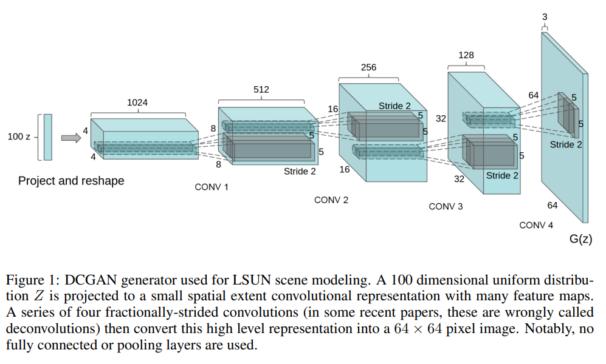
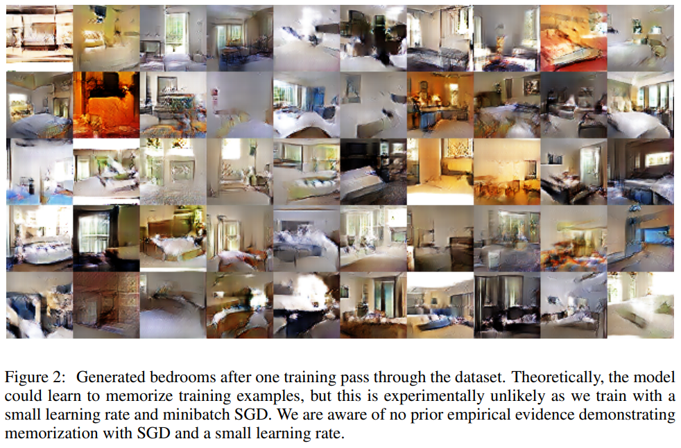
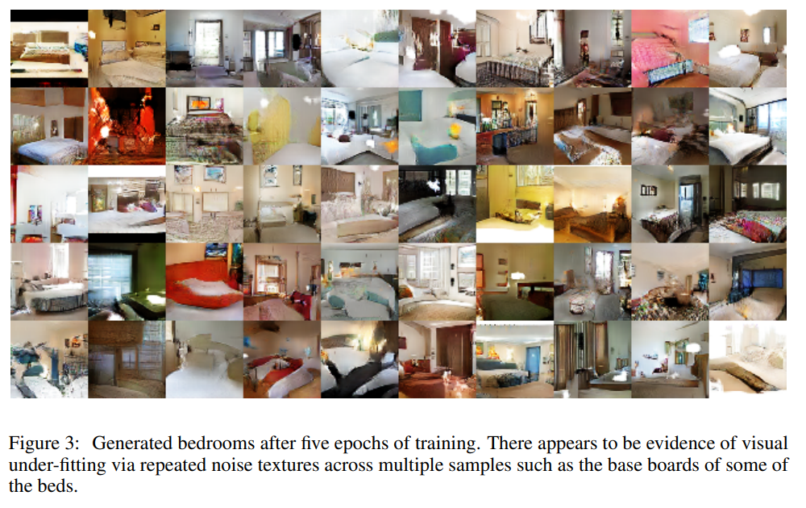
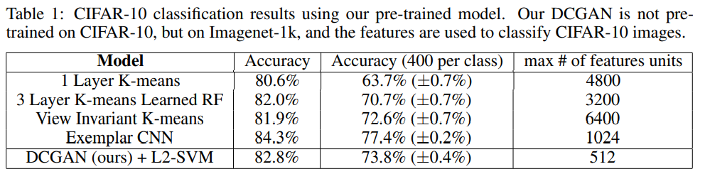
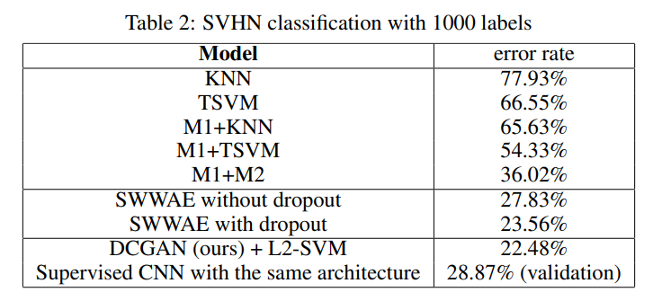
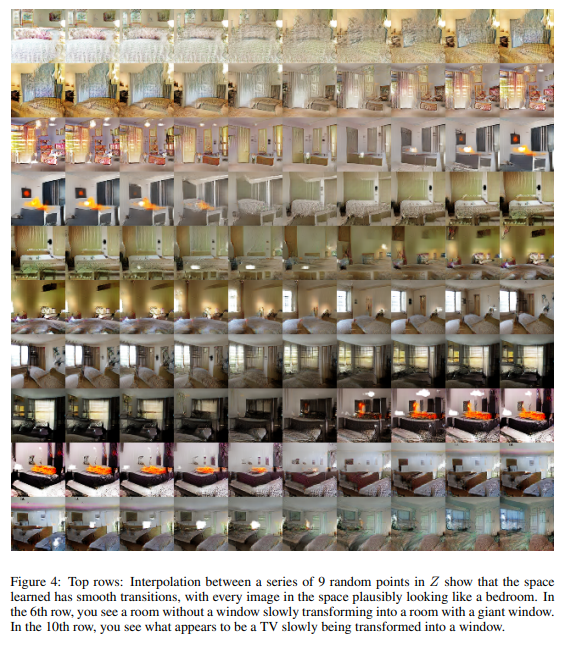
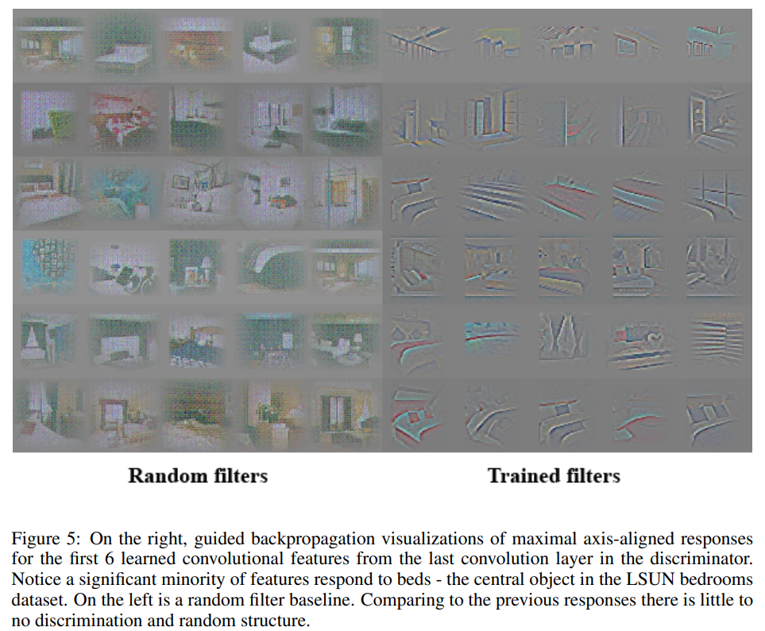
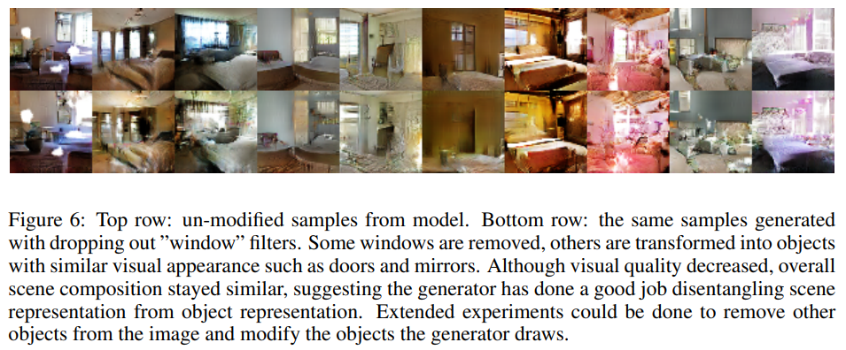
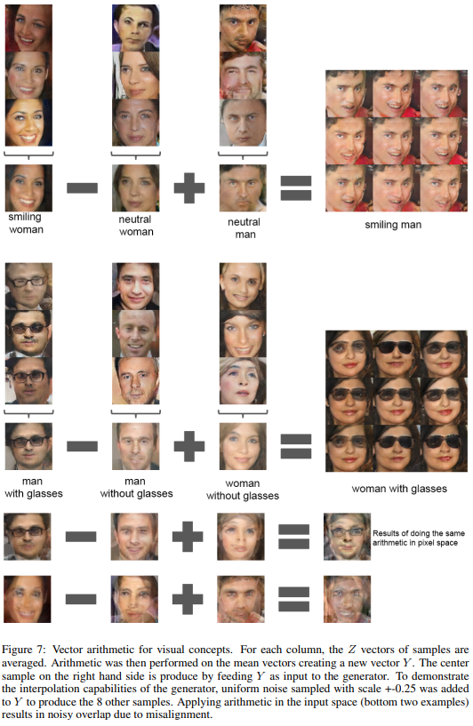
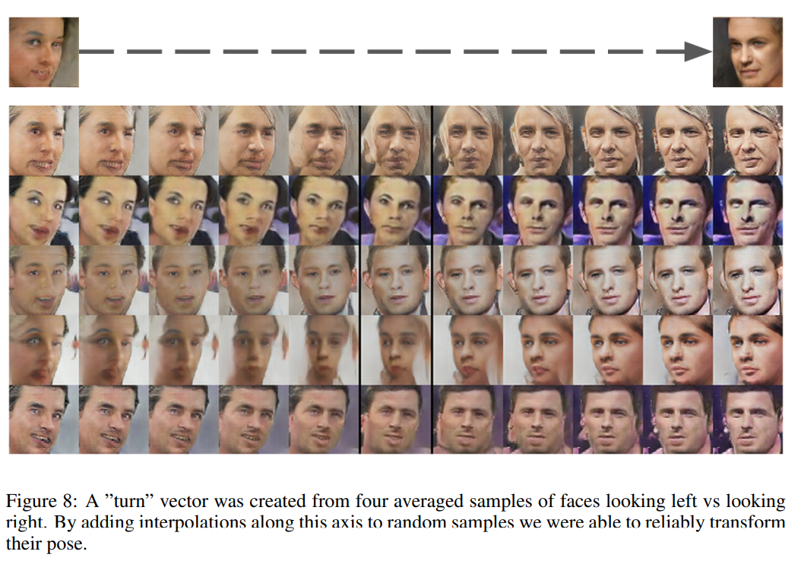

# UNSUPERVISED REPRESENTATION LEARNING WITH DEEP CONVOLUTIONAL GENERATIVE ADVERSARIAL NETWORKS 리뷰
https://youtu.be/XQNRgZ2-RKg

## Abstract
- unsupervised learning with CNN 은 집중을 덜 받았는데 이 논문에서는 CNN을 이용한 unsupervised를 논의할 것이다.
- DCGANs을 소개할 것이다.

## introduction
- 이미지의 재사용 가능한 feature을 가지고 학습시키는 것은 활발한 연구 분야이다.
- 이 방법은 중에서 가장 좋은 표현은 GAN으로 볼 수 있다. GAN은 이미지의 재 표현 뿐만 아니라 후에 generator과 discriminator network를 feature extractors로써 재사용함 가능하다. 
- GANs provide an attractive alternative to maximum likelihood techniques.
- GAN의 한계 
- - GANs have been known to be unstable to train, often resulting in generators that produce nonsensical outputs.
- 이 논문의 contribution은 아래와 같다.
- - We propose and evaluate a set of constraints on the architectural topology of Convolutional GANs that make them stable to train in most settings. 
We name this class of architectures Deep Convolutional GANs (DCGAN)
- - We use the trained discriminators for image classification tasks, showing competitive performance with other unsupervised algorithms.
- - We visualize the filters learnt by GANs and empirically show that specific filters have learned to draw specific objects.
- - We show that the generators have interesting vector arithmetic properties allowing for easy manipulation of many semantic qualities of generated samples.

## approach and model architecture
- 중요한 approach는 아래와 같다.
- 첫번째로 pooling 방법으로 downsampling하는 것을 strided convolution으로 대체할 것이다.
- 두번째로 hidden layer의 FC layer를 없애 주었다.
- 세번째로 Batch Normalization을 사용하였다.
- ReLU 를 generator에서 사용했다.
- leaky ReLU를 discriminator에서 사용했다.

## Details of adversarial training
- 3가지 dataset에서 실험함. 
- - Large-scale Scene Understanding(LSUN)
- - Imagenet-1k.
- - a newly assembled Faces dataset.
- 전처리를 training image에 하지 않았다.
- mini-batch SGD를 사용했다.
- mini-batch size  = 128
- weight 들은 zero-centered Normal distribution으로 초기화한다.(standard deviation 0.02)
- LeakyReLU의 slope는 0.2로 두었다.
- Adam optimizer을 사용했다.
- learning rate는 0.001로 설정했다.

### LSUN
   
   
   

- To demonstrate how our model scales with more data and higher resolution generation, we train a model on the LSUN bedrooms dataset containing a little over 3 million training examples.
- augmentation을 적용하지 않았다.

#### deduplication(중복제거)
- To further decrease the likelihood of the generator memorizing input examples (Fig.2) we perform a
simple image de-duplication process.

### Faces

### Imagenet -1k
- 위의 dataset을 사용했다. 32x32로 center crop하고 augmentation은 진행하지 않았다.

## Empirical validation of DCGANs capabilities
### classifying CIFAR-10 using GANs as a feature extractor
- feature extractor로써도 잘 작동하는지 보자.
- CUFAR-10 dataset을 기준으로 한다. 
- To evaluate the quality of the representations learned by DCGANs for supervised tasks,
we train on Imagenet-1k and then use the discriminator’s convolutional features from all layers,
maxpooling each layers representation to produce a 4 × 4 spatial grid.
- Further improvements could be made by finetuning the
discriminator’s representations, but we leave this for future work.  
     

### classifying SYHN digits using GANs as a feature extractor
- SUHN(streetview House Numbers) dataset 사용
- we use the features of the discriminator of a DCGAN for supervised purposes when labeled data is scarce.  
     

- 위의 결과를 보면 CNN 구조만이 모델 성능의 key contributor factor이 아니다. (왜냐하면 같은 구조로 supervise CNN을 사용했을 때보다 성능이 좋았기 때문이다) 

## INVESTIGATING AND VISUALIZING THE INTERNALS OF THE NETWORKS
### Walking in the latent space
     

### Visulizing the discriminator features
     

- train 된 filter은 특정 feature을 잘 찾고 있다.

### Manipulating the generator representation
- 이 실험에서는 generator에서 window에 해당하는 feature을 제거해보는 시도를 하였다. 
- 그러자 다른 object로 대체되었다.  
     

### Vector arithmetic on face samples
- vector(''king'') - vector(''man'') + vector(''Woman'') = Queen로 가까운 vector
- 위와 같은 Vector arithmetic을 이 논문에서도 적용해보았다.
- 이때 Z라는 representation of our generators를 선언하였다.
- 결과는 아래와 같다.  
     
     

## Conclusion and future work
- We propose a more stable set of architectures for training generative adversarial networks and we give evidence that adversarial networks learn good representations of images for supervised learning and generative modeling.
- There are still some forms of model instability remaining - we noticed as models are trained longer they sometimes collapse a subset of filters to a single oscillating mode.
- future work는 아래와 같다.
- Further work is needed to tackle this from of instability. 
- 또한 이 응용으로 video나 audio에 적용하는 것도 매우 유망할 것이다.