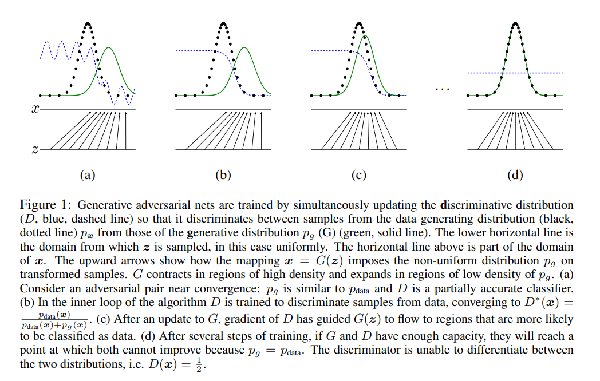
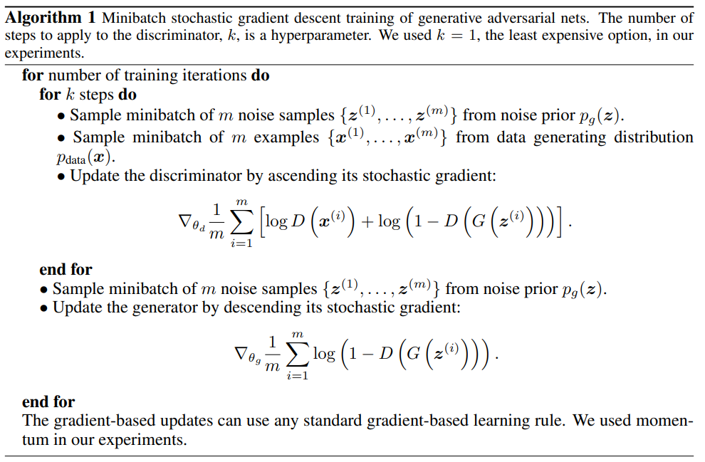
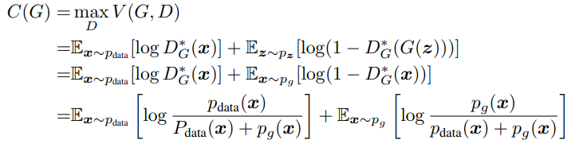
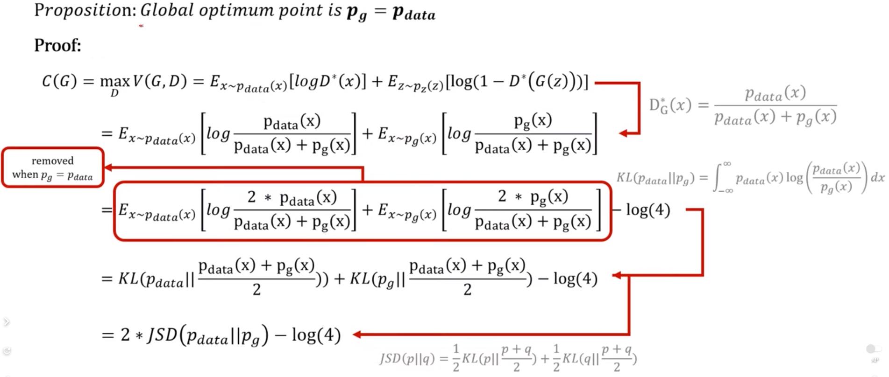
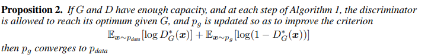
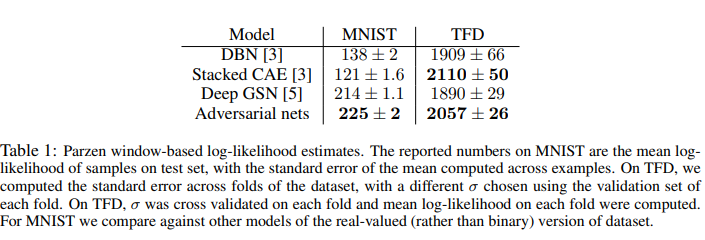
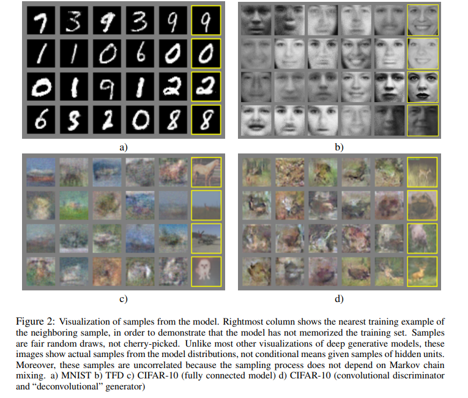

# Generative Adversarial Nets 리뷰

## Abstract
- 새로운 모델 GAN를 제시하는데 여기서 핵심은 two model을 동시에 학습시켜서 generative model을 만든다는 것이다.
- 하나는 data distribution을 capture하는 generative model G이고
- 나머지 하나는 G보다 training data로 부터 오는 sample의 확률을 더 높이 평가하는 discriminative model D 이다. 
- G는 D의 실수를 최대화하는 과정으로 학습된다.
- D는 또한 분류 실수를 최소화하는 과정으로 학습되기 때문에 이 전체 과정을 min-max two player game으로 볼 수 있다.
- 임의의 G와 D는 unique solution이 존재하는데 G는 training data distribution과 동일하고 D는 전체적으로 판별 확률이 1/2이 되도록 되는 것이 optimal solution이다.
- Experiments demonstrate the potential of the framework through qualitative and quantitative evaluation of the generated samples.

## Introduction
- The promise of deep learning is to discover rich, hierarchical models [2] that represent probability distributions.
- Deep learning은 backpropagtion과 dropout algorithm을 통해 큰 성공을 거뒀다. 특히 piecewise linear units 을 사용함으로써(ex ReLU)
- 그러나 generative model의 경우에는 대루기 힘든 확률적 계산을 근사하는 어려움 때문에 골머리를 앓았다.
- 그래서 이 논문에서는 새로운 generative model을 제한할 것이다.
- 제시하는 모델 GAN를 비유적으로 표현하자면 적과 싸우면서 발전하는 것이다.
- - discriminative model의 경우에는 training data인지 G가 만들어낸 fake 이미지인지 판단한다.
- - generative model은 화폐 위조팀 처럼 discriminative model에 안 걸리도록 이미지를 생성해낸다.
- In this article, we explore the special case when the generative model generates samples
by passing random noise through a multilayer perceptron, and the discriminative model is also a
multilayer perceptron.
- In this case, we can train both models using only the highly successful backpropagation and dropout algorithms and sample from the generative model using only forward propagation.

## Related work
생략

## Adversarial nets
$$ \underset{G}{min}\underset{D}{max}V(D,G) = E_{x ~ p_{data}(x)}[log D(x)] + E_{z~p_z(z)}[log(1-D(G(z)))] $$
- GAN의 식은 위의 식을 이해하는 것이 중요하다.
- generator's distribution $p_g$ 를 배우기 위해서 우리는 정의한다. input noise variables $p_z(z)$ 를 정의한다.
- D(x)는 x가 $p_g$ 가 아닌 data에서 온 확률을 의미한다.
- D는 최대가 되도록 학습되어야 하고(왜냐면 generator가 만든 그림이 잘못되었다고 판단해야 하므로)
- G는 반면 training data 분포와의 차이가 최소화되도록 학습되어야 한다.  

- 위의 그림은 비공식적인 설명이지만(실제로는 이차원이 아님) 학습과정을 설명할 수 있다. 
- 위의 그림에서 D가 의미하는 것은 파란색 선이고 training data는 검은색 generative data의 분포는 초록색으로 나타낸다. 학습과정에서 초록색 선은 검은색에 일치하도록 학습이 되어 D가 판별하는 확률이 1/2로 판별을 못할때가 optimal solution이 된다.
- we alternate between k steps of optimizing D and one step of optimizing G.( 이 방법으로 과적합을 방지할 수 있다.)
-  Early in learning, when G is poor, D can reject samples with high confidence because they are clearly different from the training data.(그래서 초기에는 log(1-D(G(z)))을 최소화하기 보다는 logD(G(z))을 최대화하는 방법을 사용한다.)

## Theoretical Results
- 알고리즘은 아래와 같이 D와 G를 한번씩 번갈아 가면서 업데이트한다.  

- training data인 x에 대해서는 D는 1를 내뱉고 generator이 만들어낸 이미지에 대해서 D는 0을 내뱉도록 학습한다.

### Global Optimality of $p_g = p_{data}$
- G가 주어질 때 D의 optimal을 얻는 방법을 생각해보가.
- proposition 1 : For G fixed, the optimal discriminator D is  
$$D_G^*(x) = \frac{p_{data}(x)}{p_{data}(x)+p_g(x)}$$
- 위의 식을 증명하기 위해서는 y -> alog(y) + b log(1-y)를 maximum은 $\frac{a}{a+b}$ 이라는 것을 알아야한다. (미분해보면 금방 알 수 있다.) 이 식을 
 $$ V(D,G) = E_{x ~ p_{data}(x)}[log D(x)] + E_{z~p_z(z)}[log(1-D(G(z)))] = $$
 $$ = \int_{x} p_{data}(x)log(D(x)) dx + \int_{z} p_z(z)log(1-D(g(z)))dz$$
 $$ = \int_{x} p_{data}(x)log(D(x)) + p_g(x)log(1-D(x)) dx $$
 

- Theorem 1. The global minimum of the virtual training criterion C(G) is achieved if and only if $p_g = p_{data}$. At that point, C(G) achieves the value − log 4.
 

- JSD는 두개의 분포의 거리의 차이를 나타낸다.

### Convergence of Algorithm 1
 

## Experiments
- MNIST, Toronto Face Database (TFD) , and CIFAR-10 dataset을 사용해서 학습함. 
- generator의 경우에는 ReLU와 sigmoid activation이 사용되었다.
- discriminator의 경우에는 maxout activation을 사용하였다.
- Dropout은 discriminator에 적용되었다.  
 

- 위의 자료는 GAN의 성능을 평가한 것이다. 좋은 성능을 보이는 것을 알 수 있다.
- 사실 이 당시만 하더라도 Generator의 성능지표가 명확히 확립된 시기가 아니라서 저자가 실험시에 가장 적합하다고 생각한 성능지표를 사용했다고 한다.  
 

- Rightmost column shows the nearest training example of the neighboring sample, in order to demonstrate that the model has not memorized the training set. 