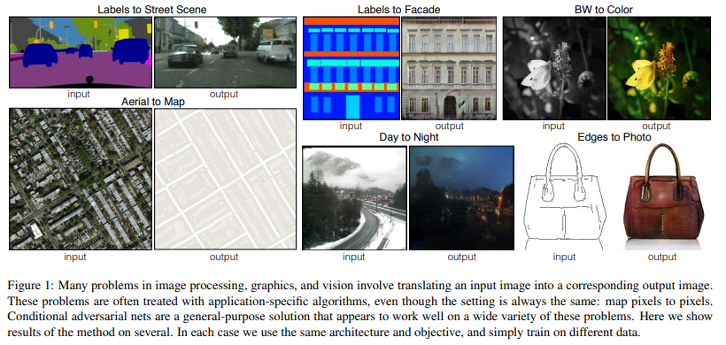

# Image-to-Image Translation with Conditional Adversarial Networks

## Abstract
- 이 연구자들은 image-to-image translation task를 위해 conditional adversarial networks을 연구했다.
- conditional adversarial networks는 input image를 output image로 mapping 시키는 것을 학습할 뿐만 아니라 이 mapping을 학습하기 위해 loss function을 학습한다.
- 기존의 연구들은 image-to-image domain 마다 loss function을 짜야 했었는데 이 연구는 같은 generic approach이 가능하다.
- 이 연구로 탄생한 모델은 넓은 영역에서 적용가능하고 또한 parameter을 일일히 찾지 않아도 되는 채택의 편함을 가지고 있다.
-  we no longer hand-engineer our mapping functions,and this work suggests we can achieve reasonable results without hand-engineering our loss functions either.
- - 즉 기존 연구는 task 마다 mapping function과 loss function을 변경해주었어야 하는데 이 연구에서는 그렇지 않아도 된다는 의미이다.

## Introduction
- 기존의 컴퓨터 비전의 문제는 입력 이미지를 task에 해당하는 출력이미지로 translating하는 것으로 볼 수 있다.
- 기계 번역 시스템 처럼 이 논문에서 하고자 하는 것도 자동으로 image-to-image translation을 하는 system을 만드는 것을 목표로 한다.   

- 기존의 연구는 각 task 별로 분리되게 설계되었다.
- Our goal in this paper is to develop a common framework for all these problems.
- 이미 인공지능 분야에서는 CNN의 발달로 loss function을 최소화하는 것을 배우고 그 과정 역시 자동적으로 이뤄진다.
- 물론 많은 연구가 더 효율적인 loss를 designing하는 것에 초점이 있기도 하다.
- 단순히 간단한 approach와 CNN이 ground truth pixel과 predicted pixel 사이 Euclidean distance를 최소화하도록 학습이 되게 설계하면 그 것은 매우 흐릿한 결과를 생성해 낸다.
- - This is because Euclidean distance is minimized by averaging all plausible outputs, which causes blurring.
- 그래서 loss function이 가지고 오는 결과는 open problem 이고 전문적으로 다루어져야 한다.
- GAN의 경우에는 "make the output indistinguishable from reality" 에 초점을 맞추어서 자동적으로 loss function을 배우도록 설계되었다.
- 위에서 흐릿한 이미지를 만들어낸다는 CNN의 단점은 GAN의 모델 구조를 이용하면 반드시 fake로 판별하기 때문에 용납되지 않을 것이고 새로운 이미지를 만들어 낼 것이다.
- Because GANs learn a loss that adapts to the data, they can be applied to a multitude of tasks that traditionally would require very different kinds of loss functions
- In this paper, we explore GANs in the conditional setting.
- Just as GANs learn a generative model of data, conditional GANs (cGANs) learn a conditional generative model.
- - cGAN은 조건을 가진 generative model이 되도록 학습된다. 
- This makes cGANs suitable for image-to-image translation tasks, where we condition on an input image and generate a corresponding output image.
- - cGANs의 경우에는 input image에 조건을 주어서 적절한 output image를 생성해내도록 image-to-image translation tasks에 적합하게 설계되어 있다.
- Our primary contribution is to demonstrate that on a wide variety of problems, conditional GANs produce reasonable results.
- Our second contribution is to present a simple framework sufficient to achieve good results, and to analyze the effects of several important architectural choices.

## Related work
### Structured losses for image modeling
- 기존의 image-to-image translation task의 연구들을 보면 pixel 마다 classification과 regression을 종종 공식화하는데 이는 각가의 output pixel들이 주어진 input image로 부터 다른 pixel들과 조건적으로 독립적으로 간주한다는 점에서 출력 공간을 'unstructured" 로 다룬다고 볼 수 있다.
- Conditional GANs instead learn a structured loss.
- Structured losses penalize the joint configuration of the output.
- The conditional GAN is different in that the loss is learned, and can, in theory, penalize any possible structure that differs between output and target.

### Conditional GANs
- 기존의 image-to-image translation task에 CGANs을 적용하는 논문은 많았지만 task마다 특별하게 설계된다는 점이 단점이었다.
- 그래서 이 논문에서는 간단한 setup만으로 모든 task에 적용가능하는 것을 목표로 설계되었다.

- 이 논문의 특징으로는 generator을 U-Net을 기반으로 모델을 설계했다는 점이고 discriminator로는 convolutional "PatchGAN" classifier을 사용했다. 
- - PatchGAN이란 image patches 구조에 penalize을 가한다.
- Here we show that this approach is effective on a wider range of problems, and we investigate the effect
of changing the patch size

## Method
- GAN은 random noise vector z로 부터 output image y로 mapping 을 배운다.
- conditional GANs의 경우에는 obseved image x와 random noise vector z로 부터 y로 mapping 되는 것을 배운다.  

- L1 alone leads to reason able but blurry results. The cGAN alone (setting λ = 0 in Eqn. 4) gives much sharper results but introduces visual ar tifacts on certain applications.

### Objective
- conditional GAN은 아래와 같이 표현할 수 있다.
$$ L_{cGAN}(G,D) = E_{x,y} [ log D(x,y) ] + E_{x,z} [log(1-D(x,G(x,z)))]$$
$$G^* = argmin_G max_D L_{cGAN}(G,D) $$

- GAN은 아래와 같이 표현할 수 있다.
$$ L_{GAN}(G,D) = E_y[log D(y)] + E_{x,z}[log(1-D(G(x,z)))]$$

- 기존의 연구의 경우 L2 distance loss를 사용하였다.
- 이 연구에서는 L1 distance를 사용해서 blurring을 완화할 것이다.
- 이 연구의 최종  objective는 이래와 같다.
$$ G^{*} = argmin_G max_G min_D L_{cGAN}(G,D) + \lambda L_{L1}(G)$$
- Without z, the net could still learn a mapping from x to y, but would produce deterministic outputs, and there fore fail to match any distribution other than a delta function.
- Despite the dropout noise, we observe only minor stochasticity in the output of our nets.
- Designing conditional GANs that produce highly stochastic output, and thereby capture the full entropy of the conditional distributions they model, is an important ques tion left open by the present work.

### Network architectures

#### Generator with skips
- 기본적으로 image to image solution 문제의 경우 encoder-decoder network르 사용했다. (downsampling -> upsampling)
- 이 연구에서는 prominent edge의 위치에 대한 정보의 bottleneck을 우회하기 위해서 skip connection을 사용한다.
- unet 구조를 사용할 것이다.
- skip connection이란 layer i 를 layer n-i와 함께 concatenate를 간단히 진행해서 기존의 정보를 보존하는 것이다.

#### Markovian discriminator (PatchGAN)
- 아래는 L2보다 L1이 blurry에 강하지만 아래 결과를 보면 그래도 심하다.  
- L1 : high-frequency structure

- In order to model high-frequencies, it is sufficient to restrict our attention to the structure in local image patches. 
- we design a discriminator architecture – which we term a PatchGAN – that only penalizes structure at the scale of patches.
- We run this discriminator convolution ally across the image, averaging all responses to provide the ultimate output of D

- PatchGAN의 경우 더 적은 parameter로 구성되어 있고 더 빠르며 더 큰 이미지 크기에도 적용가능하다.

#### Optimization and inference
- we alternate between one gradient descent step on D, then one step on G.
- minibatch SGD를 사용하고 Adam을 사용했다.
- learning rate는 0.0002로 설정했다.
- This approach to batch normalization, when the batch size is set to 1, has been termed “instance normalization” and has been demonstrated to be effective at im age generation tasks.
- In our experiments, we use batch sizes between 1 and 10 depending on the experiment.

## Experiment

### Evaluation metrics
- 합성된 이미지를 평가하는 것은 어려운 문제고 논의되는 문제이다.
- Traditional metrics such as per pixel mean-squared error do not assess joint statistics of the result, and therefore do not measure the very structure that structured losses aim to capture.
- - pixel 별로 비교하는 error의 경우는 구조에 대한 error를 측정하는 것이 아니다.
- 시각 품질을 평가하기 위해 아래 두가지 방법을 사용한다.
- - 인간 관찰자에 대해서 그럴듯함으로 판단되는 것이 목표로 한다.
- - Second, we measure whether or not our synthesized cityscapes are realistic enough that off-the-shelf recognition system can recognize the objects in them.  (FCN-8s 사용)

### Analysis of the objective function
- conditioned discriminator과 unconditional discriminator을 비교할 것이다.