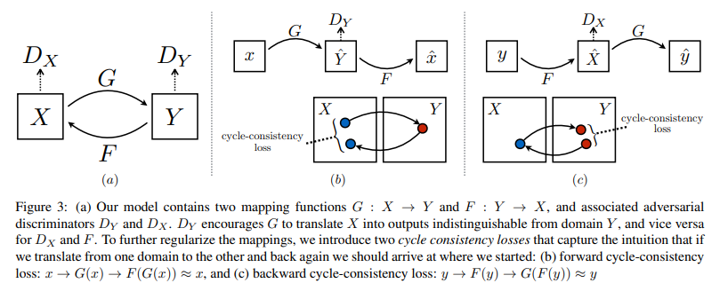

# Unpaired Image-to-Image Translation using Cycle-Consistent Adversarial Networks 리뷰
https://youtu.be/dr9Yf8EY4J4

## motivation
Pix2Pix의 경우 paired dataset에서 학습이 가능하다는 단점이 있었음.
그래서 이미지 별로 matching 되기 보다는 실제 사진, 그림 사진 처럼 domain으로 매칭되는 unpaired dataset을 학습하는 방법이 있을까하는 고민에서 나왔다.

## Abstract
- However, for many tasks, paired training data will not be available 
- paired examples이 존재하지 않는 단순히 domain만 다른 즉 source domain X에서 target domain Y로 translate하기 위한 접근을 이 논문에서 다룬다.
- 이 논문의 목표는 G : X->Y
- Because this mapping is highly under-constrained, we couple it with an inverse mapping F : Y → X and introduce a
cycle consistency loss to enforce F(G(X)) ≈ X (and vice versa).

## introduction
- 이 논문에서는 아래의 방법을 제시한다.
- - capturing special characteristics of one image col lection and figuring out how these characteristics could be translated into the other image collection, all in the absence of any paired training examples.
- paired training dataset을 얻는 것은 매우 어렵고 비싼일 이다.
- 그래서 이 저자들은 paired input-output examples이 없이 domain 사이를 translate하는 것을 배우는 algorithm을 제안한다.
- domain 사이의 근본적인 관계가 있다고 추정한다.
- - 예를 들면 같은 장면의 다른 rendering 간의 관계를 학습하는 것을 추구한다.
- 모델의 전체적인 학븍과정을 살펴보면 아래와 같다.
- - G를 학습시켜서 $\hat{y} = G(x)$ 를 구하는데 이는 image y $\in$ Y 와 구별할 수 없도록 학습시켜야 한다.
- - 목적은 output distribution over $\hat{y}$ 와 실제의 분포인 $p_{data}(y)$ 를 match되도록 하는 것이다.
- - optimal G의 경우 domain X에서 Y와 같도록 분포된 domain $\hat{Y}$ 로 translate 시켜준다.
- -  그러나 이러한 변환은 개별 입력 x와 출력이 의미 있는 방식으로 쌍을 이루는 것을 보장하지는 않는다.
- - 더욱이, 실제로, 우리는 적대적인 목표를 단독으로 최적화하는 것이 어렵다는 것을 발견했다.
- -  all input images map to the same output image and the optimization fails to make progress 이 같은 mode collapse 문제가 발생하기 때문이다.
- 위의 문제를 해결하기 위해서 
- - we exploit the property that translation should be “cycle consistent”, in the sense that if we translate 을 도입했다.
- -  Mathematically, if we have a translator G : X → Y and another translator F : Y → X, then G and F should be inverses of each other, and both mappings should be bijections.
- -  We apply this structural assumption by training both the mapping G and F simultaneously, and adding a cycle consistency loss that encourages F(G(x)) ≈ x and G(F(y)) ≈ y.  

## Formulation
- 