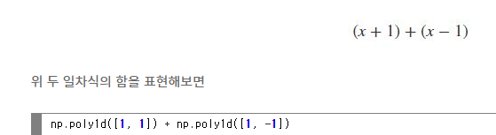

# 2주차 딥러닝 실험

## linear regression & its implementation
- CPU는 매우 오래걸림
- GPU는 병렬처리 계산이 가능하기 때문에 GPU로 돌리는 것이 의미가 있음.
- y = ax +b 에서 a, b를 fitting 시키는 것을 의미함.  

  
linear regression을 위해 우리가 필요한 것은 아래 세가지 이다.
- input data(x) and its labels(y) [ x_train, y_train]
- a fitting model [nn.Module]: Y=Ax+B에서 model이라는 것은 (A,B)을 나타냄
- - nn.Module의 경우 forward만 정의해주면 backward는 알아서 계산해준다. 
- objective function [nn.MSELoss()]: loss function

### 실습 코드에 대해
- np.unique(x)  
  
- np.polyfit()  
  
- nn.poly1d  
  
  

- GPU에 돌리기 위해서는 반드시 model과 input을 GPU로 올려야한다.

- SGD의 정의
  

## Logistic regression & its implementation
logistic regression이란 확률적인 해석을 의미하는 것으로 예를 들면 습도와 강수의 관계에 해당한다. 습도가 어느 정도 도달해야만 강수가 있고 그전에는 비가 오지 않는다. 따라서 이와 같이 binary로 근사될 수 있는 task에 사용된다.
  
- 여기서 probabilities는 $\hat{y}$ 이고 label에 해당하는 one hot encoding은 y에 해당한다. 이를 원소별로 cross entropy를 취해주면 loss가 나온다. 
-log에 해당하기 때문에 $\hat{y_i}$ 의 값은 높아질 수록 좋다.(단 1을 넘을 수 없다. : 확률이기 때문에)
- one hot encoding은 label에 해당하기도 한다. 
- test시에는 argmax로 값을 뽑아서 예측할 수 있다.

## MNIST classification with MLPs
  
