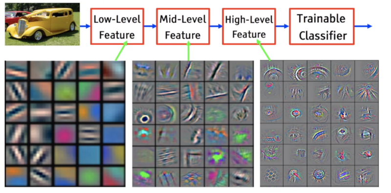
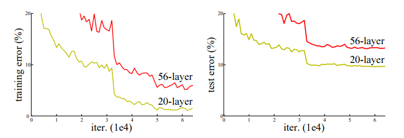
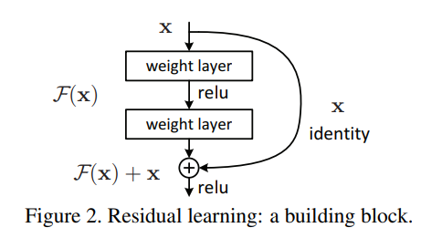
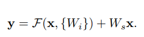
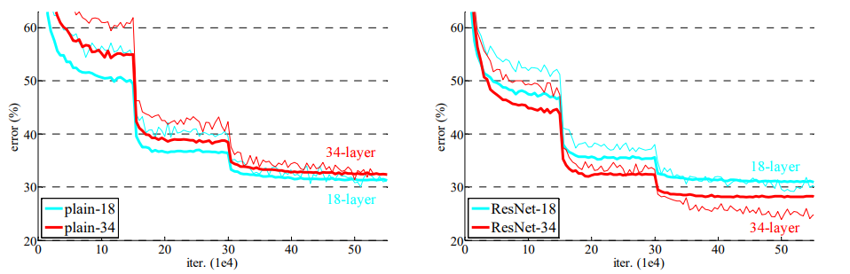
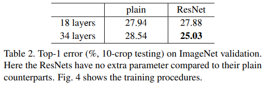
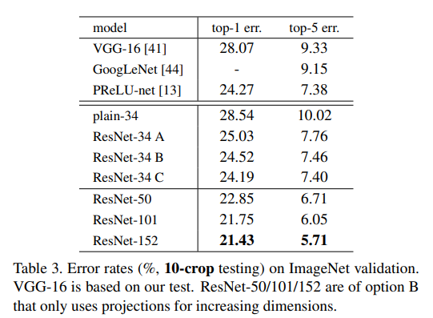
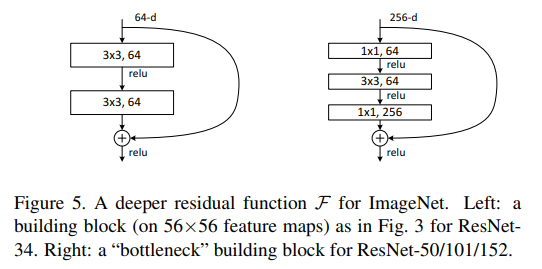
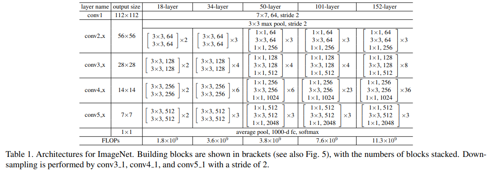
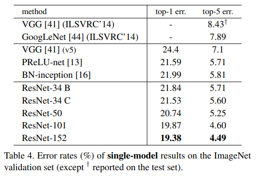

# Deep Residual Learning for Image Recognition 논문 리뷰
Kaiming He, Xiangyu Zhang, Shaoqing Ren, Jian Sun

## Abstract
- 여기서 핵심은 residual을 사용했다는 것이다.
- We explicitly reformulate the layers as learning residual functions with reference to the layer inputs
- 무려 152 layer의 depth을 가지고 있다.
- 각종 대회에서 우승을 한 모델이다. 특히 주목할 것은 ILSVRC 2015에서 우승한 결과이다.

## introduction
- Deep networks naturally integrate low/mid/high level features and classifiers in an end-to-end multilayer fashion, and the “levels” of features can be enriched by the number of stacked layers (depth).
  
- depth가 중요해짐에 따라 자연스럽게 학자들은 layer을 보다 많이 쌓기만 하면 학습을 잘할까라는 질문을 던지게 되었고 여기에는 큰 문제가 있다.
- - vanishing gradients
- - * 학습하다보면 backpropagation 과정에서 입력층으로 갈 수록 기울기(Gradient)가 점차적으로 작아지는 현상이 발생한다. 입력층에 가까운 층들에서 가중치들이 업데이트가 제대로 되지 않으면 결국 최적의 모델을 찾을 수 없게 된다. 그도 그럴 것이 gradient를 계속 곱해 나가는 과정이 back propagation이기 때문이다.
- - exploding gradients
- - * 기울기가 점차 커지더니 가중치들이 비정상적으로 큰 값이 되면서 결국 발산하는 것을 말함
- - 둘 다 ReLU를 사용하거나 normalized initialization 등의 방법으로 일부 해결할 수 있다.
- 그러나 이것들을 해결하더라도 이 논문에서는 depth가 깊어짐에 따라 발생하는 degradation problem을 발견하였다.   
  
- - 이 문제는 deeper network가 수렴하기 시작했을 때 발견되는 문제로 정확도가 정체되거나 크게 감소하는 것을 말한다. 
- - 이문제는 overfitting이라고는 할수 없는것이 training error 역시 같은 현상을 나타내기 때문이다. 
- - - There exists a solution by construction to the deeper model: the added layers are identity mapping, and the other layers are copied from the learned shallower model. 
- denoting the desired underlying mapping as H(x), we let the stacked nonlinear layers fit another mapping of F(x) := H(x)−x.  
  
- - input x에 output H(x)가 나온다. 여기서 H(x)가 ground ture에 mapping되는 함수를 얻는 것이 목표이다. 그러나 residual learning의 경우에는 H(x) - x를 얻도록 목표 세웠다. 즉 극단적으로 identity mapping이 optimal한 결과 값이라고 한다면 F(x)=0 여야 한다. 즉, H(x)를 x로 mapping 하는 것이 학습의 목표가 된다.
- - Identity short cut connections add neither extra parameter nor computational complexity.
- 이 논문를 요약하자면 
- - 1) Our extremely deep residual nets are easy to optimize, but the counterpart “plain” nets (that simply stack layers) exhibit higher training error when the depth increases; 
- - 2) Our deep residual nets can easily enjoy accuracy gains from greatly increased depth, producing re sults substantially better than previous networks.
 
 ## Related Work
 ### Residual Representations
 - 선행 연구 조사

 ### Shortcut Connections 
 - 선행 연구 조사

 ## Deep Residual learning
 ### Residual Learning
 - 한가지 가정을 하는데 multiple nonlinear layers가 복잡한 function을 점근적으로 근사할 수 있으면 residual function도 근사할 수 있을것이라는 것이다.
 - The degradation problem suggests that the solvers might have difficulties in approximating identity mappings by multiple nonlinear layers.
 - 즉 multiple nonlinear layers에 의해 degradation problem이 생겼다는 것이다. 
 - We show by experiments (Fig. 7) that the learned residual functions in general have small responses, suggesting that identity mappings provide reasonable preconditioning.

 ### Identity Mapping by Shortcuts
 - The shortcut connections introduce neither extra parameter nor computation complexity.
 - x와 F의 dimension은 일치해야하며 아닐 경우 아래처럼 $W_s$ 을 적용하여 dimension이 일치하도록 만들어줘야 한다.  
   
 - residual function $F=W_2\sigma(W_1x)$ 는 flexible하기 때문에 두개혹은 더 많은 수의 layer을 포함 할 수 있다. 다만 한개일 경우에는 linear의 결과와 같아 이득을 볼수 없다.
- The element-wise addition is performed on two feature maps, channel by channel

### Network Architectures
#### Planin Network
- VGG nets의 영향을 받아 3x3 filters 를 주로 가지고 있고 아래 두가지 rule을 따른다.
- - for the same output feature map size, the layers have the same number of filters
- - if the feature map size is halved, the number of filters is doubled so as to preserve the time complexity per layer.
- We perform downsampling directly by convolutional layers that have a stride of 2. 
- The network ends with a global average pooling layer and a 1000-way fully-connected layer with softmax

#### Residual Network
- we insert shortcut connections
- dimendion이 증가할 때 두가지 방법이 있다.
- - The shortcut still performs identity mapping, with extra zero entries padded for increasing dimensions. -> parameter 증가 없음.
- - The projection shortcut in Eqn.(2) is used to match dimensions (done by 1×1 convolutions). 
- For both options, when the shortcuts go across feature maps of two sizes, they are performed with a stride of 2.

### implementation
- The image is resized with its shorter side randomly sampled in [256, 480] for scale augmentation.
- A 224×224 crop is randomly sampled from an image or its horizontal flip, with the per-pixel mean subtracted.
- We adopt batch normalization (BN) right after each convolution and before activation, following.
- We initialize the weights and train all plain/residual nets from scratch.
- We use SGD with a mini-batch size of 256. 
- The learning rate starts from 0.1 and is divided by 10 when the error plateaus
- We use a weight decay of 0.0001 and a momentum of 0.9. 
- We do not use dropout

## Experiments
### ImageNet Classification
#### plain Network
- 18, 34-layer plain net을 사용했다. 
- 34-layer 의 경우가 18-layer보다 error가 컸다.(degradation problem)
   
- These plain networks are trained with BN, which ensures forward propagated signals to have non-zero variances. 
- We also verify that the backward propagated gradients exhibit healthy norms with BN. 
- So neither forward nor backward signals vanish.
- We conjecture that the deep plain nets may have exponentially low convergence rates, which impact the reducing of the training error.

#### residual Network
- The baseline architectures are the same as the above plain nets, expect that a shortcut connection is added to each pair of 3×3 filters
- we use identity mapping for all shortcuts and zero-padding for increasing dimensions. So they have no extra parameter compared to the plain counterparts
   
- 위의 결과를 통해 ResNet의 경우 layer을 더 쌓은 34 layer이 18 layer보다 좋다는 것을 증명했다.
- 34 layer의 경우 plain과 비교하더라도 상당히 좋은 결과를 ResNet이 도출하였다.
- 18 layer의 경우 비교할 수 없을 만큼 작은 격차지만 ResNet 기반 18 layer이 더 빨리 수렴하였다. 

#### identity vs projection shortcuts
   
- A : zero padding shortcuts are used for increasing dimensions, and all shortcuts are parameter free.
- B : projection shortcuts are used for increasing dimensions, and other shortcuts are identity
- C : all shortcuts are projections -> 성능은 제일 좋다.
- we attribute this to the extra parameters introduced by many (thirteen) projection shortcuts.
- 그러나 projection이 degradation을 해결하는 필수 조건은 아니다. 
- 그래서 A를 사용할 것이다. : A를 사용하면 memory/time complexity and model sizes을 줄일 수 있기 때문에

#### Deeper Bottleneck Architectures
- bottleneck design은 더 깊은 layer을 쌓기 위해서 고안한 아이디어로 구조는 아래와 같다. 
   
- The three layers are 1×1, 3×3, and 1×1 convolutions, where the 1×1 layers are responsible for reducing and then increasing (restoring) dimensions, leaving the 3×3 layer a bottleneck with smaller input/output dimensions.
- bottleneck architecture에는 identity shortcut이 매우 중요하다.

#### 50- layer ResNet
   
- We use option B for increasing dimensions.
- bottleneck architecture을 사용하였다.

#### 101- layer and 152-layer ResNets 
- bottleneck architecture을 사용하였다.
- 매우 depth을 증가시켰음에도 불구하고 VGG-16,19보다 더 낮은 complexity를 가지고 있다.
- The 50/101/152-layer ResNets are more accurate than the 34-layer ones by considerable margins (Table 3 and 4).
   
- layer depth가 증가할 수록 정확도는 계속해서 좋아지는 것을 볼 수 있다.

#### Comparisons with State-of-the-art Methods
- We combine six models of different depth to form an ensemble (only with two 152-layer ones at the time of submitting). This leads to 3.57% top-5 error on the test set (Table 5).