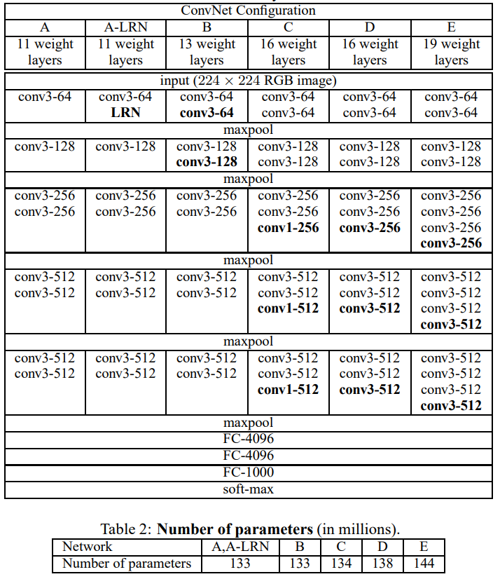
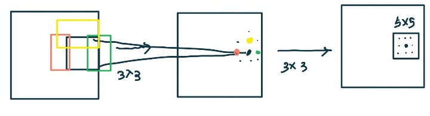
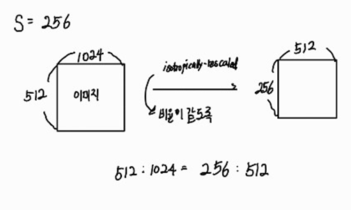
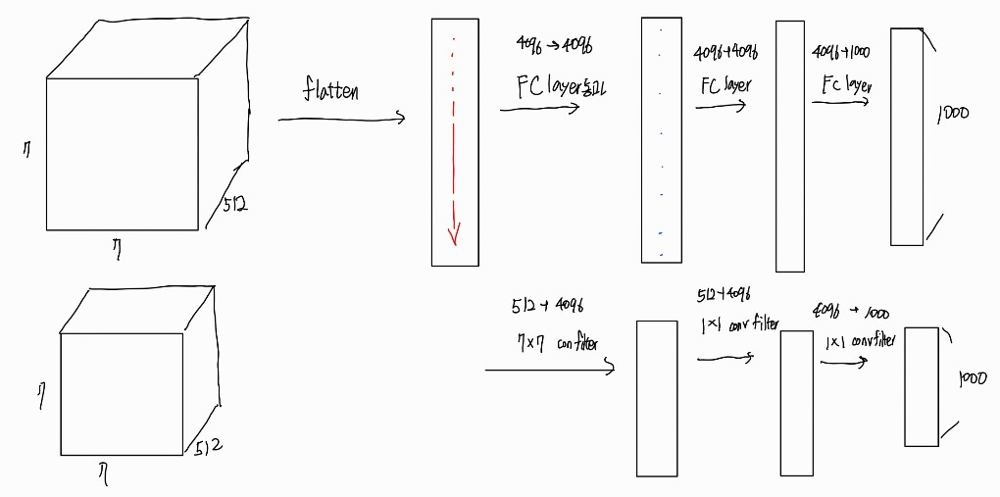
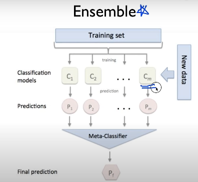
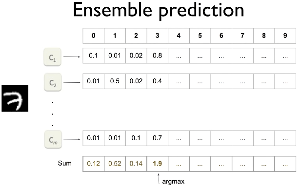

# VERY DEEP CONVOLUTIONAL NETWORKS FOR LARGE-SCALE IMAGE RECOGNITION 논문 리뷰
Karen Simonyan & Andrew Zisserman
## Abstract
- 이 논문은 3x3 conv filter을 통해 layer의 갯수를 늘려서 large-scale image recognition에서 높은 정확도을 얻은 과정을 설명하고 있는 논문이다.
- ImageNet Challenge 2014에 참여한 모델이다.
## introduction
- conv.net을 사용하여 image recognition에 많은 발전이 일어났다. 이를 가능케 해준 것은 GPU의 발전과 ILSVRC의 덕분이라고 할 수 있다.  
- In this paper, we address another important aspect of ConvNet architecture design – its depth. To this end, we fix other parameters of the architecture, and steadily increase the depth of the network by adding more convolutional layers, which is feasible due to the use of very small ( 3 × 3) convolution filters in all layers. 
- 위의 문장이 이 논문을 전체 요약한 문장과 같다. 
## CONVNET configurations
### architecture
- Input size : 224 x 224 RGB image.
- filter size : 3x3 filter, 1x1 filter(a linear transformation of the input channels의 역할)
- convolution stride : 1 pixel
- padding size : 1 pixel for 3x3 conv.layer (because the spatial resolution is preserved after convolution)
- pooling : Max-pooling 사용 (2x2 pixel window, with stride 2)
- the configuration of the fully connected layers is followed by three FC layers.
- the final layer is the soft-max layer.
- All hidden layers are equipped with the rectification (ReLU (Krizhevsky et al., 2012)) non-linearity.
### configurations
  

- VGG16  

### Discussion
- 3x3 conv.layer의 사용 
- - 3x3 receptive field의 conv.layer을 사용하면 사실상 5x5 receptive field를 커버할 수 있다. 
  
- - 그럼 이 방법이 7x7을 하나 쓰는 것과 3x3을 3개를 써 receptive field를 커버하는 하는 것과 어떤 장점이 있을까?
- - 첫번째 : We incorporate three non-linear rectification layers instead of a single one, which makes the decision function more discriminative. : 이로인해 non-linear한 문제를 더 잘 풀 수 있다.는 것
- - 두번째 : we decrease the number of parameters : 3개의 3x3 -> 3(3x3 $C^2$), 1개의 7x7 -> (7x7 $C^2$)
- - 여기서 의미하는 C는 channel을 의미한다. 
- 1x1 conv.layer의 사용
- - to increase the non-linearity of the decision function without affecting the receptive fields of the conv.layers.

## Classification framework
이 논문상에서는 training과 testing의 마지막 FC 구조를 다르게 설정하였다. 
### Training
- the training is carried out by optimizing the multinomial logistic regression objective(= Cross Entropy) using mini-batch gradient descent (based on back-propagation) with momentum.
- batch size : 256
- momentum : 0.9 -> optimizer
- L2 regularization 5 x $10^(-4)$ & Dropout=0.5
- learning rate : 초기 $10^{-2}$ -> then decreased by a factor of 10 when the validation set accuracy stopped improving.
- the learning was stopped after 370K iterations (74 epochs)
- We conjecture that in spite of the larger number of parameters and the greater depth of our nets compared to (Krizhevsky et al., 2012), the nets required less epochs to converge due to (a) implicit regularization imposed by greater depth and smaller conv. filter sizes; (b) pre-initialization of certain layers
- The initialization of the network weights is important, since bad initialization can stall learning due to the instability of gradient in deep nets
- - 여기서는 mean=0 이고 variance=$10^{-2}$인 normal distribution을 이용해서 weight를 초기화 해주었다.
- - 초기화는 pre-training 없이 random initialization procedure을 통해 구현할 수 있다는 것이 이 논문 후에 저자가 다른 논문을 통해 발견하였다.
#### Training image size
- Let S be the smallest side of an isotropically-rescaled training image, from which the ConvNet input is cropped (we also refer to S as the training scale). While the crop size is fixed to 224 × 224, in principle S can take on any value not less than 224
  
- 즉, S의 값이 양변의 최소의 길이가 되도록 설정한 후 그 다음 image를 crop(잘라내기)한다는 것이다.
- two approaches for setting the training scale S.
- - the fist is to fix S,which corresponds to single-scale training (note that image content within the sampled crops can still represent multi scale image statistics) 
- - The second approach to setting S is multi-scale training, where each training image is individually rescaled by randomly sampling S from a certain range [$S_{min}, S_{max}$] (we used $S_{min}$ = 256 and $S_{max}$ = 512). : fine-tuning을 위해 사용함.  

### Testing
실제는 train과 test가 같은 모델이 많기 때문에 구지 이해하지 않아도 된다.
- First, it is isotropically rescaled to a pre-defined smallest image side, denoted as Q (we also refer to it as the test scale). We note that Q is not necessarily equal to the training scale S
- - 의미는 test에서는 S와 같게 rescaled할 수도 아님 다르게 할 수 도 있다. 
- the fully-connected layers are first converted to convolutional layers (the first FC layer to a 7 × 7 conv. layer, the last two FC layers to 1 × 1 conv. layers).
  
- Finally, to obtain a fixed-size vector of class scores for the image, the class score map is spatially averaged (sum-pooled).

 ## Classification experiments.
 ### Dataset
 - ILSVRC- 2012 dataset을 사용함
 - The classification performance is evaluated using two measures: the top-1 and top-5 error.

 ### Single scale evaluation
 - Single scale evaluation : test시 image size가 고정 (Q=S) and Q=$0.5(S_{min}+S_{max})$ for jittered S $\in [S_{min},S_{max}]$
 - First, we note that using local response normalisation (A-LRN network) does not improve on the model A without any normalisation layers. We thus do not employ normalisation in the deeper architectures (B–E).
- Second, we observe that the classification error decreases with the increased ConvNet depth
- Notably, in spite of the same depth, the configuration C (which contains three 1 × 1 conv. layers), performs worse than the configuration D, which uses 3 × 3 conv. layers throughout the network. This indicates that while the additional non-linearity does help (C is better than B), it is also important to capture spatial context by using conv. filters with non-trivial receptive fields (D is better than C).
- 이 발견에서 가장 중요한 것은 3x3 filter가 매우 합리적이고 성능이 좋다는 것이다. 
- This confirms that training set augmentation by scale jittering is indeed helpful for capturing multi-scale image statistics.

### Multi-scale evaluation
- Multi-scale evaluation : test시 image를 multi scal로 설정하여 평가하는 방식

### convnet fusion
D,E로 가지고 ensemble하면 7개 모두 ensemble한 결과보다 좋았다.
  
  
