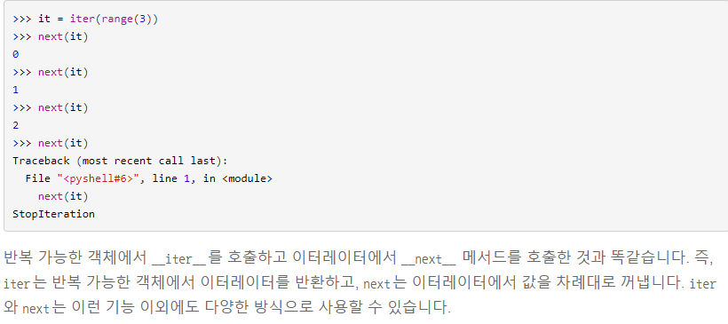
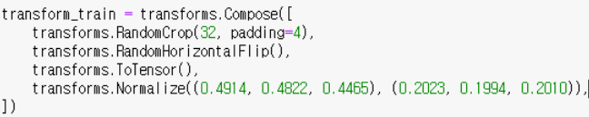
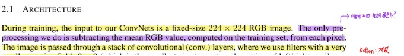
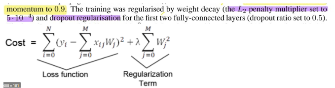

# 3주차 딥러닝 실험
- CNN은 간단하게 말하면 공간적인 정보를 추출함과 동시에 parameter 수를 MLP(=FC)보다 줄여주는 역할을 한다.

## 코드상 새로 배운것
- test시에 label과 predicted 값을 비교하는 방법은 두가지 방법이 있다.
- - 첫째로는 label도 gpu로 올려서 비교하는 방법이다.
- - 두번째로는 predicted 값에는 backward을 위한 값이 있는데 이를 사용하지 않는 다는 의미로 detech를 사용하고 cpu로 내려 주면 된다. predicted.detech().cpu()

- iter(), next()
  

- batch normalization
배치 정규화는 평균과 분산을 조정하는 과정이 별도의 과정으로 떼어진 것이 아니라, 신경망 안에 포함되어 학습 시 평균과 분산을 조정하는 과정

## 과제 
- 여러분이 예비 보고서에서 작성하셨던 것을 실제로 구현하고 성능을 뽑아봤을 때, "예상했던 점, 예상과 달랐던 점, 또는 개선할 점"과 같은 요약 내용을 기술해주시면 되겠습니다. 
(예시) ~ 해서 ~ 결과를 얻었고, 이는 ~ 으로 인한 것으로 생각된다."

## 질문
- normalize가 아래처럼 구성했는데 저 값이 나온 배경이 있나요? 논문에서 비슷한 글을 읽었는데 보라색으로 칠한 부분과 관련이 있는 건가요? 
  
  
- - 네 맞습니다. 보라색으로 칠해주신 부분 내용을 구현한 것입니다. 보통은 trainset 에 있는 전체 영상의 RGB값 평균 및 분산을 이용해서  값을 구하게 됩니다. 계산된 평균 및 분산은 데이터 전처리로써 standardization 에 이용됩니다. 코드에서는 (0.4914, 0.4822, 0.4465) 가 각각 R,G,B 값 평균에 해당하며 (0.2023, 0.1994, 0.2010) 이 각각 R,G,B 값 분산에 해당됩니다. 전처리로 standardization 을 해주는 이유로는 여러 가지가 있겠지만, 대표적으로 데이터들을 zero mean 및 unit variance 에 근사하게 만들어서 네트워크 학습을 원활히 하기 위함입니다.

- VGG 논문에서  이런 문장이 있었는데 L2는 제곱 평균인 걸(로 알고 있는데 5*10^-4로 set한다는 것은 무슨 의미인가요? 아래 그림에서 lambda를 의미하는 값인가요
 
- -  네 맞습니다. lambda 값을 5e-4 로 설정했다는 뜻입니다. 다음과 같은 코드에서 weight_decay 가 이에 해당하는 설정값 입니다.optimizer = torch.optim.SGD(model.parameters(), lr=learning_rate, momentum = momentum, weight_decay = weight_decay)

- 예비 보고서를 적으면서 논문을 보니 initialization이 매우 중요하다고 하는데 optimizer.zero_grad()로 설정한 것으로 보아 initialization은 zero로 설정했을때가 제일 좋나요? 아니면 가장 간단해서 사용하는 방법으로 정확도를 올리고 싶으면 다른 initialization을 사용해야 하나요?
- - 말씀해주신 것처럼 네트워크 학습 시 학습 파라미터들의 initialization 은 중요합니다. 다만, 질문 내용처럼 optimizer.zero_grad() 라는 코드가 zero initialize 를 해주는 것은 아닙니다. 금일 수업때 간단히 말씀드렸던 것 처럼, optimizer backpropagation 을 위해 필요한 값들을 들고 있는데, 해당 코드는 실제로 업데이트 (즉, optimizer.step()) 을 하기 전에 "이전 update 에서 쓰였던 값이나 쓰레기 값"을 들고 있을 수 있으므로, 이를 날려주는 역할을 해주는 코드입니다 (fflush 같은 느낌).
- - 이번 과제에 있어서는 따로 학습 파라미터들의 initialization 을 하는 부분은 없습니다 (따로 설정해주지 않으면, pytorch 는 default 로 uniform distribution 에서 randomly initialize 해줍니다). 따로 initialize 를 해보고 싶으시면
https://pytorch.org/docs/stable/nn.init.html을 참고하시고 이용하시면 되겠습니다.  
(예시): conv layer 를 Gaussian distribution 에서 randomly initialize 하고 싶을때  
 self.cnn1 = nn.Conv2d(in_channels=1, out_channels=16, kernel_size=5, stride=1, padding=2)  
nn.init.normal_(self.cnn1.weight, std=원하시는값)  
nn.init.constant_(self.cnn1.bias, 0) # 보통 bias 는 0 으로 합니다