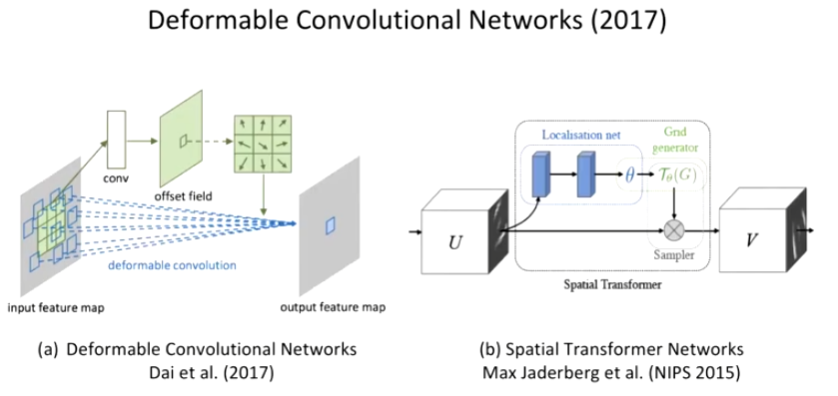

# Spatial(공간) Transformer Networks 논문 리뷰
논문과 아래 사이트 강의 참조.
https://www.youtube.com/watch?v=Rv3osRZWGbg

##  Abstract
- CNNs are still limited by the lack of ability to be spatially invariant to the input data in a computationally and parameter efficient manner.
- CNN은 scale, rotation과 같은 변형에 대해 spatially invariant가 부족하다는 의미이다.
- 이 논문에서는 Spatial Transformer이라고 명명한 learnable module을 소개할 것이다. 
- 이 module은 data의 네트워크 내부에서 공간적인 취급이 가능토록 해준다.
- 이 module은 이미 존재하는 Convolutaional architecture에 적용할 수 있고 스스로 feature map과 조건은 공간적으로 변형시켜줘준다.
- We show that the use of spatial transformers results in models which learn invariance to translation, scale, rotation and more generic warping

## introduction
- A desirable property of a system which is able to reason about images is to disentangle object pose and part deformation from texture and shape.
- The introduction of local max-pooling layers in CNNs has helped to satisfy this property by allowing a network to be somewhat spatially invariant to the position of features.
- 하지만 maxpooling의 경우에는 3x3이라던지 그 공간적인 특징이 이미 정해져 있고 작기 때문에 deep hierarchy에서만 잘 적용되며 중간 feature map에서는 input data에 대한 공간적 불변성을 보장하지 않는다.
- 이 논문에서는 Spatial Transformer module을 제한하는데 표준 CNN model에 포함되어 공간적인 불변성을 보장해줄 것이다.
- The action of the spatial transformer is conditioned on individual data samples, with the appropriate behaviour learnt during training for the task in question (without extra supervision).
- the spatial transformer module is a dynamic mechanism that can actively spatially transform an image (or a feature map) 
- This allows networks which include spatial transformers to not only select regions of an image that are most relevant (attention), but also to transform those regions to a canonical, expected pose to simplify recognition in the following layers.
   

## Related Work
- 2D affine에 대해  
이동, 스케일링 등의 변환 전체를 식으로 표현한 것을 말한다.  
https://m.blog.naver.com/PostView.naver?isHttpsRedirect=true&blogId=baejun_k&logNo=221207284223

## Spatial Transformers
- spatial transformer은 differentiable module로 feature map에다가 공간적 변형을 적용한다. (single forward pass 동안에)
- multi channel input에 대해서도 같은 warping을 각각의 channel에 적용시킨다. 
- 이 논문에서는 간단하게 single transform과 single output per transformer 을 설명하지만 multiple transformation에서도 적용가능하다.
- Spatial transformer mechanism 은 크게 세 부분으로 나뉜다. 계산 순서대로 아래처럼 구성되어 있다.
- - localization network : input feature map이 삽입되는 곳 이곳에서 input에 대한 조건적인 변형을 준다.
- - grid generator : 예상한 transformation parameter은 sampling grid를 만들 때 사용되고 여기서 말하는 sampling grid란 변형된 output을 생성하기 위한 input map의 point 들을 말한다. 
- the feature map and the sampling grid are taken as inputs to the sampler, producing the output map sampled from the input at the grid points  

   

- 이 그림이 spatial Transformer module 한개로 CNN이나 FCN 앞에다가 삽입한다. 
### Localization Network
일종의 neural network이다. 좌표를 transform 해주기 위한 parameter &theta;를 찾아준다.
- 복잡할 필요는 없지만(CNN이든 FCN이든 상관없다.) 마지막 단에 regression layer가 필요하다.
$$ \theta = f_{loc}(U)$$
### Parameterized Sampling Grid
parameter &theta;를 가지고 input image와 output image 사이 좌표를 변환해주는 grid를 계산해준다.
- 결국은 V에서 나오는 output 값을 CNN에 넣어줄 것이다.
- identity transform  

- affine transform     
   

   

- attention이란것은 우리 관심꺼에 주목하는 것을 말한다.

### Differentiable Image Sampling : Sampler
위의 결과들을 받아서 point 값으로 input point를 output point로 mapping 시켜준다. 
- 즉 gird generator가 발생시킨 좌표값을 하나씩 읽어오면 된다. 
- 그런데 고려해야할 문제가 있다. 뭐냐면 정수대 정수로 가져오는 것이 아니라서 (중간 중간 값을 가져와야 한다.) interpolation이 필요하다.  
   

- interpolation을 modeling 하는 sampling kernel을 generic하게 modeling하면 아래와 같은 형태로 나타난다.  
   

- 예를 들어보자. 가장 가까운 옆에 pixel에서 읽어올때는 integer sampling을 하게 된다. 
   

- bilinear sampling 할 때 (x,y축으로 각각 liner interpolation 해주는 것을 말함.) 구지 아래처럼 안하고 필요에 따라 중간값을 sampling하도록 설계하면 된다. 
   

   

- 이걸 하는 이유는 미분가능하게 만들어야 앞단에 있는 CNN으로 부터 학습한 결과가 backpropagation이 가능하다. 그래서 미분 가능성이 매우 중요하다. (따로 loss function을 만들 필요가 없다.)
   

- 그냥 붙어서 똑같이 CNN만 있는 경우처럼 학습시키면 알아서 학습한다. 

### Spatial Transformer Networks
- It is possible to have multiple spatial transformers in a CNN.
- Multiple spatial transformers in parallel can be useful  if there are multiple objects or parts of interest in a feature map that should be focussed on individually : 병렬로 하겠다는 의미는 focus를 여러 이미지에 하겠다는 의미가 된다.
- spatial transformer network로 downsample, upsample이 가능하기만 aliasing effect를 발생시키므로 하지마라

### Experiments
#### Distorted versions of the MNIST handwriting dataset for classification
- Distortions : Rotation, Rotation-Scale-Translation(RTS), Projective(빛을 줘서 그림자를 볼때 여러 형태가 있는 것을 말한다.), Elastic(마치 철판이 휘어지는 것 같은 형태)
- Transformations: Affine, Projective, Thin Plate Spline(TPS)  

   
- ST-CNN이 ST-FCN보다 정확도가 높은데 이유는 이미지에서 CNN이 더 정확도가 높기도하고 pooling layer이 들어있기 때문에 Spatial Transformer를 보완해주는 역할을 해주기도 한다.

- Spatial Transformer을 2개를 넣어보자. 
   

- input이 2channel인데 1channel의 공간적 조건을 찾는 Spatial Transformer을 하나두고 2channel의 공간적 조건을 찾는 Spatial Transformer을 둔것이다. 이 때 만약 각 channel에 특화된걸 다른것에 적용하면 잘 안 맞다는 것 죽 independent하게 각각 알아서 학습한다는 의미이다. 아래에 실험 영상이 있다. 참고하자.
https://www.youtube.com/watch?v=yGFVO2B8gok&t=8s

#### A challenging real-world dataset, Street View House Numbers for number recognition
- Data is preprocessed by taking 64x64 crops and more loosely 128x128 crops around each digit sequence  
   

#### CUB-200-2011 birds dataset for fine-grained classification by using multiple parallel spatial transformers
- Fine-Grained Classification
- CUB-200-2011 birds dataset contains 6k training images and 5.8k test images, covering 200 species of birds.
- The birds appear at a range of scales and orientations, are not tightly cropped
- Only image class labels are used for training.
- The transformation predicted by 2xST-CNN(top row) and 4 x ST-CNN(bottom row)  
   

- 빨간색은 머리 초록색은 바디를 찾는 것을 확인할 수 있다.

### Conclusion

- 공통점이 있지만 deformable convolutional networks의 경우에는 점하나하나들의 offset을 계산해줌. 원래 해야 하는 conv에 offset만 더해주는거라서 더 좋다고 주장함.
- Spatial Transformer의 경우에는 transformer하는 parameter만 찾아줌. sampling하면서 interpolation하는 연산을 해줘야함. 좀 더 복잡한 연산도 가능함. 

정리하자면
- Similarity
- - have internal transformation parameters
- - learn parameters purely from data
- Difference
- - 1. Spatial Transformer Networks
- - * parameters : transform matrix
- - * U -> V mapping is not free
- - * "expensive warping, difficult parameter learning, success in small scale classification only"
- - 2. Deformable Convolutional Networks
- - * parameters : offsets per pixel
- - * input -> output mapping is free
- - * "light-weight no parametric transformation, no warping feature map"

최종 결론.

- A module that performs spatial transformations to features has been presented.
- It is differentiable and learnt in an end-to-end fashion
- No modifications to the loss function are needed.
- Outperforms the state-of-the-art performance in some tasks.