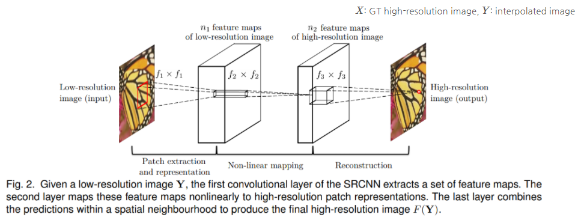
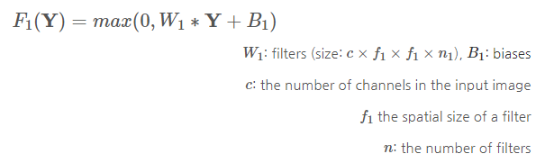
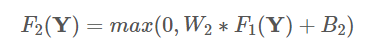
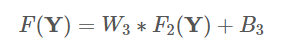
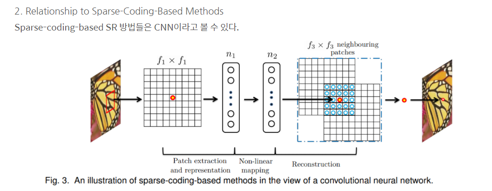
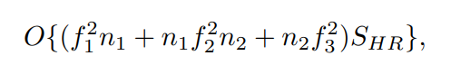
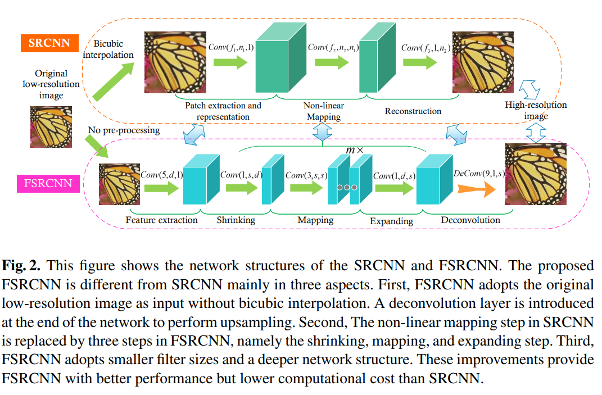

# Accelerating the Super-Resolution Convolutional Neural Network

## Abstract
- motivation : SRCNN(CNN을 활용한 Super-Resolution model)은 이미 성능이 좋지만 real-time에 사용하기에는 computational cost가 높다. 
- 목적 : SRCNN의 속도를 높인 구조를 제안하는 것 -> 아래 3가지를 중심으로 고침
- - deconvolution layer at the end of the networ 
- - we reformulate the mapping layer by shrinking the input feature dimension before mapping and expanding back afterwards
- - we adopt smaller filter sizes but more mapping layers. 
- 결론 : The proposed model achieves a speed up of more than 40 times with even superior restoration quality. 
- - Further, we present the parameter settings that can achieve real-time performance on a generic CPU while still maintaining good performance

## introduction
- SRCNN은 간단한 구조와 좋은 restoration quality 때문에 주목을 받았다. 기존의 learning-based method보다 빠르지만 큰 이미지에서 processing speed가 여전히 불만족 스럽다는 단점이 있다. 그래서 real-time에 사용하기에는 멀었다.
- SRCNN에서 적어도 17배의 성능 향상이 일어나야 된다.
- This sounds implausible at the first glance, as accelerating by simply reducing
the parameters will severely impact the performance. However, when we delve into the
network structure, we find two inherent limitations that restrict its running speed.
- first. pre-processing step으로써 LR image를 upsampling을 해야하는데 이때 bicubic interpolation을 사용한다. 그래서 계산량이 제곱에 비례해서 증가한다. 
- - If the network was learned directly from the original LR image, the acceleration would be significant, i.e., about $n^2$ times faster.
- second. The restriction lies on the costly non-linear mapping step.
- - Then the question is how to shrink the network scale while still keeping the previous accuracy.
- To solve the first problem, we adopt a deconvolution layer to replace the bicubic interpolation.
- - To further ease the computational burden, we place the deconvolution layer at the end of the network, then the computational complexity is only proportional to the spatial size of the original LR image.
- For the second problem, we add a shrinking and an expanding layer at the beginning
and the end of the mapping layer separately to restrict mapping in a low-dimensional
feature space. 
- - Furthermore, we decompose a single wide mapping layer into several
layers with a fixed filter size 3 × 3.
- 기여하고자 하는 것
- - 1) We formulate a compact hourglass-shape CNN structure for fast image super-resolution. With the collaboration of a set of deconvolu tion filters, the network can learn an end-to-end mapping between the original LR and HR images with no pre-processing. 
- - 2) The proposed model achieves a speed up of at least 40× than the SRCNN-Ex while still keeping its exceptional performance. One of its small-size version can run in real-time (>24 fps) on a generic CPU with better restoration quality than SRCNN. 
- - 3) We transfer the convolution layers of the pro posed networks for fast training and testing across different upscaling factors, with no loss of restoration quality.

## Related Work
1. Deep Learning for SR
SR 문제를 풀기 위해 처음 SRCNN이 제안된 후, 점점 더 깊은 구조들이 나오고 있다.
하지만 다른 모델들 모두 pre-processing 과정에서 bicubic interpolation을 진행해야 한다.

2. CNNs Acceleration
Object detection이나 image classification 등의 영역에서 CNN의 속도를 높이기 위한 많은 연구들이 진행됐다.
하지만 그 연구들은 high-level vision문제를 위해 고안된 것이다.
SR 문제를 위한 deep model들은 fully-connected layer가 없기 때문에 convolution filter의 역할이 중요하다.

## Fast Super-Resolution by CNN

### SRCNN 
https://sofar-sogood.tistory.com/entry/SRCNN-Image-Super-Resolution-Using-Deep-Convolutional-Networks-ECCV-14  
SRCNN aims at learning an end-to-end mapping function F between the bicubic interpolated LR image Y and the HR image X. 

- Formulation
- - 저해상도 이미지가 있을때 bicubic interpolation으로 원하는 크기까지 upscale을 진행한다.
다음의 과정들을 통해 Interpolated image을 mapping하는 F를 학습하고자 한다.
    

- - Patch extraction and representation:  Y 에서 여러 patch들을 뽑고, 각 patch들을 vector로 나타낸다. 이 vecter들은 feature map이다.
첫번째 layer는 $F_1$ 으로 표현한다.
    
이후 ReLU를 적용한다.
- - Non-linear mapping: 한 vector에서 다른 vector로 nonlinearly mapping한다. 각 mapped vector는 high-resolution patch를 표현한다.

첫번째 layer는  $n_1$ 차원  feature를 뽑는다. 이 과정에서는 $n_1$ 차원 벡터들을 $n_2$ 차원 벡터로 mapping한다.
    
Non-linearity를 높이고 싶으면 conv layer를 더 쌓으면 되지만 complexity가 높아지게 되고, 결국 학습 시간이 늘어난다.

- - Reconstruction : 앞서 만들어진 patch들을 모아 high-resolution image를 만든다. 이때 이 image는 GT인 X와 비슷할 것이다.
기존의 전통적인 방법들은 최종 이미지를 만들기 위해 patch들을 평균냈다.
평균내는 행위는 벡터들을 'flatten'하는 행위이기 때문에 이에 착안하여 다음과 같은 layer를 설계했다.
    

    

- 계산 복잡도는 아래와 같다
    

    

### FSRCNN
- 위 그림에 따르면 5개의 part로 구분되어 있다. (1~4는 convoution layer로 구성되어 있고 5번쨰는 deconvolution layer로 구성되어 있다.)
- - variable이 몇 십개가 되다보니 각각을 분석하기에는 불가능하고 reasonable value만 알아보자.  
- feature extraction
- shrinking
- mapping
- expanding
- deconvolution 