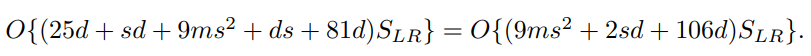
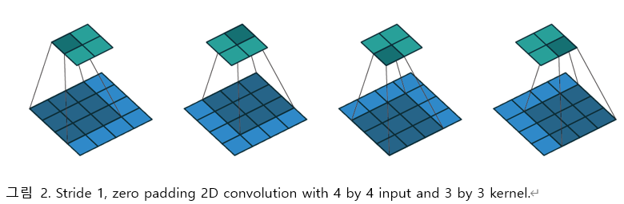
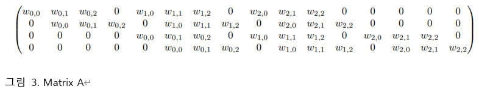
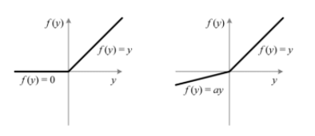
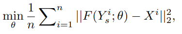
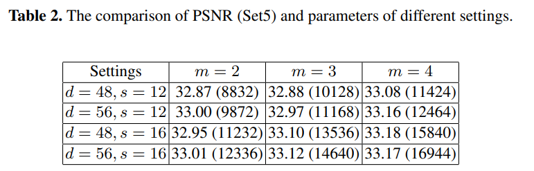

<<<<<<< HEAD
# Accelerating the Super-Resolution Convolutional Neural Network 리뷰 
=======
# Accelerating the Super-Resolution Convolutional Neural Network
>>>>>>> e3032d77f38b7e12b1c6b398635aac7ba4c25bd6

## Super-Resolution
- image Super-Resolution은 저해상도 이미지를 고해상도로 변환시키는 문제를 의미함
- image Super-Resolution은 유일한 정답이 존재하지 않는 ill-posed problem이 존재
- 딥러닝 모델을 적용해서 image Super-Resolution 문제를 해결하려는 연구가 다수 진행되고 있음.
- 크게 Supervised learning 방식과 GAN을 활용해 고해상도 이미지를 생성하는 방식이 있다.
<<<<<<< HEAD
## 0. Abstract
- motivation : SRCNN(CNN을 활용한 Super-Resolution model)은 이미 성능이 좋지만 real-time에 사용하기에는 computational cost가 높다. 
- 목적 : SRCNN의 속도를 높인 구조를 제안하는 것 -> 아래 3가지를 중심으로 고침
- - deconvolution layer at the end of the network 
=======
## Abstract
- motivation : SRCNN(CNN을 활용한 Super-Resolution model)은 이미 성능이 좋지만 real-time에 사용하기에는 computational cost가 높다. 
- 목적 : SRCNN의 속도를 높인 구조를 제안하는 것 -> 아래 3가지를 중심으로 고침
- - deconvolution layer at the end of the networ 
>>>>>>> e3032d77f38b7e12b1c6b398635aac7ba4c25bd6
- - we reformulate the mapping layer by shrinking the input feature dimension before mapping and expanding back afterwards
- - we adopt smaller filter sizes but more mapping layers. 
- 결론 : The proposed model achieves a speed up of more than 40 times with even superior restoration quality. 
- - Further, we present the parameter settings that can achieve real-time performance on a generic CPU while still maintaining good performance

<<<<<<< HEAD
## 1. introduction
- Single image super-resolution은 low-resolution(LR) image를 high-resolution(HR) image로 변형하는 기법이다.
- SRCNN은 간단한 구조와 좋은 restoration quality 때문에 주목을 받았다. 기존의 learning-based method보다 빠르지만 큰 이미지에서 processing speed가 여전히 불만족 스럽다는 단점이 있다. 그래서 real-time에 사용하기에는 멀었다.
- SRCNN에서 적어도 17배의 성능 향상이 일어나야 된다.
- we find two inherent limitations that restrict its running speed.
### 1) pre-processing step
- first. pre-processing step으로써 LR image를 upsampling을 해야하는데 이때 bicubic interpolation을 사용한다. 그래서 계산량이 제곱에 비례해서 증가한다. 
- If the network was learned directly from the original LR image, the acceleration would be significant, i.e., about $n^2$ times faster.
- To solve the first problem, we adopt a deconvolution layer to replace the bicubic interpolation.
- To further ease the computational burden, we place the deconvolution layer at the end of the network, then the computational complexity is only proportional to the spatial size of the original LR image.
### 2) non-linear mapping step
- second. The restriction lies on the costly non-linear mapping step.
- Then the question is how to shrink the network scale while still keeping the previous accuracy.
=======
## introduction
- SRCNN은 간단한 구조와 좋은 restoration quality 때문에 주목을 받았다. 기존의 learning-based method보다 빠르지만 큰 이미지에서 processing speed가 여전히 불만족 스럽다는 단점이 있다. 그래서 real-time에 사용하기에는 멀었다.
- SRCNN에서 적어도 17배의 성능 향상이 일어나야 된다.
- This sounds implausible at the first glance, as accelerating by simply reducing
the parameters will severely impact the performance. However, when we delve into the
network structure, we find two inherent limitations that restrict its running speed.
- first. pre-processing step으로써 LR image를 upsampling을 해야하는데 이때 bicubic interpolation을 사용한다. 그래서 계산량이 제곱에 비례해서 증가한다. 
- - If the network was learned directly from the original LR image, the acceleration would be significant, i.e., about $n^2$ times faster.
- second. The restriction lies on the costly non-linear mapping step.
- - Then the question is how to shrink the network scale while still keeping the previous accuracy.
- To solve the first problem, we adopt a deconvolution layer to replace the bicubic interpolation.
- - To further ease the computational burden, we place the deconvolution layer at the end of the network, then the computational complexity is only proportional to the spatial size of the original LR image.
>>>>>>> e3032d77f38b7e12b1c6b398635aac7ba4c25bd6
- For the second problem, we add a shrinking and an expanding layer at the beginning
and the end of the mapping layer separately to restrict mapping in a low-dimensional
feature space. 
- - Furthermore, we decompose a single wide mapping layer into several
layers with a fixed filter size 3 × 3.
<<<<<<< HEAD

### 3) 논문 목표
1) We formulate a compact hourglass-shape CNN structure for fast image super-resolution. With the collaboration of a set of deconvolution filters, the network can learn an end-to-end mapping between the original LR and HR images with no pre-processing. 

2) The proposed model achieves a speed up of at least 40× than the SRCNN-Ex while still keeping its exceptional performance. One of its small-size version can run in real-time (>24 fps) on a generic CPU with better restoration quality than SRCNN. 

3) We transfer the convolution layers of the pro posed networks for fast training and testing across different upscaling factors, with no loss of restoration quality.

## 2. Related Work
1. Deep Learning for SR

=======
- 기여하고자 하는 것
- - 1) We formulate a compact hourglass-shape CNN structure for fast image super-resolution. With the collaboration of a set of deconvolu tion filters, the network can learn an end-to-end mapping between the original LR and HR images with no pre-processing. 
- - 2) The proposed model achieves a speed up of at least 40× than the SRCNN-Ex while still keeping its exceptional performance. One of its small-size version can run in real-time (>24 fps) on a generic CPU with better restoration quality than SRCNN. 
- - 3) We transfer the convolution layers of the pro posed networks for fast training and testing across different upscaling factors, with no loss of restoration quality.

## Related Work
1. Deep Learning for SR
>>>>>>> e3032d77f38b7e12b1c6b398635aac7ba4c25bd6
SR 문제를 풀기 위해 처음 SRCNN이 제안된 후, 점점 더 깊은 구조들이 나오고 있다.
하지만 다른 모델들 모두 pre-processing 과정에서 bicubic interpolation을 진행해야 한다.

2. CNNs Acceleration
<<<<<<< HEAD

=======
>>>>>>> e3032d77f38b7e12b1c6b398635aac7ba4c25bd6
Object detection이나 image classification 등의 영역에서 CNN의 속도를 높이기 위한 많은 연구들이 진행됐다.
하지만 그 연구들은 high-level vision문제를 위해 고안된 것이다.
SR 문제를 위한 deep model들은 fully-connected layer가 없기 때문에 convolution filter의 역할이 중요하다.

<<<<<<< HEAD
## 3. Fast Super-Resolution by CNN

### 1) SRCNN 
https://sofar-sogood.tistory.com/entry/SRCNN-Image-Super-Resolution-Using-Deep-Convolutional-Networks-ECCV-14  
SRCNN은 이 논문의 저자들이 이전에 제안한 SR model로써, bicubic interpolated LR image와 HR image 사이의 mapping function을 end-to-end 학습을 목표로 설계되었다. 네트워크는 전부 conv. layer로 구성되며, 전체 network는 figure 1에 나타나 있듯이 3개의 part로 구분할 수 있다.

#### Formulation
 주어진 bicubic interpolated LR image에 대해, 첫번째 convolution layer는 set of feature map을 추출한다. 이후, 두번째 layer에서는 이 feature maps를 HR patch로 mapping한다. 마지막 layer에서는 이들을 결합하여 최종적인 output HR image를 생성한다.
- 저해상도 이미지가 있을때 bicubic interpolation으로 원하는 크기까지 upscale을 진행한다.
다음의 과정들을 통해 Interpolated image을 mapping하는 F를 학습하고자 한다.
    

##### Patch extraction and representation
- 전체 네트워크의 첫번째에 해당하며, Y(input image) 에서 여러 patches을 뽑고, 각 patches을 high-dimensional feature vector로 나타낸다. 이 vector들은 feature map이다.
첫번째 layer는 $F_1$ 으로 표현한다.
    
이후 ReLU를 적용한다.

##### Non-linear mapping
- 한 vector에서 다른 vector로 nonlinearly  mapping한다. 각 mapped vector는 high-resolution patch를 표현한다.
- 이것은 feature vectors를 HR features로 mapping한다
- layer는  $n_1$ 차원  feature를 뽑는다. 이 과정에서는 $n_1$ 차원 벡터들을 $n_2$ 차원 벡터로 mapping한다.
    
- Non-linearity를 높이고 싶으면 conv layer를 더 쌓으면 되지만 complexity가 높아지게 되고, 결국 학습 시간이 늘어난다.

##### Reconstruction 
 - 앞서 만들어진 patch들을 모아 high-resolution image를 만든다. 이때 이 image는 GT인 X와 비슷할 것이다.
 - 기존의 전통적인 방법들은 최종 이미지를 만들기 위해 patch들을 평균냈다.
 - 평균내는 행위는 벡터들을 'flatten'하는 행위이기 때문에 이에 착안하여 다음과 같은 layer를 설계했다.
=======
## Fast Super-Resolution by CNN

### SRCNN 
https://sofar-sogood.tistory.com/entry/SRCNN-Image-Super-Resolution-Using-Deep-Convolutional-Networks-ECCV-14  
SRCNN aims at learning an end-to-end mapping function F between the bicubic interpolated LR image Y and the HR image X. 

- Formulation
- - 저해상도 이미지가 있을때 bicubic interpolation으로 원하는 크기까지 upscale을 진행한다.
다음의 과정들을 통해 Interpolated image을 mapping하는 F를 학습하고자 한다.
    

- - Patch extraction and representation:  Y 에서 여러 patch들을 뽑고, 각 patch들을 vector로 나타낸다. 이 vecter들은 feature map이다.
첫번째 layer는 $F_1$ 으로 표현한다.
    
이후 ReLU를 적용한다.
- - Non-linear mapping: 한 vector에서 다른 vector로 nonlinearly mapping한다. 각 mapped vector는 high-resolution patch를 표현한다.

첫번째 layer는  $n_1$ 차원  feature를 뽑는다. 이 과정에서는 $n_1$ 차원 벡터들을 $n_2$ 차원 벡터로 mapping한다.
    
Non-linearity를 높이고 싶으면 conv layer를 더 쌓으면 되지만 complexity가 높아지게 되고, 결국 학습 시간이 늘어난다.

- - Reconstruction : 앞서 만들어진 patch들을 모아 high-resolution image를 만든다. 이때 이 image는 GT인 X와 비슷할 것이다.
기존의 전통적인 방법들은 최종 이미지를 만들기 위해 patch들을 평균냈다.
평균내는 행위는 벡터들을 'flatten'하는 행위이기 때문에 이에 착안하여 다음과 같은 layer를 설계했다.
>>>>>>> e3032d77f38b7e12b1c6b398635aac7ba4c25bd6
    

    

<<<<<<< HEAD
- 계산 복잡도는 아래와 같다  

- where  ${{\{f_i\}}^3}_{i=1}$ and ${{\{n_i\}}^3}_{i=1}$ are the filter size and filter number of three convolution layers, respectively, and $S_{HR}$ is the size of the HR image.      

    

##### SRCNN의 high speed을 가지기 위한 한계
- 첫번째 한계점은 전처리 과정에서 발생한다. SRCNN을 학습하기 위해서는 original LR image에 대해 bicubic interpolation을 사용해 upsampling을 먼저 진행해야 한다
- 두번째 한계점은 non-linear mapping step에서 발생한다. 이전에 설계했던 SRCNN의 경우, input image patch들은 high-dimensional LR feature space로 사영된 후, 또 다른 high-dimensional HR feature space로 mapping된다. 이러한 방식은 정확도를 향상시키지만, running time cost 측면에서는 불리하다. 

##### FSRCNN의 탄생 배경
- 저자들은 위에서 언급한 한계점들을 개선함으로써 performance는 증가하거나 유지되고, speed는 향상된 새로운 FSRCNN model을 구현하였다. 아래 sections에서는 새로 추가한 deconvolution layer에 대한 내용, FSRNN의 구조의 디테일, 마지막으로는 실험 결과와 결론에 대해서 다룰 것이다.

### 2) FSRCNN
- 위 그림에 따르면 5개의 part로 구분되어 있다. (1~4는 convoution layer로 구성되어 있고 5번쨰는 deconvolution layer로 구성되어 있다.)
- - feature extraction
- - shrinking
- - mapping
- - expanding
- - deconvolution 
- FSRCNN은 수십 개의 parameters를 가지게 되는데, 저자들은 이들 모두를 조정하는 것보다 중요하고 model의 성능에 큰 영향을 끼치는 몇 개의 parameter들을 제외하고 나머지들에 대해서는 SRCNN에서 사용한 값들을 참고하여 미리 조정하였다. 또한 저자들은 이들을 각각 insensitive variable, 그리고 sensitive variable이라고 불렀다.
- SRCNN의 경우 pre-training process을 통해 original LR image를 bicubic interpolation을 이용해 HR image로 변환하는 과정을 거쳐야 한다. 따라서 저자들은 bicubic interpolation을 대체하는 deconvolution layer를 network의 끝에 추가시켰고, 이를 통해 computation complexity는 HR image의 size에 비례하는 것이 아닌, original LR image size에 비례하도록 re-set된다. 
- 따라서 SRCNN과 FSRCNN의 computation complexity는 다음과 같이 다르게 나타나며, SRCNN은 HR image size에 비례하지만 FSRCNN은 original LR image size에 비례하게 complexity가 결정된다는 점에 주목해야 한다.  
- 두번째 문제점은 non-linear mapping step에서 발생하였는데, SRCNN에서 mapping을 하는 과정을 high dimension 내에서 진행한다는 점이었다. 따라서 이를 해결하기 위해 저자들은 non-linear mapping step의 시작과 끝에 shrinking, expending layer를 추가하였고, 이를 통해 feature map의 dimension을 감소시킨 후, mapping이 low dimensional space에서 진행되도록 제한하였고, 이후 다시 dimension을 증가시킬 수 있도록 하였다. 뿐만 아니라, SRCNN의 single wide mapping layer를 3 by 3의 작은 filter size를 갖는 m개의 layer들로 나누었다. 

     

- FSRCNN의 구조에 들어가기 앞서 convolution layer을 $Conv(f_i,n_i,c_i)$ 라고 정의하고 deconvolution layer은 $DeConv(f_i,n_i,c_i)$ 라고 정의한다. 
- 간단하게 $n_i$ 는 output channel 수 이고 $c_i$ 는 input channel 수 이다.
#### 1) feature extraction
- FSRCNN의 첫번째 단계는 input image에서 feature를 추출하는 것이다. SRCNN의 첫번째 part와 거의 유사하지만, input의 형태에서 FSRCNN은 SRCNN과 다르게 전처리를 진행하지 않은 original LR image를 사용한다. 
- feature extraction을 통해서 input image의 각 patches은 high-dimensional feature vector로 변환된다. 
- Convolution layer의 parameter의 값 중 $f_1$ (filter size)과 $c_1$ (input channel 수) 은 SRCNN과 input image와 비교하여 FSRCNN의 input data는 전처리 하지 않았기 때문에 각각 5, 1로 설정하였다. 
- $n_1$ 의 경우 첫번째 sensitive variable이 되며, d로 표현한다. (sensitive variable은 값이 변함에 따라 정확도하게 현저하게 영향을 미치는 factor이다.)
- $Conv(5,d,1)$

#### 2) Shrinking
- Shrinking part에서는 계산량을 감소하기 위해서 non-linear mapping을 하기 전 feature들을 low-dimension으로 치환한다.
- shrinking layer의 경우 1x1 convolution layer을 사용하여 channel 수를 줄인다. 
- $n_2$ 를 두번째 sensitive parameter로 설정하여 s로 표기한다. 결국 차원을 낮추는 것이 목적이기 때문에 s는 d보다 작은 값을 사용하며, shrinking의 정도를 결정하게 된다. 
- 결과적으로 전체 parameter의 수를 줄일 수 있게 된다.
- $Conv(1,s,d)$.

#### 3) Non-linear mapping
- 이 step은 FSRCNN의 performance에 가장 많은 영향을 끼치는 부분이며, 결국 layer의 수 m과 layer 내 filter의 수 $n_3$ 가 가장 많은 영향을 행사한다. 
- SRCNN에서는 5 by 5 conv. layer가 1 by 1 보다 더 좋은 성능을 나타냈지만, 이것은 deep network들에 대해서는 실험이 많이 진행되지 않았다. 따라서 performance와 network의 scale의 trade-off 관계성을 고려하였을 때, f_3는 3으로 설정하였다. 
- Layer의 수인 m은 세번째 sensitive parameter가 되며, mapping accuracy와 complexity에 모두 영향을 줄 것이다. 
- filter의 수는 모두 동일하게 $n_3$ =s로 설정하였다.
- $ m \times Conv(3,s,s) $

#### 4) Expanding
- 여기서는 shrinking 한 channel을 다시 확장하는 곳이다. 이 이유는 대칭적인 구조가 더 성능이 좋게 나왔기 때문이다. 
- 만약 expanding layer가 없다면, low-dimensional feature map에서 restoration이 진행한다.
- $ Conv(1,d,s) $

#### 5) Deconvolution
- FSRCNN의 핵심이 되는 부분이다.
- 먼저 Deconvolution을 이해하기 위해서는 Deconvolution layer의 역할을 알아야 한다. 
##### transposed convolution layer
- deconvolution layer을 면밀하게는 transposed convolution layer로 명명해야 한다.
- Convolution layer는 주어진 input feature map을 여러 개의 kernel을 슬라이딩 윈도우 기법을 사용하여 다른 차원으로의 feature map으로 사영시킨다. 
- 이렇게 convolution layer 내에서는 kernel의 2차원적인 움직임으로 인해 아래와 같이 2차원의 input and output feature map과 kernel을 이용해 나타낸다.  
     

- 이 연산을 matrix 연산으로 표현할 수 있다. 4x4 input feature map X와 3x3 kernel A를 통해 stride 1, zero padding convolution 연산을 하여 2x2 output feature map Y를 구한다고 가정하자. 이 경우 우리는 Y=AX 꼴로 표현하기 위해서 kernel을 나타내는 matrix A를 다음과 같이 표현할 수 있다.   
     

- A를 위와 같이 표현하고, input feature map을 일자로 쭉 펴서 16x1 vector 형태로 만들면 우리는 4x1 output vector를 얻을 수 있으며, 이는 2x2 feature map이 vector 형태로 표현된 것이다. 
- 그렇다면 만약 우리가 위의 연산을 반대로 진행하고 싶다면 Y=AX 식의 양변에 A의 transposed matrix인 16x4 size의 A_T를 inner product 연산해주면 된다. 이를 통해 우리는 4x1 input vector에서 16x1 output vector를 얻을 수 있으며, 결론적으로 이는 2x2 input feature map에서 convolution의 반대 연산을 통하여 4x4 output feature map을 얻은 것이다. 이러한 연산 과정에 의해 이것을 transposed convolution 연산이라고 명명하게 되었다.
- 이걸 이 논문에서는 upscaling 기법으로 사용하고자 하는 것이다.

##### deconvolution 
- Transposed convolution layer에서는 upsampling을 하고 이전 layer에서의 output feature들을 종합한다. 
-$f_5$ 는 transposed convolution과 일반적인 convolution과의 관계성을 고려했을 때 SRCNN의 첫번째 layer에서 사용한 9로 설정한다.
- $ DeConv(9,1,d) $

##### PReLU
- 여기서는 activation function으로 PReLU를 사용하였다. PReLU의 형태는 아래와 같다. 
   

- $f(x_i) = max(x_i,0) + a_i min(0,x_i)$
- $a_i$는 coefficient of the negative part이다.
- PReLU를 사용하면 ReLU에서 zero gradients에 의해 야기되는 dead features을 피할 수 있다. 

##### Overall structure
$ Conv(5,d,1) - PReLU - Conv(1,s,d) - PReLU - m \times Conv(3,s,s) - PReLU - Conv(1,d,s) - PReLU - DeConv(9,1,d) $
- 전체 구조는 위와 같고 여기서 특히 sensitive valuable을 이용해서 FSRCNN(d,s,m)으로 나타낸다.

##### Cost function
- cost function으로는 MSE(mean square error)을 사용한다.  
   

### 3) SRCNN vs FSRCNN
- 앞에서도 수없이 언급했지만 마지막으로 두개의 차이를 정리해보자.
- 1) deconvolution layer로 upscaling 진행
- 2) SRCNN에서는 single mapping layer이었던 반면 FSRCNN에서는 shrinking layer,4 mapping layers and an expanding layer로 구성을 바꾸었다.

## 4. Experiments
- 실험에서는 3개의 sensitive parameters의 값을 조정하여 총 12개의 model을 생성하였다.
- Accuracy는 PSNR(Peak Signal-to-Noise Ratio)를 이용하여 구분하였으며, PSNR은 높을수록 신호의 손실이 적다는 것을 의미한다.

   

- m이 클수록 더 좋은 성능을 보인다.
- 단 m은 non-linear mapping layer의 수이기 때문에 m이 클수록 계산량이 많아져서 trade-off 관계에 있다.
- d와 s를 변화시켰을 때 parameter의 수가 클수록 더 좋은 성능을 가지는 경향이 있지만, 모든 경우에서 항상 만족하는 것이 아니다. 

- 결론적으로, 저자들은 FSRCNN(56, 12, 4)를 가장 좋은 model이라고 평가하였는데, 그 이유는 performance와 parameter의 수 사이의 trade-off 관계성을 고려한 것이라고 서술하였다

## 5. Conclusion
결론적으로 이전의 논문들보다 더 좋은 성능과 computational complexity를 가진 Super Resolution model을 제안하였으며, 이전의 논문들과는 다른 방법(transposed convolution layer 사용, hourglass 구조 채택, filter의 size를 줄이고 네트워크는 더 깊게 설계)을 사용함으로써 SR 분야 뿐만이 아닌 다른 분야에서의 CNN model이 나아가야 할 방향을 제시하였다고 할 수 있다.
=======
- 계산 복잡도는 아래와 같다
    

    

### FSRCNN
- 위 그림에 따르면 5개의 part로 구분되어 있다. (1~4는 convoution layer로 구성되어 있고 5번쨰는 deconvolution layer로 구성되어 있다.)
- - variable이 몇 십개가 되다보니 각각을 분석하기에는 불가능하고 reasonable value만 알아보자.  
- feature extraction
- shrinking
- mapping
- expanding
- deconvolution 
>>>>>>> e3032d77f38b7e12b1c6b398635aac7ba4c25bd6
