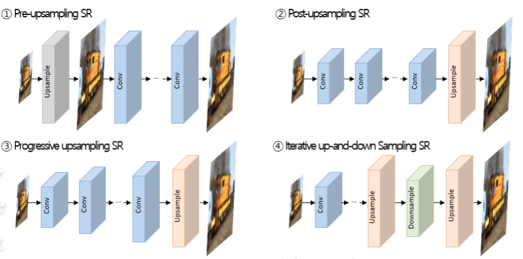

# Image super Resolution
이 논문을 살펴보기 전에 간단한 개요를 살펴보자.
https://www.youtube.com/watch?v=unf2ziKXBP4
강의를 참고하였다.

## introduction
SR = Super-Resolution(초고해상도) -> 여기서는 주로 모델로 생성된 image를 의미

HR = High-Resolution(고해상도) -> 주로 Output image를 의미

LR = Low-Resolution(저해상도) -> 주로 input image를 의미

Image Super-Resolution
- image Super-Resolution은 저해상도 이미지를 고해상도로 변환시키는 문제를 의미함
- image Super-Resolution은 유일한 정답이 존재하지 않는 ill-posed problem이 존재
- 딥러닝 모델을 적용해서 image Super-Resolution 문제를 해결하려는 연구가 다수 진행되고 있음.
    
- 크게 Supervised learning 방식과 GAN을 활용해 고해상도 이미지를 생성하는 방식이 있다. 
    

### image Super-Resolution 특징 
- 저해상도 이미지와 고해상도 이미지 크기가 다른 문제를 어떻게 다룰 것인가?
- 어떻게 딥러닝 모델을 적용할 것인가>
- 고해상도 이미지 변환이 잘 되었다는 것을 어떻게 평가할 것인가?

#### 저해상도 이미지 크기를 어떻게 고해상도 이미지 크기로 맞춰 학습할 것인가? 
    
    
    

- Upsampling 방법
- - 인접 픽셀 값을 활용해서 빈 영역을 채우는 interpolation 방법
- - Upsampling이 가능한 Layer를 활용해서 upsampling parameter를 학습하는 방법
    

- Nearest-neighbor interpolation
    

- Bilinear interpolation
    

- Bicubic interpolation
    

- 비교
    

- Transpose Convoluation
- - 저해상도 이미지를 먼저 고해상도 이미지 크기에 맞춰서 확장함
- - 확장한 영역에는 모두 0값으로 채움
- - Transpose Convolution 연산 이후 원하는 Output Data 크기로 만들기 위해 필요한 크기만큼 zero padding을 진행
- - 원하는 Output 크기에 맞는 Convolution Filter 크기 설정 
- - Convolution Filter 내 weight는 모델 학습으로 결정됨
    

- Sub-pixel convolutional layer
    

    

    

    

####  어떻게 딥러닝 모델을 적용할 것인가?
일반적인 분류,회귀모델에서 사용하는 방법론이 사용가능 
  

  

  

  

- Loss function in image Super-Resolution
  

#### 고해상도 이미지 변환이 잘 되었다는 것을 어떻게 평가할 것인가?
PSNR, SSIM을 중심으로 고해상도 이미지 변환이 잘되었음을 평가  

PSNR
  
- 원본 이미지 픽셀값과 예측 이미지 픽셀값이 같게 되면 MSE=0이 되어 최댓값을 알 수 없다. 
- 모통 PSNR이 40이 넘어가면 잘 복원되었다고 평가함.
- PSNR은 원본 이미지 대비 손실된 품질의 정도를 알 수 있음
- 하지만 원본 이미지에 따라 PSNR값이 유사하더라도 화질의 차이가 있을 수 있음.  
- 이를 보안하기 위해 SSIM 방법이 나옴.
  

SSIM
  

#### image Super Resolution 모델 정리 
  

#### Image Super-Resolution using Deep Convolutional Networks(SRCNN)
  

  

  

#### Second-order Attention Network for Single Image Super-Resolution(SAN)
- 2019년 CVPR에서 발표
  

  

  
 
  

  

  

  

# Conclusion
  

