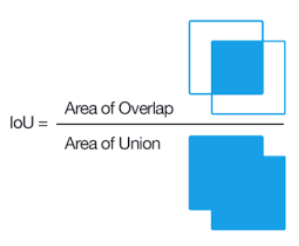

# Fully Convolutional Networks for Semantic Segmentation 리뷰 

## Abstract
- convolutational networks은 hierarchies of features을 추출해내는 시각 모델로 인정을 받고 있다.
- 이미 다른 시각 task(classification, object detection)에서 사용하고 있는 CNN을 segmentation task에 적용할 것인데 이때 end-to-end, pixels-to-pixels로 training한다. 
- 이 논문의 핵심은 segmentation에 fully convolutional network을 적용시키는 것이고 이를 위해 임의의 input size가 들어왔을 때 그와 일치하는 output을 이끌어내야 한다.
- 이 논문은 새로운 architecture을 만든다기 보다는 classification networks model을 사용할 것이고 segmentation task의 fine-tuning을 옮겨 줄 것이다.
- 이 논문에서는 얖은 단에서 나오는 coarse layer 정보와 보다 정확한 segmentation의 정보를 가지고 있는 fine layer를 결합할 것이다.

## Introduction
- Convolutational network는 다양한 인식 분야에서 사용되고 있다.(classification, object detection)
- 이 논문에서는 CNN을 every pixel 값을 예상하도록 설계할 것이다. 
- 이 논문이 하고자한 것을 정리한 문장 
- - We show that a fully convolutional network (FCN) trained end-to-end, pixels-to-pixels on semantic segmentation exceeds the state-of-the-art without further machinery.
- 이 논문은 end-to-end for pixelwise prediction 과 supervised pre-training으로 학습한 첫 논문이라는 것에 의의가 있다.
- Both learning and inference are performed whole-image-at-a-time by dense feedforward computation and backpropagation.
- In-network upsampling layers enable pixelwise prediction and learning in nets with subsampled pooling.
- Our approach does not make use of pre- and post-processing complications.
- Our model transfers recent success in classification to dense prediction by reinterpreting classification nets as fully convolutional and fine-tuning from their learned representations.
- global information은 what을 담당하고 local information은 where을 담당한다. 
- We define a skip architecture to take advantage of this feature spectrum that combines deep, coarse, semantic information and shallow, fine, appearance information.

## Fully convolutional networks
- Each layer of data in a convnet is a three-dimensional array of size h × w × d, where h and w are spatial dimensions, and d is the feature or channel dimension. 
- receptive fields :  출력 레이어의 뉴런 하나에 영향을 미치는 입력 뉴런들의 공간 크기
     
$ y_{ij} = f_{ks}(\{x_{si+\delta i , sj + \delta j} \}_{0 \leq \delta i , \delta j \leq k} ) $  
- 위의 식에서  
k : the kernel size  
s : the stride or subsampling factor  
$ f_{ks} $ : the layer type : e.g. convolutation, pooling, activation function  
$$ f_{ks} \circ  g_{k's'} = (f \circ  g)_{k'+(k-1)s',ss'}$$ 

- While a general deep net computes a general nonlinear function, a net with only layers of this form computes a nonlinear filter, which we call a deep filter or fully convolutional network.
- An FCN naturally operates on an input of any size, and produces an output of corresponding (possibly resampled) spatial dimensions.
- If the loss function is a sum over the spatial dimensions of the final layer, $ l(x; \theta) = \Sigma_{ij}l'(x_{ij}; \theta) $, its gradient will be a sum over the gradients of each of its spatial components.
- When these receptive fields overlap significantly, both feedforward computation and backpropagation are much more efficient when computed layer-by-layer over an entire image instead of independently patch-by-patch.
- CNNd은 입력 이미지에서 layer(convolution, pooling, activation function)를 통과시키더라도 위치 정보가 불변하다. 이를 translation invariant라고 말합니다. 단지 receptive fields에 해당하는 feature map들의 영역만 영향을 받게된다.

### Adapting classifiers for dense prediction
- 일반적으로 LeNet고 AlexNet같은 recognition nets은 non-spatial output을 만든다.(classification의 output은 각 class의 확률 값이다.)
- 그도 그럴것이 마지막 단이 fully connected layer로써 dimension이 고정되어 있고 vectorized을 진행할 때 공간적인 정보를 잃기 때문이다. 
- 그래서 connected 대신 convolutational을 고려해서 input region전체를 cover하도록 만들어보자.
- While our reinterpretation of classification nets as fully convolutional yields output maps for inputs of any size, the output dimensions are typically reduced by subsampling.

### Shift - and - stitch is filter rarefaction
여기에 나오는 개념을 바로 사용하지는 않을 것이지만 여기서 insight를 얻어서 수정할 것이다.  
https://stackoverflow.com/questions/40690951/how-does-shift-and-stitch-in-a-fully-convolutional-network-work  
위의 사이트에 설명이 나와있다. 
- Dense predictions can be obtained from coarse outputs by stitching together output from shifted versions of the input.
- If the output is downsampled by a factor of f, shift the input x pixels to the right and y pixels down, once for every (x, y) s.t. 0 ≤ x, y < f.
- 즉, 5 x 5 input size image가 있을 때 output image size는 3x3이라고 하면 resolution이 낮을수 밖에 없다. 그러므로 upsampling을 진행해야 하는데 특히 semantic segmentation의 경우에는 input과 output size가 같아야한다.
- 이를 위해 upsampling을 진행할 때 output을 그대로 upsampling하면 정확도가 떨어지게 될것이다. 
- 이를 보안하기 위해 여러개의 출력이미지를 결합해서 사용하자는 철학이 shift-and-stitch이다. 
     
- 위의 그림을 설명하자면 빨간색은 2x2 max pooling을 진행하는데 stride를 2로 준것이다.
- 노란색은 같은 2x2 maxpooling을 진행하는데 stride를 2로 주지만 입력행렬의 형태가 빨간색과는 다르다. 여기서 회색부분은 입력 이미지를 왼쪽으로 1 pixel만큼 이동했기 때문에 가장 오른쪽 픽셀 영역은 필요없는 정보임을 보여주기 위해 색칠하지 않았다. 
- 초록색 파란색도 진행해준다.
- 그런다음 하나로 합친다. 
- 이 알고리즘은 계산량이 높아서 계산량을 줄이기 위해서 이 논문에서는 upsampling을 위해서 trick을 설명하였다. 
- s : stride
- $f_{ij}$ : convolution layer 의 filter weights.
- 다음 layer의 필터의 가중치를 만약 s가 i,j를 나눌 수 있다면 $f'_{ij} = f_{i/s,j/s}$ 로 채우고 나누지 못한다면 0으로 채운다.
-  shift-and-stitch와 다른 점은 max pooling을 사용하지 않고 학습가능한 가중치로 필터를 채운다는 점이다.
- 근데 이것보다 skip connection이 더 효율적이라서 사용하지 않음.

### Upsampling is backwards strided convolution
upsampling을 위해 deconvolution은 사용할 것이다.
- upsampling은 interpolation 방법도 있다. 
- Transposed convolution 
- - upsampling is performed in-network for end-to-end learning by backpropagation from the pixelwise loss

### Patchwise training is loss sampling
we consider training by patchwise sampling and give evidence in Section 4.3 that our whole image train ing is faster and equally effective.
- Both patchwise train ing and fully convolutional training can be made to pro duce any distribution, although their relative computational efficiency depends on overlap and minibatch size.
- Whole image fully convolutional training is identical to patchwise training where each batch consists of all the receptive fields of the units below the loss for an image (or collection of images).
- If the kept patches still have significant overlap, fully convolutional computation will still speed up training. 
- Sampling in patchwise training can correct class imbalance [27, 7, 2] and mitigate the spatial correlation of dense patches [28, 15]. In fully convolutional training, class bal ance can also be achieved by weighting the loss, and loss sampling can be used to address spatial correlation.
- 결론 :  Whole image training is effective and efficient.

## Segmentation Architecture
- We cast ILSVRC classifiers into FCNs and augment them for dense prediction with in-network upsampling and
a pixelwise loss.
- 1. We train for segmentation by fine-tuning.
- 2. we add skips between layers to fuse coarse, semantic and local, appearance information.
- skip connection은 end-to-end로 학습하게 된다.
- 사용한 데이터 셋은 PASCAL VOC 2011 segmentation challenge이고 학습을 할 때는 pixel 별 multinomial logistic loss를 사용했다.
     
- - y : true label
- - $h_\theta$ : model
- - x : input data
- 마지막 성능 평가를 위해서 segmentation에서 대표적으로 사용되는 mean pixel intersection over union을 사용했는데 줄여서 IoU라고 하기도 한다.
     

### From classifier to dense FCN
- 기존의 classification model 중에 VGG16가 classifier만 FCN으로 바꾸었을 때 가장 효과가 좋았다. 다만 parameter이 많아 실행시간이 길다.   
      
- We append a 1 × 1 convolution with channel dimension 21 to predict scores for each of the PASCAL classes (including background) at each of the coarse output locations, followed by a deconvolution layer to bilinearly upsample the coarse outputs to pixel-dense outputs as described.

### Combining what and where
- While fully convolutionalized classifiers can be fine-tuned to segmentation as shown in 4.1, and even score highly on the standard metric, their output is dissatisfyingly coarse (see Figure 4).
      
- 마지막 layer에서 바로 upsampling하는 것이 output 결과가 불만족스러운 것에 이유가 되는 것 같아서 skip connection을 사용해주었다. 
- We address this by adding skips [1] that combine the final prediction layer with lower layers with finer strides.  
      
- 결과는 아래와 같다.
      
- skip connection을 어디에서 했는 지에 따라서 성능이 어떻게 차이가 나는 지 보여준다. 실제로 위에서 언급했듯이 fine layer에는 입력 이미지의 세세한 정보가 많이 담겨있어 convolution layer를 진행하면서 조금씩 손실되는 이미지의 정보를 skip connection을 통해서 손실을 막아주는 역할을 한다. 따라서 FCN-16보다 FCN-8이 더 좋은 성능을 보이는 이유는 더 얕은 layer에서 skip connection을 주었기 때문에 더 디테일한 이미지의 정보를 얻을 수 있었기 때문이라고 해석할 수 있을 것 같습니다.

## Conclusion
Fully convolutional networks are a rich class of mod els, of which modern classification convnets are a spe cial case. Recognizing this, extending these classification nets to segmentation, and improving the architecture with multi-resolution layer combinations dramatically improves the state-of-the-art, while simultaneously simplifying and speeding up learning and inference
