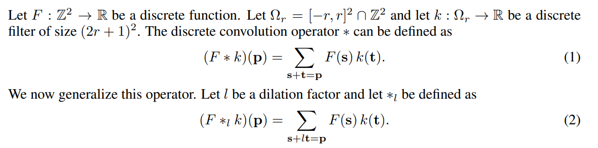
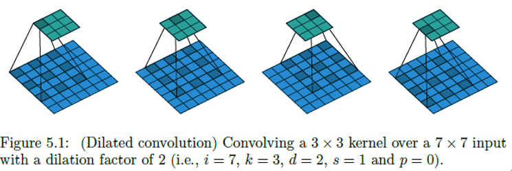
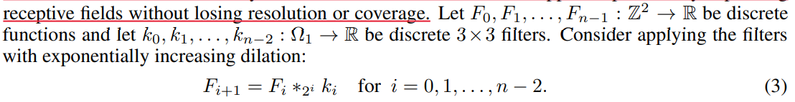
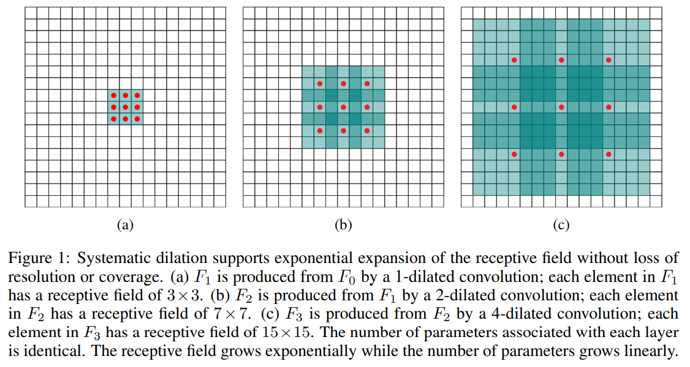
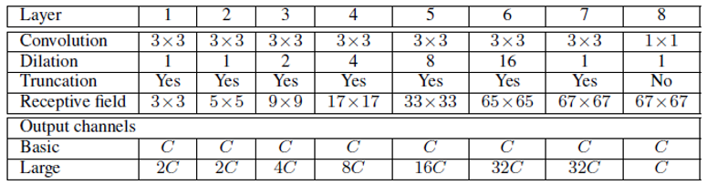
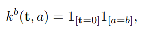
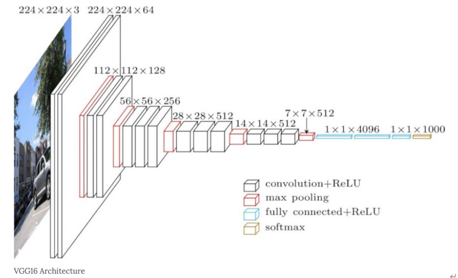
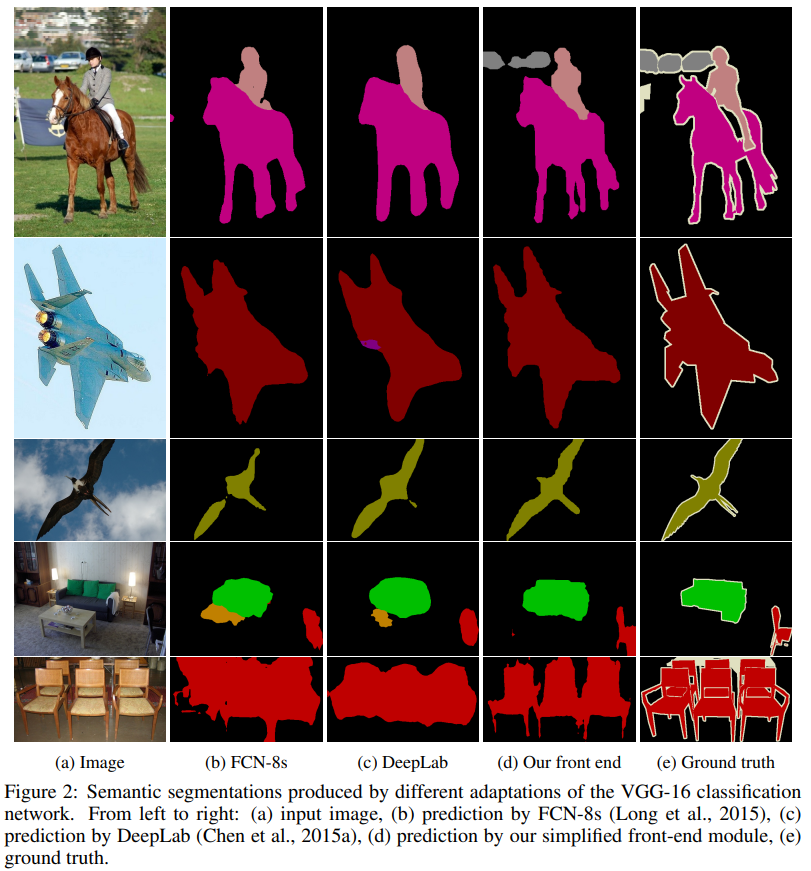
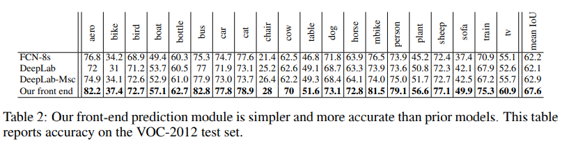
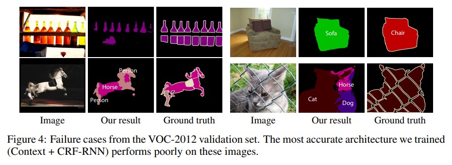

# MULTI-SCALE CONTEXT AGGREGATION BY DILATED CONVOLUTIONS

## Abstract
- CNN을 기반으로 한 classification model을 task의 차이가 있지만 semantic segmentation에서도 사용하였다.
-  In this work, we develop a new convolutional network module that is specifically designed for dense prediction.
- new module은 dilated convolution을 사용한다. dilated convolution이란 resolution 감소 없이 multi-scale contextual information을 결합하는 방법론이다.
-  dilated convolutions support exponential expansion of the receptive field without loss of resolution or coverage.
- 이 논문에서는 dilated convolution을 정의하고 이게 정확도를 증가하는데 사용된다는 것을 밝힌다. 
- 일종의 network 경향화 기법이다.

## Introduction
- The dense prediction goal is to compute a discrete or continuous label for each pixel in the image.
- CNN을 사용한 semantic segmentation model의 정확도가 기존의 기술보다 뛰어나다.
-  This prompts new questions motivated by the structural differences between image classification and dense prediction.
- 즉 기존에는 classification model을 사용해서 정확도를 높게 얻었지만 사실은 dense prediction과는 차이가 있다.
- Which aspects of the repurposed networks are truly necessary and which reduce accuracy when operated densely? Can dedicated modules designed specifically for dense prediction improve accuracy further?
- 1)	재구성된 CNN model의 어떤 측면들이 필요하고 불필요한지 ? 즉, accuracy에 영향을 준 부분들이 어디인지 ?
- 2)	Dense prediction만을 위한 model을 설계할 수는 없는 것인지 ?
- dense prediction calls for multiscale contextual reasoning in combination with full-resolution output.
- - dense prediction에서는 full-resolution output을 얻는 것과 multi-scale contextual reasoning을 동시에 필요로 한다.
- In this work, we develop a convolutional network module that aggregates multi-scale contextual information without losing resolution or analyzing rescaled images.
- The module can be plugged into existing architectures at any resolution.
- -	임의의 해상도에서, 기존 architecture에 연결될 수 있다.
- It is a rectangular prism of convolutional layers, with no pooling or subsampling.
- - Pooling과 subsampling 없이, convolutional layer로 구성된 rectangular 구조이다.
- The module is based on dilated convolutions, which support exponential expansion of the receptive field without loss of resolution or coverage.
- - Dilated convolution을 기반으로 설계되었으며, 이는 loss of resolution or coverage 없이 receptive field를 확장시킨다.  

학습을 진행하면서 사용하는 다양한 technique(structured prediction, multi-column architectures, multiple training datasets)들을 사용할 경우, core prediction module의 performance에 영향을 준다. 따라서 deep image classification networks를 제한된 setting 내에서 실험을 진행하고, performance에 부정적인 영향을 주는 요소들을 제거하는 방향으로 새로운 model을 설계하였다. 

## DILATED Convolutions
$ F : Z^2 \rightarrow R $ : discrete function
     
- (2)번 식을 l-dilated convolution 연산이라고 부르며, 따라서 일반적인 conv. 연산은 1-dilatated convolution.로 볼 수 있다.
- dilatated convolution이란 아래처럼 3x3 filter이 간격을 둔것을 의미한다.  
     
- The dilated convolution operator can apply the same filter at different ranges using different dilation factors.
- we develop a new convolutional network architecture that systematically uses dilated convolutions for multi-scale context aggregation.
- 이 논문의 저자들은 multi-scale context aggregation을 위하여 dilated conv.를 사용하였다고 말하며, 이를 사용한 이유는 dilated conv.가 resolution이나 converge의 손실 없이 receptive field를 기하급수적으로 확장할 수 있기 때문이라고 이야기한다.
     
     
- The receptive field is a square of exponentially increasing size
- 위의 그림은 3번의 dilated conv.를 순차적으로 진행했을 때 receptive filed가 어떻게 변화하는지 나타낸 것이다. 첫번째의 dilated factor는 1(general conv.), 두번째는 2, 세번째는 4이다. 따라서 그림의 빨간색 점이 있는 위치에만 kernel의 parameter가 존재하는 상태이다.

## MULTI-SCALE CONTEXT AGGREGATION
- The context module is designed to increase the performance of dense prediction architectures by
aggregating multi-scale contextual information.
- Context module은 multi-scale contextual information을 종합하여 dense prediction architecture의 performance를 향상시키기 위해 설계되었다. Input과 output의 채널 수가 동일하기 때문에 이미 설계되어 있는 다른 architecture와 연결하여 사용할 수 있다.
- 저자들은 context module을 총 2개의 form으로 설계하였다. 첫번째는 basic, 두번째는 large form으로 두 module의 구조의 차이는 아래 table에서 확인할 수 있다.
     
- Basic form의 context module은 다음과 같은 특징을 가진다.
- -	7 layers with kernel size of 3 by 3 and they have different dilation factors.
- -	Dilations are 1, 1, 2, 4, 8, 16, and 1.
- -	모든 layer의 channel 수는 C로 동일하며, activation도 모두 ReLU 사용
- -	Front-end module로부터 64 by 64의 입력을 받으므로 6번째 layer 이후로는 receptive field가 증가하지 않도록 설계하였다.
- we found that random initialization schemes were not effective for the context module. We found an
alternative initialization with clear semantics to be much more effective  
- 하지만 초기에 설계한 구조는 문제점을 나타내었는데, 이는 확인해본 결과 initialization에서 발생한 것으로 확인하였다. CNN의 일반적인 initialization은 random distributions을 이용하지만, 이는 context module에는 효과적이지 못하다고 판단하였고, 따라서 identity initialization 기법을 사용하였다.

       

- a is the index of the input feature map, b is the index of the output map
- Identity initialization은 각 layer들이 input과 동일하게 output을 출력하도록 filter를 세팅하는 것이다. 여기서 문제점은 이 initialization 방법이 model의 성능을 저하시킬 수 있다는 점이지만, 저자들은 실험을 통해 입증하였다고 주장한다. 
- Context module의 두번째 form은 large form으로써, basic form에서 layer가 깊어질수록 channel의 수를 증가하게 설계한 module이다. Channel의 수는 2C, 2C, 4C, 8C, 16C, 32C, 32C, C 순으로 설정하였다.

## Front-End prediction Module
- 3 channel input -> 21 channel output
- VGG-16 model을 수정하여 이 module을 설계하였는데, 수정한 부분은 다음과 같다.
       

- -	마지막 2개 pooling과 striding layer를 제거
- -	제거된 pooling layer의 뒷부분의 모든 conv. layer는 2-dilated 로 진행
- -	마지막 layer의 conv. 연산은 4-dilated conv.로 진행
- -	Reflection padded image을 사용.
- The front-end module takes padded images as input and produces feature
maps at resolution 64×64. 
- We use reflection padding: the buffer zone is filled by reflecting the
image about each edge.
- This enables initialization with the parameters of the original classification network, but produces
higher-resolution output.
-  The front-end module takes padded images as input and produces feature
maps at resolution 64×64.

       

       

- Our front-end prediction module is both simpler and more accurate than the prior models.

## Experiments
- Our front-end prediction module is both simpler and more accurate than the prior models.
- we believe that high-resolution operation throughout the network is both feasible and desirable.
-  Our work shows that the dilated convolution operator is particularly
suited to dense prediction due to its ability to expand the receptive field without losing resolution
or coverage.
- 아래 그림은 앞으로 연구가 해결해나갈 이 논문의 network 문제를 서술하고 있다.
       
