# You Only Look Once : Unified, Real-Time Object Detection 
https://www.youtube.com/watch?v=O78V3kwBRBk
## Basic concept 
### what is objection Detection
classification과 localization을 함께하는 것을 object detection이라고 한다.
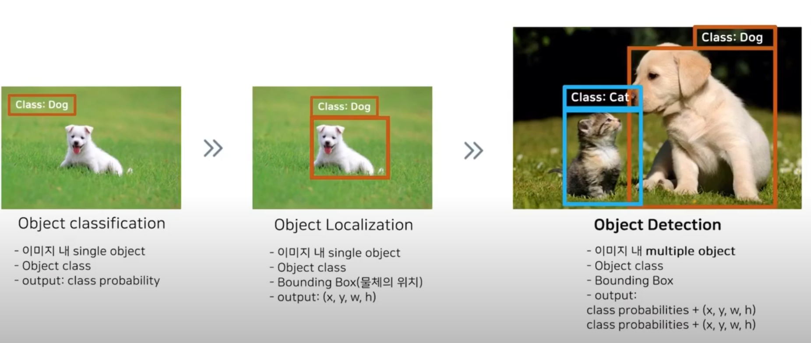  

### one-stage detector vs two-stage detector
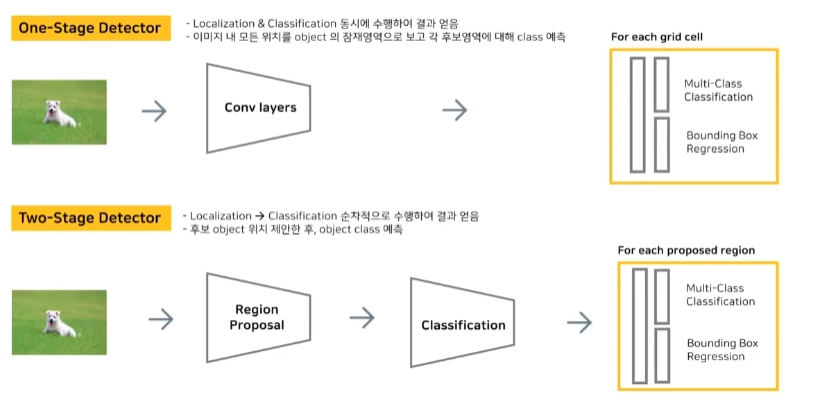  
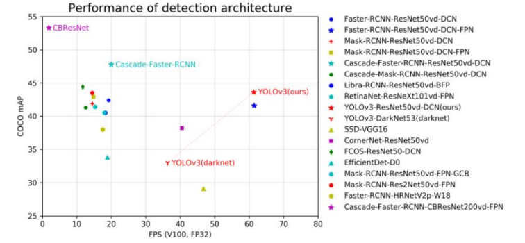  

### YOLO 흐름
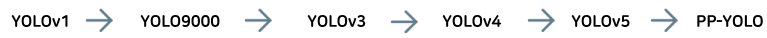  

### object detection 발전 과정
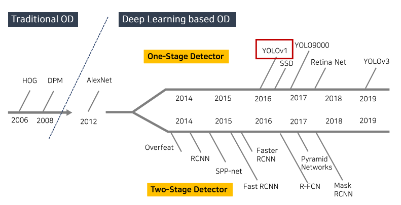  

### YOLO 논문의 뜻 
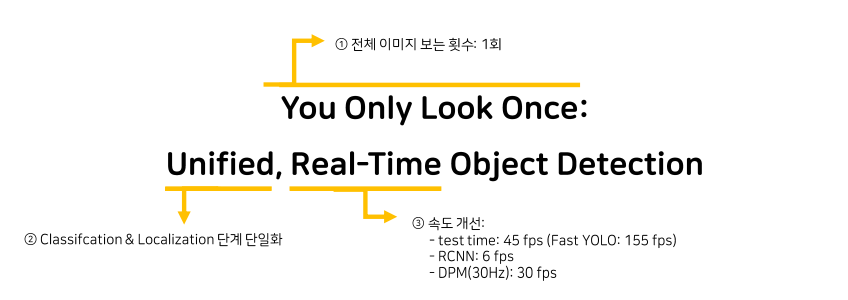  

## Abstract
- Prior work on object detection repurposes classifiers to per form detection. Instead, we frame object detection as a re gression problem to spatially separated bounding boxes and associated class probabilities.
- - Object detection 문제를 regression 문제로 관점을 전환했다.
- A single neural network predicts bounding boxes and class probabilities directly from full images in one evaluation.
- - 한 번의 평가만으로 전체 이미지의 bounding box와 class probabilities를 예상함
- - Object Detection task 중에서도 one stage detection 방법이다. 
- Unified Architecture : 하나의 신경망으로 classification과 localization을 예측함
- DPM과 RCNN보다 속도를 확연히 개선(real time 가능)

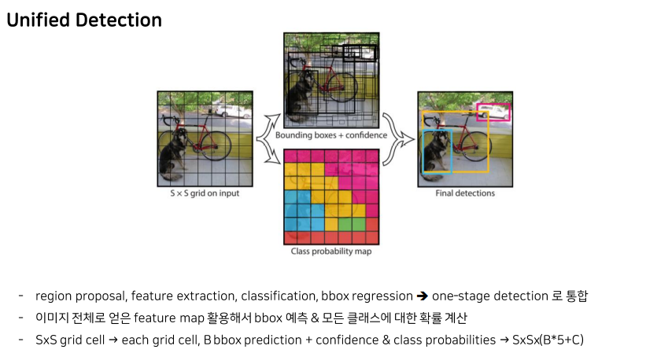    

- bound box regression과 class probability를 병렬적으로 수행
- YOLO는 localization errors 은 많이 발생하지만 background에 있는 false positives를 예측하는 것은 더 작다. 
- Compared to state-of-the-art detection systems, YOLO
makes more localization errors but is less likely to predict
false positives on background.
- 여러 도메인에서 object detection 가능
- - YOLO learns very general representations of objects. 

## introduction
- Fast, accurate algorithms for object detection would allow computers to drive cars without specialized sensors, enable assistive devices to convey real-time scene information to human users, and unlock the potential for general purpose, responsive robotic systems
- - 따라서 만약 빠르고 정확한 algorithm을 설계할 수 있다면, 이 algorithm은 특별한 센서 없이 컴퓨터가 차를 주행할 수 있거나, 실시간으로 장면 분석하여 정보를 사람에게 전달해주는 보조 장치에 사용할 수 있을 것이다.
- - 특히 sliding widow를 이용하여 구현한 Deformable Parts Models(DPM)이 있다.

- 현재의 object detection system은 classification model를 변형한 것이다.
- R-CNN의 경우 region proposal method를 사용하며, 총 3가지의 단계를 거쳐 object를 detect한다. 
- - 첫번째로, image에서 potential bounding boxes를 생성한 후 
- - 이 boxes에서 classifier를 실행한다. 
- - 그 이후에는, post-processing을 거쳐 boxes를 제거하거나 합치면서 개선한다. 
- 이렇게 R-CNN은 region proposal / classification / box regression 총 3단계를 지니기에 이렇게 복잡한 pipeline은 속도가 느리며, 각각의 component별로 training을 진행해야 하기 때문에 optimize하기 힘들다.  

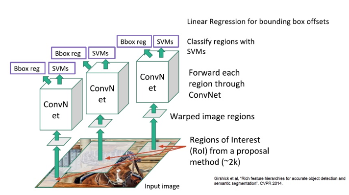    
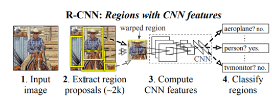    

- 따라서 저자들은 object detection을 single regression problem으로 관점을 전환하여, image pixels에서 bounding box coordinate와 class를 예측하는 network를 설계하였다.  

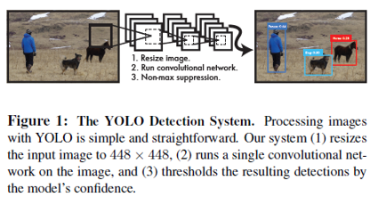    

- YOLO의 장점
- - First, YOLO is extremely fast.
- - * Our base network runs at 45
frames per second with no batch processing on a Titan X GPU and a fast version runs at more than 150 fps.
- - * Furthermore, YOLO achieves more than twice the mean average precision of other real-time systems
- - Second, YOLO reasons globally about the image when making predictions.
- - * YOLO는 전체 이미지를 봐서 image의 문맥 정보(class and appearance)를 encode할 수 있다. 또한 detection model 중에서 Fast-RCNN은 큰 context를 보지 않기 때문에 background 를 잘못 detection하는 경우가 많은데 YOLO는 background error를 Fast-RCNN과 비교해서 1/2배로 줄였다.
- - Third, YOLO learns generalizable representations of objects. 
- - * 새로운 domain(natural image and artwork) 이나 unexpected inputs에 적용될 때 성능이 극단적으로 떨어지지 않는다

- YOLO의 단점
- - YOLO still lags behind state-of-the-art detection systems in accuracy
- - While it can quickly identify objects in images it struggles to precisely localize some objects, especially small ones. 

- detection model은 정확도와 속도간의 tradeoff가 있다.

## Unified Detection
- 기존의 two stage detector을 one stage detector로 통합하여 end-to-end training이 가능할 뿐만 아니라 realtime speed를 달성 할 수 있다.
- Our system divides the input image into an S × S grid.
- Each grid cell predicts B bounding boxes and confidence scores for those boxes.
- - These confidence scores reflect how confident the model is that the box contains an object and
also how accurate it thinks the box is that it predicts.
- - confidence score = $Pr(Object) \times IOU_{pred}^{truth}$
- - If no object exists in that cell, the confidence scores should be zero.
- Each bounding box consists of 5 predictions: x, y, w, h,and confidence.
- - The (x, y) coordinates represent the center of the box relative to the bounds of the grid cell.
- - The width and height are predicted relative to the whole image.
- - the confidence prediction represents the IOU between the predicted box and any ground truth box.
- Each grid cell also predicts C conditional class probabilities, $Pr(Class_i|Object)$.
- - 이는 box의 개수인 B에 관계없이 grid cell 당 하나의 class probabilities set을 예측하며, 결론적으로 YOLO는 $S \times S \times (B \times 5 + C)$ tensor를 예측하게 된다.
- At test time we multiply the conditional class probabilities and the individual box confidence predictions,
which gives us class-specific confidence scores for each box.

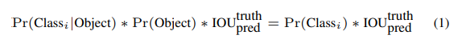    

### Network Design
- The initial convolutional layers of the network extract features from the image while the fully connected layers predict the output probabilities and coordinates.

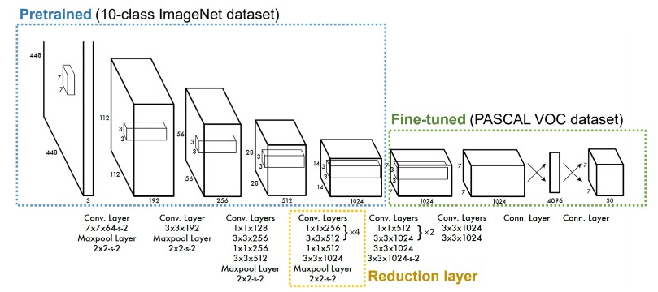    

- GoogLeNet의 구조를 기반으로 해서 24개의 convolution layers와 2개의 fully connected layers로 YOLO를 구성하였다.
- GoogLeNet의 inception module과는 달리 3 by 3 convolution layer의 앞부분에 1 by 1 reduction layer를 사용하여 계산량을 줄었다.
- 또한 저자들은 더 빠른 object detection을 위하여 YOLO의 fast version도 설계하였는데, 이는 더 적은 convolution layer와 layer 내에서 더 적은 filter를 사용한다. 

### Training 
- 처음 20개의 convolution layer는 1000-class ImageNet dataset으로 pretraining 시켰다.
- we add four convolutional layers and two fully connected layers with randomly initialized weights.
- Detection often requires fine-grained visual information so we increase the input resolution of the network from 224 × 224 to 448 × 448
- We normalize the bounding box width and height by the image width and height so that they fall between 0 and 1.
- We use a linear activation function for the final layer and all other layers use the following leaky rectified linear activation  (leaky ReLU)  
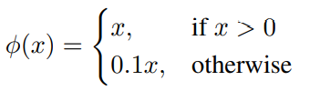    

- sum-squared error을 사용하였다. -> 약간의 문제 때문에 loss function을 가중치를 두어 재정의 하였다.
- - 저자들은 loss function으로 sum-squared error를 채택하였지만, 일반적인 sum-squared error loss가 그들의 목표인 maximizing average precision으로 이끌지는 못한다.
- - 그 이유는 localization error와 classification error에 대해 동일한 가중을 두는 것은 적절하지 못하기 때문이다. 또한, background patch에 속하는 grid cell의 경우 object를 포함하고 있지 않기 때문에 해당 cell의 confidence score가 -0이 되도록 학습할 것이다. 따라서 이는 object를 포함하고 있는 cell의 gradient를 overpowering하게 만들며, model이 불안정하지는 결과를 낳게 된다. 
- - 따라서 이를 해결하기 위해서 저자들은 bounding box coordinate prediction의 loss와 object를 포함하고 있지 않은 cell의 confidence prediction의 loss에 대해 가중치를 다르게 두었다.

- 또한 sum-squared error같은 경우에는 large box와 small box의 error 가중치가 동일하다.
- - Our error metric should reflect that small deviations in large boxes matter less than in small boxes.
- - bounding box width와 hight에 square root를 취해주었다.
- YOLO는 multiple bounding box를 한 cell당 예상하는데 train 단계에서는 더 responsible한 box한 개면 충분하다. 그래서 더 높은 current IOU만을 남긴다. 

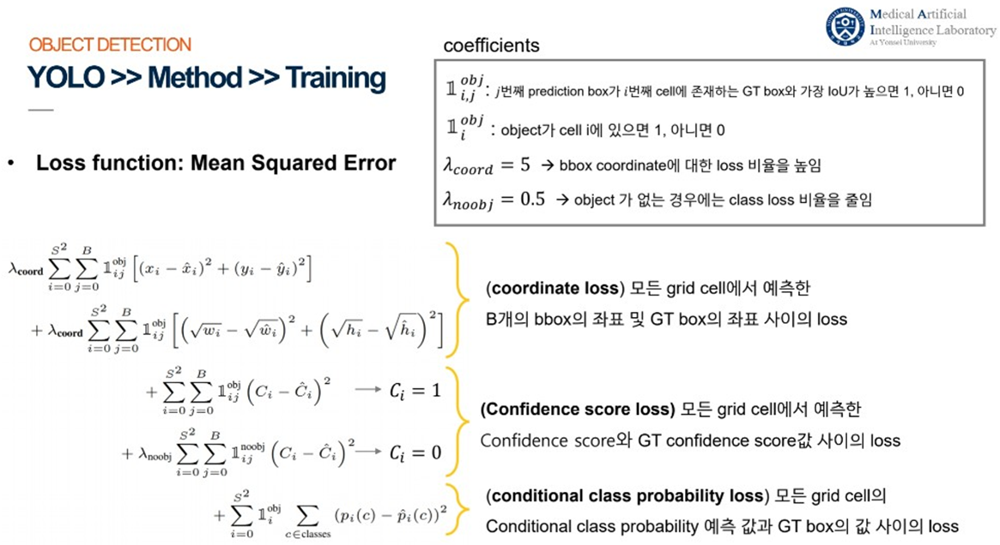    

- $1^{obj}_i$ 은 i번째 cell에 object가 있는지를 나타낸다. $1^{obj}_{ij}$ 는 i cell에서 j번째 bounding box predictor가 현재 prediction에서 responsible한지를 나타낸다.
- Note that the loss function only penalizes classification error if an object is present in that grid cell (hence the conditional class probability discussed earlier). It also only penalizes bounding box coordinate error if that predictor is “responsible” for the ground truth box (i.e. has the highest IOU of any predictor in that grid cell).
- Throughout training we use a batch size of 64, a momentum of 0.9 and a decay of 0.0005.
- learning rate schedule도 진행하였다.
- To avoid overfitting we use dropout and extensive data augmentation.

### Inference
- YOLO의 grid design은 한 가지 단점이 존재하는데, 그것은 하나의 object를 여러 grid cell이 동시에 검출할 수 있다는 점이다. Object의 크기가 크거나 grid cell 경계에 인접하여 위치한 경우, 그 object에 대한 bounding box가 여러 개 생길 수 있다. 이런 경우를 multiple detection이라고 부르며, 이를 위해 저자들은 non-maximal supperession을 통해 개선하였다. 이 method는 confidence가 가장 높은 bounding box와 다른 box들과의 IOU를 측정하여, 일정 값 이상인 box들은 동일한 object를 검출하였다고 판단하고, 이 box들을 제거한다. 이를 통해 YOLO는 mAP를 더향상시킬 수 있었다.

### Limitations of YOLO
- 이 section에서는 저자들이 grid design을 사용한 YOLO를 설계하면서 speed 측면에서는 타 network보다 더 좋은 성능을 이끌어낼 수 있었음에도 불구하고, 그들의 network가 가진 3가지의 명확한 한계점을 제시한다.
- 첫번째는 한 cell에 작은 object가 그룹으로 위치해있는 경우에 대해서는 잘 검출하지 못한다는 점이다. Flocks of birds(새떼)의 경우에 대해 명확하게 이를 확인할 수 있는데, 이는 YOLO가 각 grid cell에 대해 2개의 box들과 하나의 class만을 예측할 수 있도록 설계되었기 때문이다.
- 두번째는 YOLO는 new or unusual aspect ratios or configurations에 대해 robust하지 못하다는 점이다. YOLO는 grid cell에서 하나의 object에 대해 여러 개의 box들이 발생할 수 있으며, 그 중 ground truth와의 IOU가 가장 높은 box만을 채택한다. 따라서 각 predictor는 특정 size, aspect ratios, 도는 object의 class에 대해서 더 좋은 성능을 나타낸다. 따라서 다양한 값들에 대해서는 좋은 성능을 내기 힘들며, 또한 YOLO가 downsampling을 통해 생겨난 relatively coarse features를 사용한다는 점도 이에 영향을 준다.
- 마지막으로 loss function에서 box의 size에 따라 loss에 미치는 기여도의 차이를 고려하지 않았다는 점이다. 이러한 점들도 분명하게 model의 performance에 영향을 준다.

## Comparison to Other Detection Systems
- Detection pipelines generally start by extracting a set of
robust features from input images.
- Deformable parts models : DPM은 슬라이딩 윈도우 방식인데 정적 feature 추출, region 분류, 고득점 region에 대한 bbox 예측 등을 하기 위해 분리된 파이프라인을 사용한다.
-  Our unified architecture leads to a faster, more accurate model than DPM
- RCNN - R-CNN and its variants use region proposals instead of sliding windows to find objects in images.
- Selective Search generates potential bounding boxes, a convolu tional network extracts features, an SVM scores the boxes, a linear model adjusts the bounding boxes, and non-max sup pression eliminates duplicate detections.
- RCNN과 YOLO의 공통점 : Each grid
cell proposes potential bounding boxes and scores those
boxes using convolutional features.
- RCNN과 YOLO의 차이점 : However, our system
puts spatial constraints on the grid cell proposals which
helps mitigate multiple detections of the same object.
- - Our
system also proposes far fewer bounding boxes, only 98
per image compared to about 2000 from Selective Search.
- - Finally, our system combines these individual components
into a single, jointly optimized model

- Both YOLO and MultiBox use a
convolutional network to predict bounding boxes in an image but YOLO is a complete detection system.

## Experiments 
저자들은 YOLO를 이용한 5가지의 실험 결과를 제시하였다.
### Comparison to Other Real-Time Systems
다른 real-time systems과의 비교를 통해서 YOLO가 준수한 mAP를 가지면서 real-time에 사용 가능한 network임을 입증하였다. DPM의 경우 FPS 설정을 통하여 실시간으로 사용이 가능하지만 mAP가 매우 낮게 나타났으며, R-CNN은 반대로 mAP는 가장 좋게 나타났지만 FPS가 매우 낮게 나타나 실시간으로 사용이 불가능하다는 것을 같이 확인할 수 있다.
- Many research efforts in object detection focus on making standard detection pipelines fast
- Fast YOLO is the fastest object detection method on PASCAL; as far as we know, it is the fastest extant object detector.  
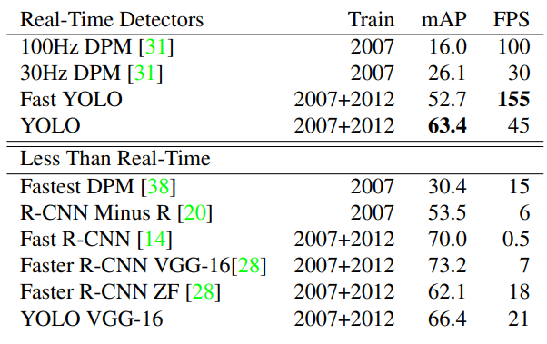    

- Fast R-CNN speeds up the classification stage of R-CNN but it still relies on selective search which can take around 2 seconds per image to generate bounding box proposals.
### VOC 2007 Error Analysis
PASCAL VOC 2007 dataset을 이용하여 YOLO와 Fast R-CNN의 성능을 비교하였으며, class의 유사도와 IOU를 기준으로 총 5가지의 case를 분류하여 성능을 세부적으로 분석하였다. 그 결과는 Figure 4를 통해 확인할 수 있다.
- Correct: correct class and IOU > .5
- Localization: correct class, .1 < IOU < .5
- Similar: class is similar, IOU > .1
- Other: class is wrong, IOU > .1
- Background: IOU < .1 for any object  
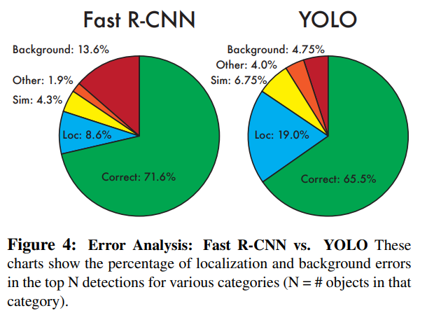    
Figure 4를 살펴보면, YOLO는 localization error가 가장 크게 나타났으며, Fast R-CNN은 background error가 가장 크게 나타난 것을 확인할 수 있다. 따라서 YOLO는 물체의 위치를 완벽하게는 찾아내지는 못하지만 유사하게 찾아낸다고 할 수 있고, Fast R-CNN은 더 넓은 context를 확인하지 못하기 때문에 object가 없음에도 있다고 판단하는 false positive error가 높게 나타나는 것을 확인할 수 있다.

### Combining Fast R-CNN and YOLO
이전 실험에서 YOLO와 Fast R-CNN은 서로가 가진 문제점을 보완할 수 있음을 확인할 수 있었다. ensemble technique를 이용한다면 더 좋은 성능을 이끌어낼 수 있는지 확인해보았다. 그 결과 Fast R-CNN보다 ensemble system의 mAP가 3.2%p가 증가하였으며, YOLO보다는 느리긴 하지만 YOLO 자체가 워낙 빠르기에 속도도 충분히 빠른 것을 확인할 수 있었다.
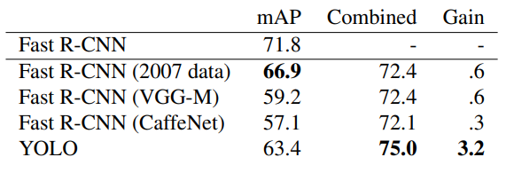    
- The boost from YOLO is not simply a byproduct of model ensembling since there is little benefit from combin ing different versions of Fast R-CNN.

### VOC 2012 Results
 VOC 2012 test set에 대해서도 실험을 진행한 결과 R-CNN + YOLO model이 정확도 측면에서는 가장 좋은 성능을 보였으며, 속도 측면에서는 YOLO만 단독으로 사용하였을 때 가장 높게 나타났다.

### Generalizability : PersonDetection in Artwork
 Object detection에서 training과 test에 사용하는 dataset은 동일한 distribution을 가지도록 설계한다. 하지만 real-world에서는 이러한 상황이 거의 발생하지 않으므로, 저자들은 Picasso Dataset과 People-Art Dataset을 이용하여 artwork에 대해 person detection의 성능이 어떻게 나타나는지 확인하였다. 그 결과 R-CNN은 정확도가 크게 떨어진 것을 확인할 수 있고, DPM은 VOC 2007 dataset에서와 비슷하게 매우 낮은 정확도를 가짐을 확인할 수 있었다. 하지만 YOLO는 정확도가 크게 떨어지지 않았다.
 - R-CNN uses Selective Search for bounding box proposals which is tuned for natural images.
 - Prior work theorizes that DPM performs well because it has strong spatial models of the shape and layout of objects. Though DPM doesn’t degrade as much as R-CNN, it starts from a lower AP
 - YOLO has good performance on VOC 2007 and its AP degrades less than other methods when applied to artwork.
 - Like DPM, YOLO models the size and shape of objects, as well as relationships between objects and where objects commonly appear. 

 ## Real-Time Detection In the world
 - YOLO는 빠르고 정확한 object detection model 이다.
 - While YOLO processes images individually, when attached to a webcam it functions like a tracking system, detecting objects as they move around and change in appearance.

 ## Conclusion
 - 저자들은 YOLO라는 one-stage detector를 제시하여 더 단순하게 설계되고 end-to-end training이 가능한 model을 설계하였다. 결론적으로 YOLO는 높은 정확도를 가지면서 real-time에 사용 가능하였을 뿐만 아니라, 새로운 domain에 대해서도 robust하다는 것을 확인할 수 있었다. 마지막으로 ensemble technique를 이용하여 YOLO와 R-CNN이 가진 문제점을 서로 상호 보완하여 더 좋은 model을 생성할 수 있었다.
 - Fast YOLO is the fastest general-purpose object detec tor in the literature and YOLO pushes the state-of-the-art in real-time object detection. YOLO also generalizes well to new domains making it ideal for applications that rely on fast, robust object detection.
 - YOLO is trained on a loss function that directly corresponds to detection performance and the entire model is trained jointly.