# Grad-CAM: Visual Explanations from Deep Networks via Gradient-based Localization

https://youtu.be/uA5rIr79I0o

## Abstract(Objectives)
- 그래서 이 논문에서는 CNN based models의 decision을 시각화할 수 있는 기술을 제안한다.
- Gradient-weighted Class Activation Mapping (Grad-CAM), uses the gradients of any target concept flowing into the final convolutional layer to produce a coarse localization map highlighting the important regions in the image for predicting the concept.
- Grad-CAM의 장점은 구조적인 제약이 없다는 것이다.
- 이 논문에서 밝히는 장점은 다음과 같다.
- our visualizations
- -  (a) lend insights into failure modes of these models (showing that seemingly unreasonable predictions have reasonable explanations)
- - (b) outperform previous methods on the ILSVRC-15 weakly-supervised localization task
- - (c) are robust to adversarial perturbations
- - (d) are more faithful to the underlying model
- - (e) help achieve model generalization by identifying dataset bias.
- Grad-CAM : Class-discriminative한 localization technique으로, 시각화를 통해 실패한 모델의 진단 또한 가능
- Top-performing classification, captioning, VQA 등 다양한 downstream task에 적용 가능
- Human study를 수행하여 Grad-CAM이 class-discriminative하다는 것을 보일 뿐 아니라, 훈련되지 않은 일반인도 '강한'모델과 '약한'모델을 구분할 수 있음을 보임.  
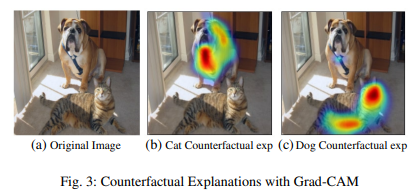    

## instruction
- CNN에 기초한 Deep neural model은 computer vision task에서 놀라운 성과를 거두어 왔으나, 직관적인 성분으로 나눠지기 어렵다는 점 때문에 모델의 해석을 어렵게 만들었다.

### Interoperability matters
- 우리는 투명한 딥러닝 모델을 구축하여야 하는데, 이 뜻은 모델에 예측하는 바가 어떻게 예측되었는지를 알 수 있어야 함을 의미한다. 특히 AI 시대의 3가지 단계 각각에 있어 transparency, 또는 interpretability는 아래와 같은 이유로 중요하다.
- - AI가 인간에 비해 약할 때 : 모델의 실패 원인을 파악하고, 연구의 제대로 된 방향성을 설정하기 위함
- - AI와 인간이 동등할 때 : 모델을 사용하는 사용자로부터 충분한 신뢰성을 얻기 위함
- - AI가 훨씬 강할 때 : machine이 사람을 가르치는 상황(machine-teaching)에서 사람이 더 나은 결정을 내릴 수 있도록 하기 위함.  
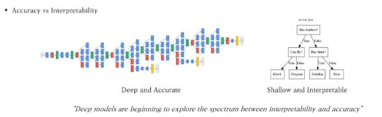    
- Accuracy와 simplicity or interpretablility는 trade off 관계에 있다.
- In essence, CAM trades off model complexity and performance for more transparency into the working of the model. In contrast, we make existing state-of-the-art deep models interpretable without altering their architecture, thus avoiding the interpretability vs. accuracy trade-off.

### What makes a good visual explanation? (feature map을 보여주는 것)
- Class discriminative : 다른 class를 구분할 수 있어야 함
- High-resolution : 충분히 object를 판별할 수 있고 특징을 알아낼 수 있어야 함.
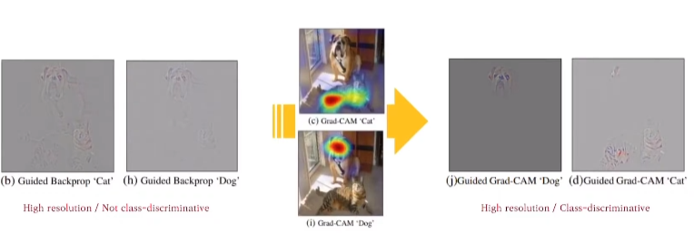    

- 위의 그림이 의미하는 것은 기존의 model(Guided Backpropagation and Deconvolution)의 경우 high resolution output을 얻을 수 있었지만 class-discriminative하지는 않다. 그러나 Grad-CAM의 경우에는 class-discriminative하다.
- 이 두가지 특징을 결합하기 위해서 이 연구자들은 Guided Grad Grad-CAM visualization을 만든다.

### Contribution
- Grad-CAM model 만듦으로써 기존의 CNN model의 구조 제약 없이 model을 분석할 수 있다.
- For image classification, our visualizations lend insight into failures of current CNNs, showing that seemingly unreasonable predictions have reasonable explanations.
- We show a proof-of-concept of how interpretable Grad-CAM visualizations help in diagnosing failure modes by uncovering biases in datasets
- We conduct human studies that show Guided Grad-CAM explanations are class-discriminative and not only help humans establish trust, but also help untrained users successfully discern a ‘stronger’ network from a ‘weaker’ one, even when both make identical predictions.

## Related Works
### Visualizing CNN
- [Deep inside convolutional networks,2013] 등과 같이 pixel 단위의 영향력(중요성)을 시각화하려는 연구가 많으나 class-discriminative 하지 않음. 
- Visualizations with respect to different classes are nearly identical
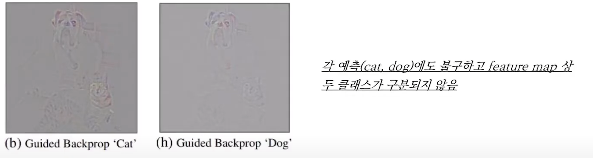    

- [Visualizing Higher-layer Features of a Deep Network,2009] 등은 네트워크의 특정 부분을 maximally-activate 결과가 high-resolution and class-discriminative하나 이는 single image에 대해서가 아니라 모델 전반을 시각화 한다는 한계가 있다. 

### Assessing Model Trust
- [Why Should I Trust You? : Explining the Predictions of Any Classifier.2016]은 모델에 대한 notions of interpretability와 신뢰성(trust) 평가를 연구하였고, 본 논문은 이에 영감을 얻어 human study를 통해 Grad-CAM 시각화를 평가
- - Grad-CAM이 자동화된 시스템(deep-learning models)을 평가하고 이용자에게 신뢰를 주기 위한 도구가 될 수 있음

### Aligning Gradient-based Importance
- [Choose your neuron : Incorporating domain knowledge through neuron-importance,2018]은 gradient에 기반한 neuron importance를 새로운 class에 대한 분류기를 학습을 위해 인간의 class specific domain-knowledge에 연결함.
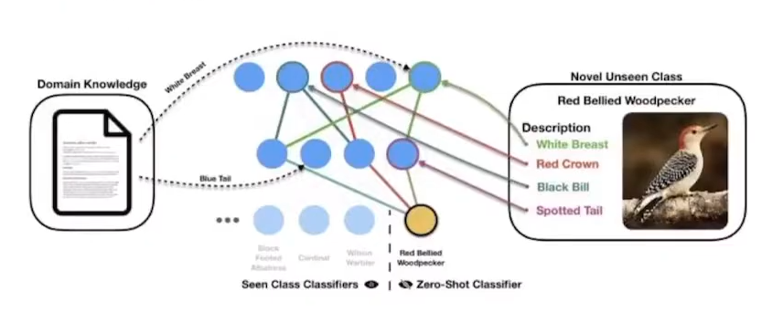   

### Weakly-supervised Localization
- 이미지 내 물체를 localize하는 weakly-supervised localization 연구 중 가장 대표적이고 Grad-CAM과 연관이 깊은 것이 CAM(Class Activation Map)  
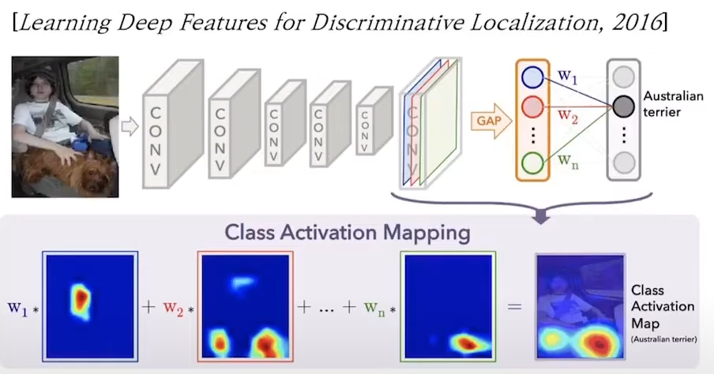   

- CNN의 마지막 feature map을 GAP한 뒤, 가중치 $ w_i $ 를 각각 곱하여 class score를 계산
- 각 $w_i$를 feature map과 선형 결합하여 Class Activation Map을 얻을 수 있고, 이를 통해 class score에 대한 feature map의 영향력(중요성)을 시각적으로 확인할 수 있음.
- GAP layer가 아니면 CAM을 적용할 수 없다는 큰 한계점 존재.

## Grad-CAM

### Overview
- 핵심 아이디어 : 
- - A number of previous works have asserted that deeper repre sentations in a CNN capture higher-level visual constructs
- - Convolutional Neural Network에서 얕은 층은 edge 등 low-level feature를 읽으며, 깊은 층으로 갈수록 semantic class-specific 정보를 읽음.  
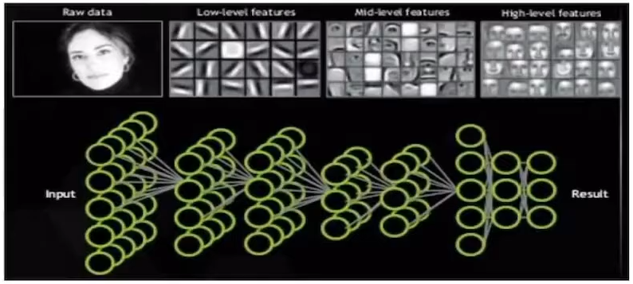   

- convolutional layers naturally retain spatial information which is lost in fully-connected layers, so we can expect the last convolutional layers to have the best com promise between high-level semantics and detailed spatial information.
- Grad-CAM은 CNN의 마지막 layer에 흘러들어가는 gradient을 이용해 모델의 예측에 각 뉴런이 미치는 영향을 파악(물론 모든 layer에 대해서도 사용가능)  
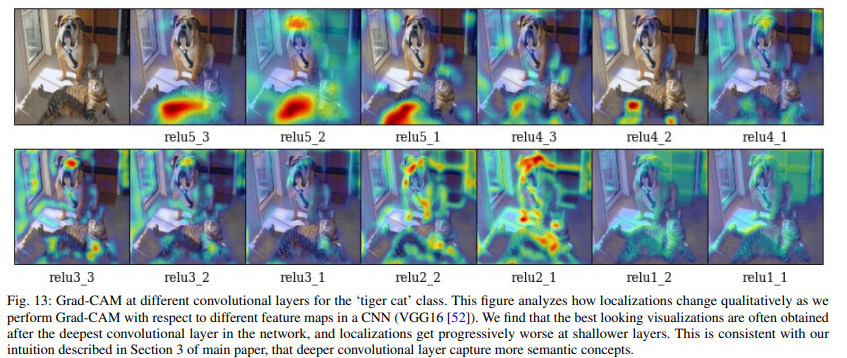   

### Architecture

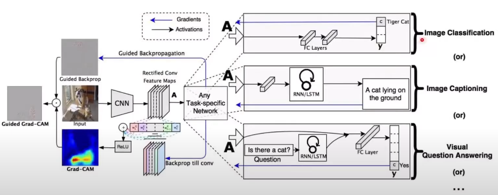   

- in order to obtain the class-discriminative localization map Grad-CAM $L^c_{Grad-CAM} \in R^{ u \times v}$ of width u and height v for any class c, we first compute the gradient of the score for class c, $y^c$(before the softmax), with respect to feature map activations $A^k$ of a convolutional layer, i.e. $\frac{∂y_c}{∂A^k}$. These gradients flowing back are global-average-pooled over the width and height dimensions (indexed by i and j respectively) to obtain the neuron importance weights $\alpha^c_k$ :  
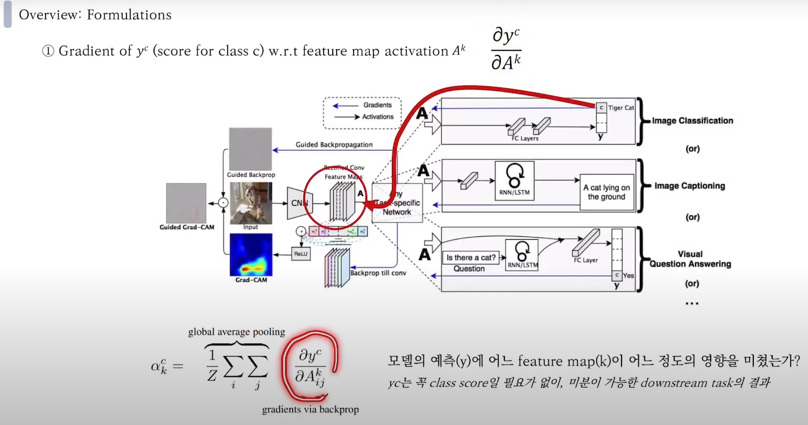   

- We perform a weighted combination of forward activation maps, and follow it by a ReLU to obtain,
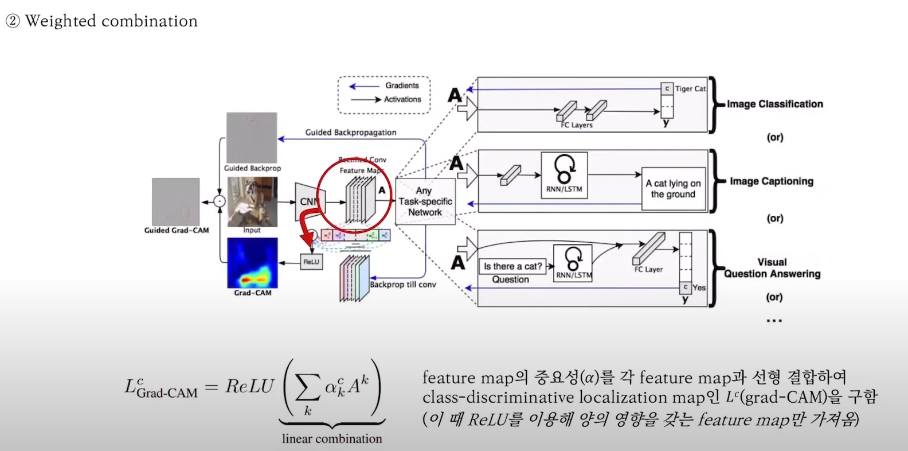   

- Negative pixels are likely to belong to other categories in the image.

### Grad-CAM generalized CAM
- In this section, we discuss the connections between Grad CAM and Class Activation Mapping (CAM) [59], and for mally prove that Grad-CAM generalizes CAM for a wide variety of CNN-based architectures.  
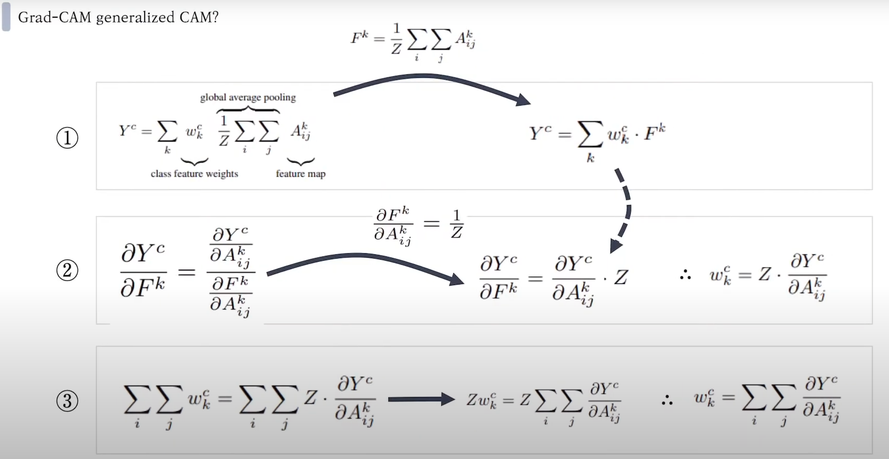   

- 1의 왼쪽이 CAM 식이다. 
- $w_k^c$ is the weight connecting the $k^{th}$ feature map with the $c^{th}$ class.
- Z is the number of pixels in the feature map
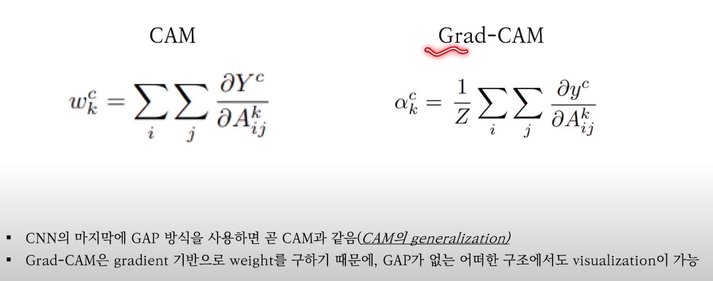   
- CAM은 GAP을 이용한 weight 값을 이용하고 Grad-CAM의 경우에는 gradient 기반의 weight 값으로 계산하기 때문에 구조적 제약이 없다. 

### Guided-Grad-CAM
- While Grad-CAM is class-discriminative and localizes relevant image regions, it lacks the ability to highlight fine grained details like pixel-space gradient visualization methods.  
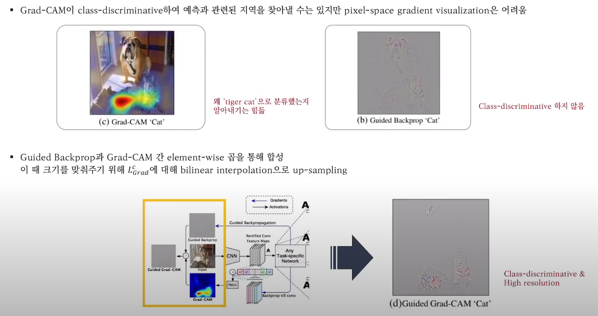   

- In order to combine the best aspects of both, we fuse Guided Backpropagation and Grad-CAM visualizations via element-wise multiplication ($L^c_{Grad-CAM}$ is first upsampled to the input image resolution using bilinear interpolation).

### Counterfacual Explanation
- Using a slight modification to Grad-CAM, we can obtain explanations that highlight support for regions that would make the network change its prediction. As a consequence, removing concepts occurring in those regions would make the model more confident about its prediction. We refer to this explanation modality as counterfactual explanations.   
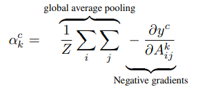   

## Evaluating Localization Ability of Grad-CAM
- we evaluate the localization capability of Grad-CAM in the context of image classification.
- Grad-CAM for VGG-16 also achieves better top-1 localization error than CAM, which requires a change in the model architecture, necessitates re-training and thereby achieves worse classification errors (2.98% worse top-1), while Grad-CAM does not compromise on classification performance.
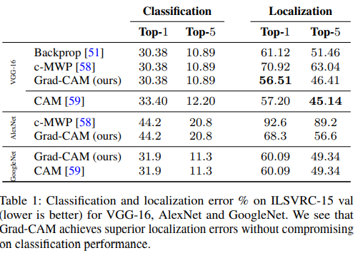   

## Evaluating Visualizations