# Learning Deep Features for Discriminative Localization
XAI 분야의 논문이다.  
https://youtu.be/KzpSM6erO6c  
https://youtu.be/GiP0r2_OIak  

## Abstract
- global average pooling layer
- Despite the apparent simplicity of global average pooling, we are able to achieve 37.1% top-5 error for object localization on ILSVRC 2014, which is remarkably close to the 34.2% top-5 error achieved by a fully supervised CNN approach.

## Introduction
- 최근의 연구에 따르면 CNN lyer의 convolutional unit은 object detector 역할을 하기도 한다.
- 그러나 FC layer에서 location 정보를 잃는다.
- 최근에는 FC layer을 피할려고 하는 연구들이 많다.( 1. parameter을 최소화하기 위해서)
- global average pooling -> acts as a structural regularizer, preventing over fitting during training.
- In our experiments, we found that the advantages of this global average pooling layer extend beyond simply acting as a regularizer - In fact, with a little tweaking, the network can retain its remarkable localization ability until the final layer  
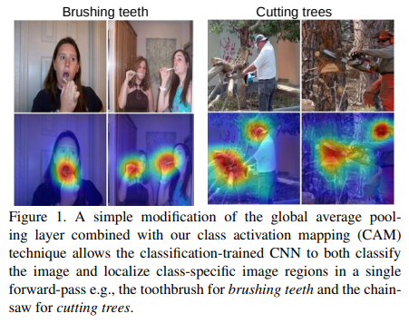    

- A CNN trained on object categorization is successfully able to localize the discriminative regions for action classification as the objects that the humans are interacting with rather than the humans themselves.

### Related work
In this work, we show that, using the right architecture, we can generalize this ability beyond just localizing objects, to start identifying exactly which regions of an image are being used for discrimination

#### Weakly-supervised object localization
- * object label로만 object localization을 해보자!
- * 기존의 논문에서는 GMP(Global Max pooling)을 사용했는데 이는 localization 정보를 잃게 된다. 그래서 이 논문에서는 GAP(Global Average Pooling)을 사용할 것이다. 
- * GAP의 장점으로는 label과 직관적인 관계가 형성 된다는 점과 별도의 파라미터가 필요하지 않다는 장점이 있다.  
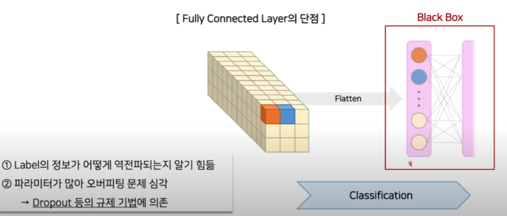      
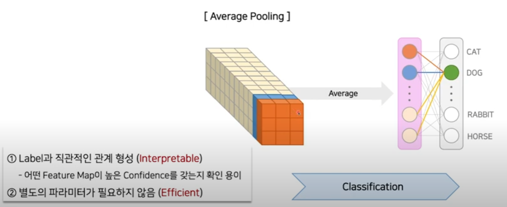    

- 기존 방법의 문제점으로는
- * Not End-to-End
- * Multiple Forward Pass
- * Global Max Pooling
- 이를 해결하기 위해 아래를 사용함.
- * End - to - End
- * Single Forward Pass
- * Global Average Pooling

#### Visualizing CNNs 
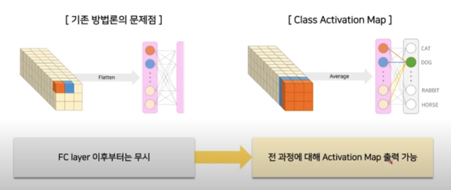    

## Class Activation Mapping
- NIN와 GoogLeNet의 final output layer(softmax)전에 GAP를 수행하고 이를 FC layer에 대한 feature로써 사용한다.
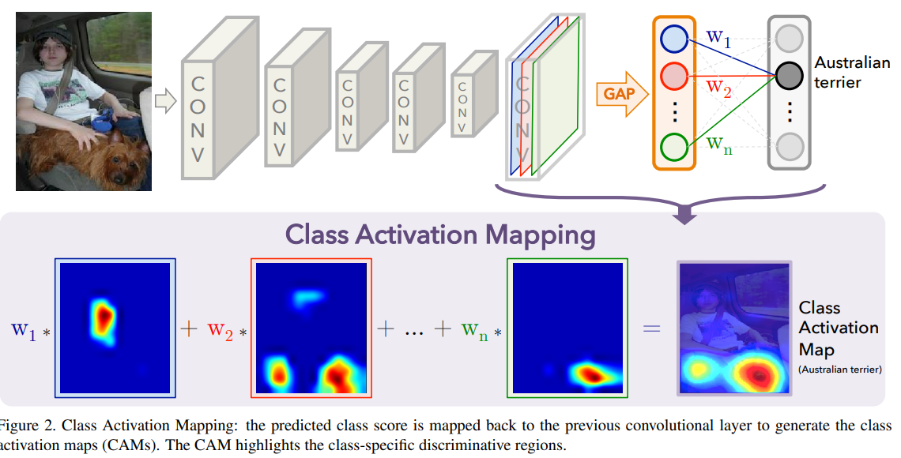    
- $f_k(x,y)$ 는 k번째 feature map에 x,y를 의미한다. 
- GAP를 적용한 결과는 $F^k= \Sigma_{x,y}f_k(x,y)$ 로 나타낸다.  (전체로 나누는 과정은 편의상 생략했음)
- class c에 대한 softmax의 input은 $S_c=\Sigma_k w_c^cF_k$ 라고 나타낸다.
- 결론적으로 $w_C^k$ 는 class c에 대한 $F_k$의 importance를 나타냄.
- 마지막으로 class c에 대한 softmax의 output은 $P_c=\frac{exp(S_C)}{\Sigma_c exp(S_C)}$ 로 나타낸다.  
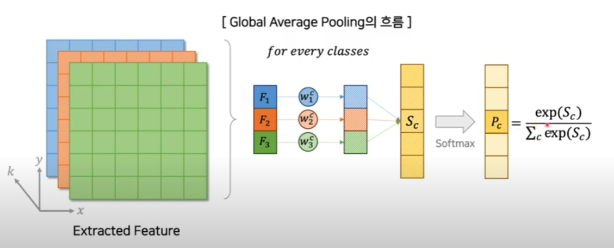    
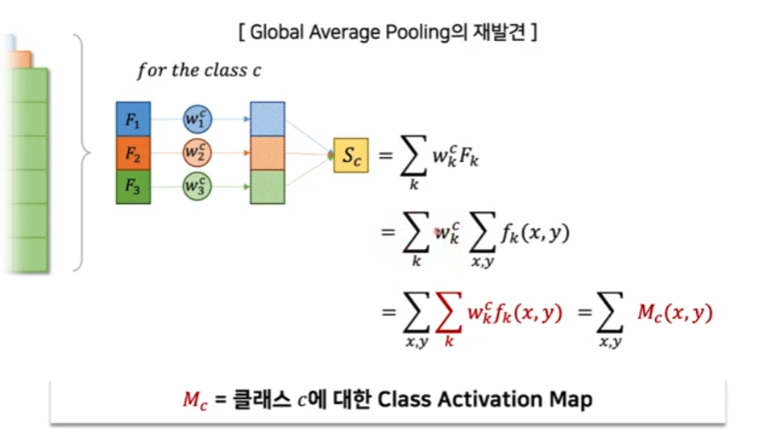    
- hence Mc(x, y) directly indicates the importance of the activation at spatial grid (x, y) leading to the classification of an image to class c.
- By simply upsampling the class activation map to the size of the input image, we can identify the image regions most relevant to the particular category.  
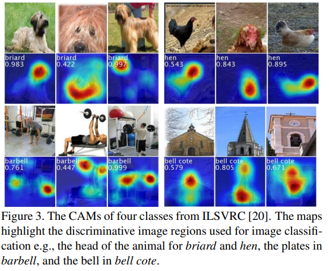    
- 위의 그림을 통해 다양한 class에 대해 discriminative region이 표시된 것을 볼 수 있다.
- In Fig. 4 we highlight the differences in the CAMs for a single image when using different classes c to gener ate the maps.  
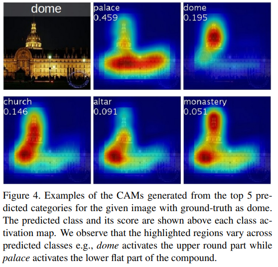    

### GAP vs GMP
- 이전 논문들은 GMP을 사용해 왔다.
- We believe that GAP loss encourages the network to identify the extent of the object as compared to GMP which encourages it to identify just one discriminative part.

## Weakly-supervised Object Localization
-ILSVRC 2014 dataset 사용

### Setup
- 비교군 : AlexNet, VGGnet, GoogLeNet
- - final output 전에 FC layer 을 제거하고 GAP로 대체하였다.
- We found that the localization ability of the networks improved when the last convolutional layer before GAP had a higher spatial resolution, which we term the mapping resolution.
- - 이를 위해서 network 일부를 수정하였다.  

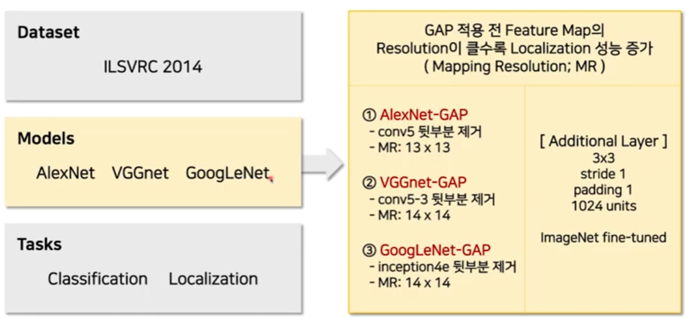    

### Results

#### Classification
- network를 조금씩 수정했기 때문에 기존의 모델에 비해 classification 결과는 더 성능이 좋지 않다.  
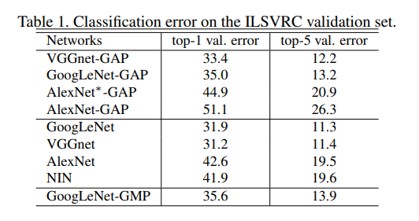    
- 특히 AlexNet의 경우에는 성능이 많이 떨어졌기 때문에 이를 보상하기 위해 두개의 conv layer를 GAP 전에 삽입하였다.
- Thus, overall we find that the classification performance is largely preserved for our GAP networks. Further, we observe that GoogLeNet-GAP and GoogLeNet-GMP have similar performance on classification, as expected.
- Note that it is important for the networks to perform well on classification in order to achieve a high performance on localization as it involves identifying both the object category and the bounding box location accurately.

#### Localization
- In order to perform localization, we need to generate a bounding box and its associated object category.
- To generate a bounding box from the CAMs, we use a simple thresholding technique to segment the heatmap.
- - We first segment the regions of which the value is above 20% of the max value of the CAM.
- - Then we take the bounding box that covers the largest connected component in the segmentation map.  

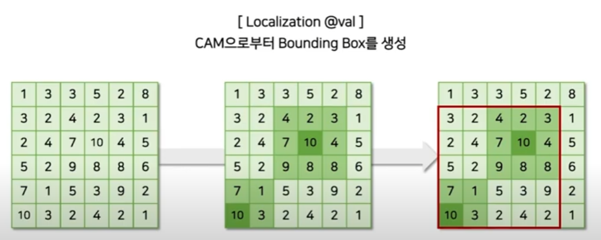    

- 그 결과 아래와 같다.  
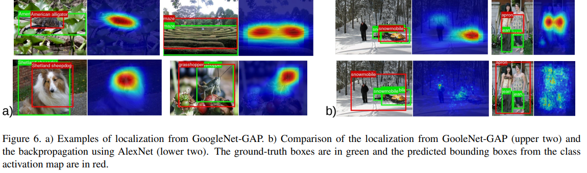    
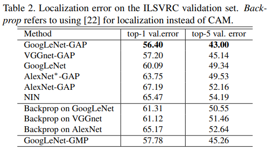    

- We observe that our GAP networks outperform all the baseline approaches with GoogLeNet-GAP achieving the lowest localization error of 43% on top-5. 
- This is remarkable given that this network was not trained on a single annotated bounding box.
- we observe that GoogLeNet-GAP outperforms GoogLeNet-GMP by a reasonable margin illustrating the importance of average pooling over max pooling for identifying the extent of objects

- We follow a slightly differ ent bounding box selection strategy here: 
- - we select two bounding boxes (one tight and one loose) from the class activation map of the top 1st and 2nd predicted classes and one loose bounding boxes from the top 3rd predicted class. 
- - We found that this heuristic was helpful to improve performances on the validation set.  

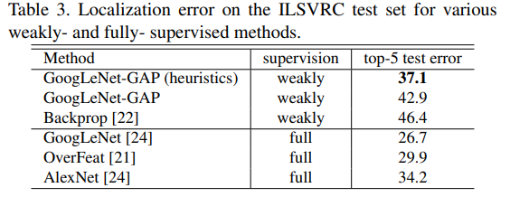    

- 여기서 full은 ground truth가 존재하는 경우이다.
- 한계점 : While impressive, we still have a long way to go when com paring the fully-supervised networks with the same architecture (i.e., weakly-supervised GoogLeNet-GAP vs fully supervised GoogLeNet) for the localization.

## Deep Features for Generic Localization
We observe that the most discriminative regions tend to be high lighted across all datasets. 

### Fine-grained Recognition

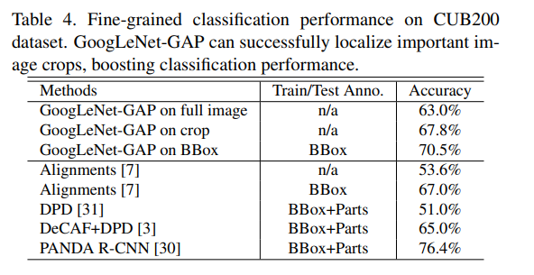    
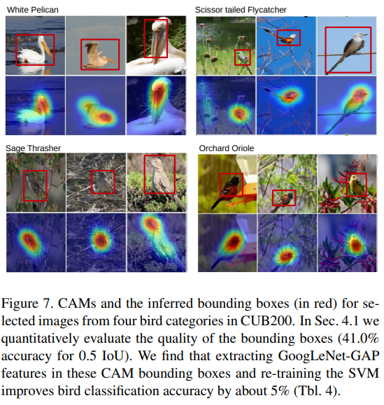    

### Patten Discovery
- Discovering informative objects in the scenes
- - We observe that the high activation regions frequently correspond to objects indica tive of the particular scene category  
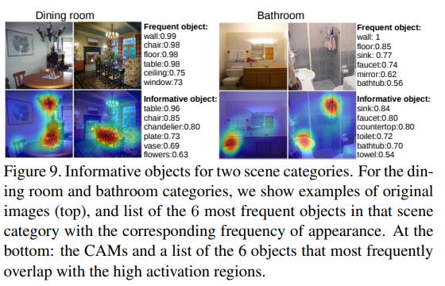    

- Concept localization in weakly labeled images 
- -  Note that CAM localizes the informative regions for the concepts, even though the phrases are much more abstract than typical object names.  
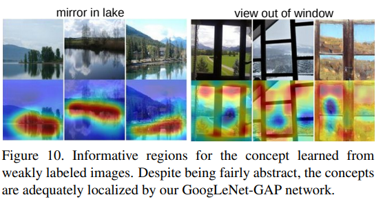    

- Weakly supervised text detector
- - As shown in Fig. 11, our approach highlights the text accurately without using bounding box annotations  
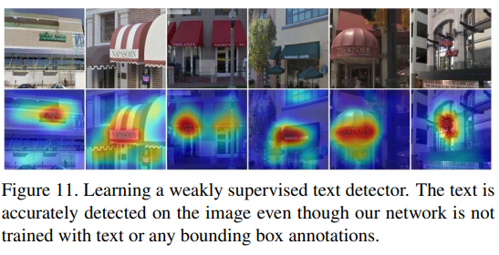    

- Interpreting visual question answering
- As shown in Fig. 12, our approach highlights the im age regions relevant to the predicted answers.
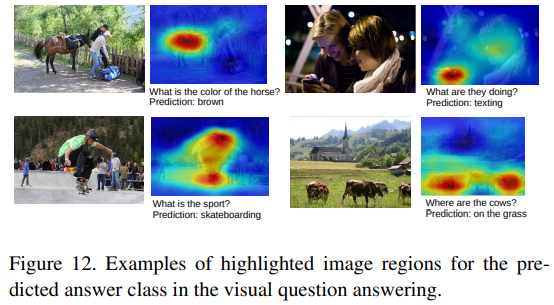    

## Visualizing Class-Specific Units
- Zhou et al [33] have shown that the convolutional units of various layers of CNNs act as visual concept detectors, identifying low-level concepts like textures or materials, to high-level concepts like objects or scenes.
- Deeper into the network, the units become increasingly discrimi native. However, given the fully-connected layers in many networks, it can be difficult to identify the importance of different units for identifying different categories.

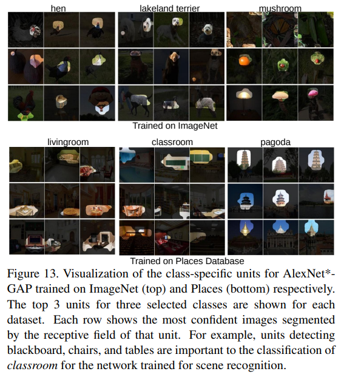    
- Fig. 13 shows the class-specific units for AlexNet∗ -GAP trained on ILSVRC dataset for object recognition (top) and Places Database for scene recognition (bottom).
- From the figure we can identify the parts of the object that are most discriminative for classification and exactly which units detect these parts.
- Thus we could infer that the CNN actually learns a bag of words, where each word is a discriminative class-specific unit. A combination of these class-specific units guides the CNN in classifying each image.

## Conclusion
- In this work we propose a general technique called Class Activation Mapping (CAM) for CNNs with global average pooling.
- This enables classification-trained CNNs to learn to perform object localization, without using any bounding box annotations.
- Class activation maps allow us to visualize the predicted class scores on any given image, highlighting the discriminative object parts detected by the CNN.
- our technique produces generic localizable deep features that can aid other researchers in understanding the basis of discrimination used by CNNs for their tasks

## 한계 
모델 구조적인 한계