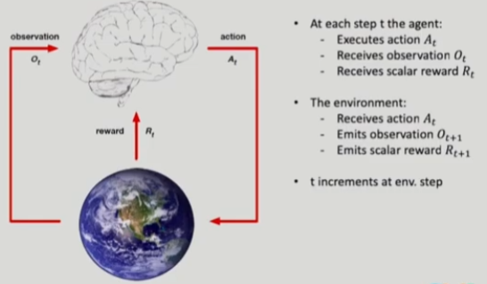

# 1강 introduction to Reinforcement Learning : 서울대학교 이정우 교수님
reinforcement는 결국 시행착오로 학습하는 것이다.

### A task capable of reinforcement learning

- there is interaction with environments : 강화학습으로 풀 수 있는지 판단하는 기준이 된다.
- there is no supervisor, only a reward signal 강화학습은 정답은 없지만 비슷한 reward 가 있다.
- 대부분의 task는 대부분은 reward가 즉시 나오지 않을 수도 있다. (ex: 주식 장기 투자)
- 강화학습은 주로 time 축이 존재한다. 단 주기는 중요하지 않다. (얼마나 sampling할지는 사용자가 정할 수 있다.)
예를 들면 2시간마다 결과가 나오는 task는 2시간마다 즉시 결과가 나오는 task는 짧게 잡으면 된다.
- agent's actions affect the subsequent data it receives

### examples of reinforcement learning
- 로봇의 움직임
- cartpole 
- pendulum
- helicopter stunt
- Alphago

### introduction to Reinforcement Learning
2개의 input과 1개의 output  
#### input
- observation(Ot)
- reward(Rt)

#### output
- action(At)

(St = Ot , At) -> Rt+1

- 어떤 액션을 취하는가를 결정하는 것이 Policy라고 한다.

- Policy의 근거가 되는 것은 Value function이다. 

실전에 사용하는 것은 대부분 model free이다. : model을 근사할 수 있다고 하더라도 너무 복잡하기 때문에

## Reinfoceement Learning vs Planning
Reinforcement
- The environmnet is initially unknown
-The agent interacts with the environmnet

Planning : 기계공학에서 사용하는 problems in sequential decision making
- A model of the environment is known
- The agent performs computations with its model(without any external interaction)

## Reinforcement의 단점 
- 문제자체가 model이 없는 것이기 때문에 초기의 시행착오가 매우 많이 일어난다.(안대를 끼고 집으로 가는 상태이다)
- 즉 model로 풀수 있는 문제는 다른 방법으로 푸는 것이 현명할 수 있다.

## 강화학습의 핵심은 Exploration과 Exploitation이다.
- Exploration finds more information about the environment : Exploration은 현재 지식이 아닌 다른 곳도 탐험해보는 것 : 탐험
- Exploitation exploits known information to maximize reward : Exploitation은 현재 지식을 최대한 이용하는 것 : 착취
- ex : 단골집만 가는 것 : Exploitation , 다른 집만 가는 것 : Exploration

## reinforcement가 역사 : 3 different approaches
- Trial-error learning : 동물 실험에서 나옴
- Optimal control(dynamic programming) :기계, 제어 공학에서
- Temporal- difference(TD) learning
- TD + optimal control : Q - learning