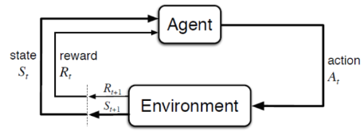

# 2강 introduction to RL, Markov Decision Process : 서울대학교 이정우 교수님
machine learning 중에서 reinforcement learning이 사람의 학습과 가장 유사하다.  
강화학습의 관점은 신경(생물)학적 관점(뉴런, 시냅스, 도파민): 새로운 아이디어 탐색 과 수학적인 관점 : 제어 2가지로 봐야한다.

## reinforcement가 역사 : 3 different approaches
- Trial-error learning : 동물 실험에서 나옴 -> 도파민과 관련, 생물학적 관점
- Optimal control(dynamic programming) :기계, 제어 공학에서 사용, 수학적인 관점
- Temporal- difference(TD) learning : 업데이트를 할 때 미래의 한단계를 앞서 보는 것
- TD + optimal control : Q - learning
- 단, 강화학습은 어떤 문제를 푸는 한가지 방법론일 뿐이다. 다시말해, 반드시 강화학습이 유일한 답을 얻는 방법은 아니다.

## Markov Decision Process : 이론적이고 수학적인 관점
 현대의 나와있는 강화학습이론은 MDP에 기본해서 해석할 수 있다.
 
- agent : the learner and the decision maker
- environment : the thing that an agent interacts with(everything outside agent).
- Task: a complete specification of an environment including rewards
- input -> reward, state
- output -> next action
- 위의 형태로 modeling 가능한 task만 reinforcement Learning이 가능하다. 

## Reward
- Reward hypothesis : What we mean by goals and purposes can be well thought of as maximization of the expected value of the cumulative sum of reward.

## Markov property
history가 주어졌을 때 다음에 일어날 일이 history 전체 경로에 무관하고 직전의 state에만 영향을 받는 랜덤 프로세스를 말함.  
Def. A state is Markov iff P[St+1 | St] = P[St+1 | S1, S2, ... St]

## State transition matrix
- PSS' = P[St+1=s' | St=s]

- P where each row sums to 1
- 위의 P 앞에 현재 time에서 state의 확률 의미하는 qt를 곱하면 qt+1 값을 얻을 수 있다.

## Markov Process
Def. A markov process(Marov Chain) is a tuple <S, P>
- S is a (finite) set of states
- P is a state transition probability matrix,
PSS' = P[St+1=s' | St=s]

## Markov Reward Process
Markov Process + reward
Def, A Markov Reward Process is a tuple < S,P,R, &gamma; >
- S is a (finite) set of states
- P is a state transition probability matrix,
PSS' = P[St+1=s' | St=s]
- R is a reward function, Rs = E[ Rt+1 | St = s]
- &gamma; is a discount factor, &gamma; &in; [0,1]
- 현재 대문자는 랜덤 변수를 의미한다.