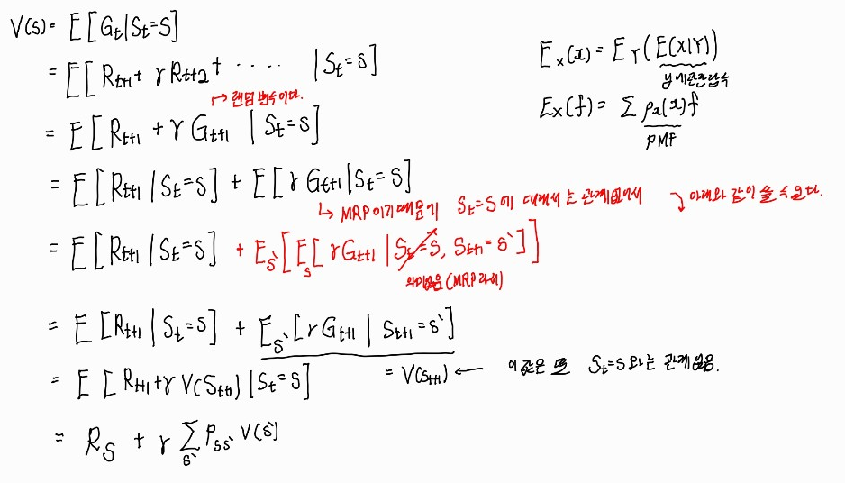

# 3강 Markov Decision Process(2) : 서울대학교 이정우 교수님

## Markov Reward Process
Markov Process + reward
Def, A Markov Reward Process is a tuple < S,P,R, &gamma; >
- S is a (finite) set of states
- P is a state transition probability matrix,
PSS' = P[St+1=s' | St=s]
- R is a reward function, Rs = E[ Rt+1 | St = s]
- &gamma; is a discount factor, &gamma; &in; [0,1]
- 현재 대문자는 랜덤 변수를 의미한다.

## Return
Def. The return Gt is the total discounted reward from time-step t.  

- infinite episode -> 주식투자
- finite episodes -> 대부분 게임
- MDP를 강화학습에 적용할 때는 episode에서 reward를 메모리에 저장해두고 return을 계산함
- 이방법은 return을 단순 무식하게 구하는 방법이기 때문에 계산량도 많고 delay도 심하다. -> 해결책 value function

## discount
-Needed for an infinite episode. otherwise, return diverges
- &gamma; = 0, myopic return :근시안적이다. -> 현재 reward만 중시한다.
- &gamma; = 1, far-sighted return : 원시안적이다. -> 모든 reward를 동등하게 본다.
- Gt = Rt+1 + &gamma; [Rt+2+&gamma;Rt+3+ ...] =  Rt+1 + &gamma;Gt+1  
  
  
  

## value function for MRP
Def. The state-value function v(s) of an MRP is the expected return starting from state s,
v(s) = E[Gt | St = s]
- Return의 경우 random variable이기 때문에 다루기가 어려워서(시시각각 변하기 때문에) 기댓값을 취한 value function을 다룬다. 이를 최대화하는 것이 목표이다.
- Bellman Equation for MRP  

- E[x] = E[E[x]] : E[x]는 상수이기 때문에 가능함. : 사실 독립이라 St 와 St+1의 순서를 바꿀 수 있다도 적용되어 있다.
- Markov Process라고 가정했기 때문에 transition probability에만 영향을 받기 때문에 이런식으로 유도된다.
- 핵심 : 현재 state의 value function은 다음 state의 value function으로 표현가능하다.  : Markov Process라서 가능한 중요한 수식이다. 
- 직관적 이해 아래 사진을 보자 : 현재에 1에 있다고 했을 때 다음 나의 행동으로 향할 모든 상태의 확률을 각 state의 value function에 곱해서 모두 더하면 현재 value function을 구할 수 있다.  

## value function for MRP in Matrix Form

- 계산의 복잡도가 n의 3제곱에 비례하는데 현재 우리가 풀려는 state는 단위가 매우 크기 때문에 적절하기 않다.
- 간단한 문제는 이런 Matrix Form으로 구해도 된다. 
- 복잡한 문제는 dynamic programming으로 구하면 된다. 

## Markov Decision Process(MDP)
- MDP is a Markov reward process with actions
- A Markov Decision Process is a tuple < S,A, P,R, &gamma; >
- S is a finite set of states
- A is a finite set of actions
- P is a state transition probability matrix,
PSS' = P[St+1=s' | St=s]
- R is a reward function, Rs = E[ Rt+1 | St = s]
- &gamma; is a discount factor, &gamma; &in; [0,1]

## Policies
Def. A policy os a distribution over actions given states, &pi;(a|s) = P [At = a | St = s]
- 어떤 state에서 어떤 a를 할 확률을 의미한다. 
- A policy fully defines the behavior of an agent.
- MDP policy depends only on the current state.
- Policies are time-invariant(stationary) : 가정

### Given an MDP < S,A, P,R, &gamma; > and a policy
- The state sequence S1,S2,... is a Markov process <S,P&pi;>
- The state and reward sequence S1,R1,S2,R2,... is a Markov reward process < S,P&pi;,R&pi;, &gamma; >
- 즉, MDP는 MP와 MRP를 포함하는 더 큰 개념이다.   

- 위의 사진은 MDP를 MRP의 transition Probability로 바꾸고 싶으면 각각의 transition Probability에 a의 대해 평균을 취해주면 된다는 의미이다. 
- MDP의 reward를 MRP의 reward로 바꾸고 싶으면 reward의 policy distribution곱해 평균을 취하면 된다는 의미이다. 

## value function : 위에서는 MRP의 경우에서였다. 
Def. The state-value function v(s) of an MDP is the expected return starting from state s, and then following policy &pi;  
v&pi;(s) = E&pi;[Gt | St = s]  
- value function for MRP와의 차이는 policy &pi;에 dependent하다는 것이다. 즉, MDP에서 expectation을 취할 때 random variable은 state와 action 두개이다.

## action-value function : MDP에서는 새로운 function이 추가적으로 정의한다.
Def. The action-value function q(s,a) is the expected return starting from state s, taking action a, and then following policy &pi;  
q&pi;(s,a) = E&pi;[Gt | St = s, At = a]  
- conditional variable에 action이 추가되었다는 것이 value function과의 유일한 차이다.

## Bellman Expectation Equation for V&pi;

