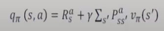
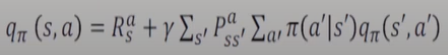
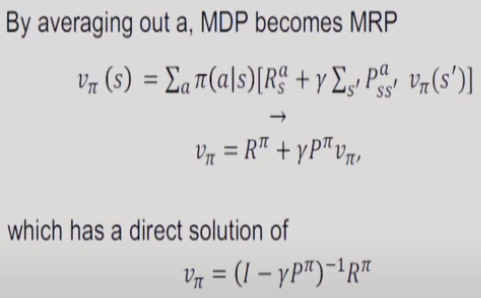
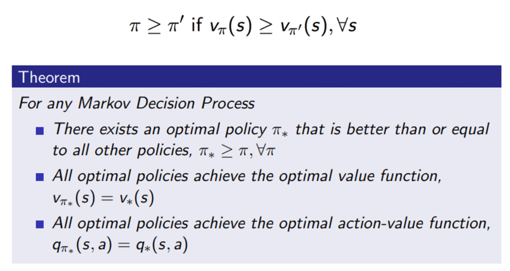
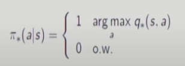
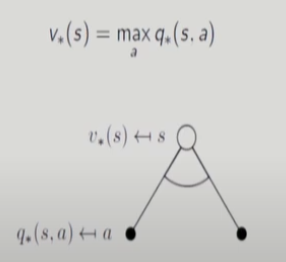
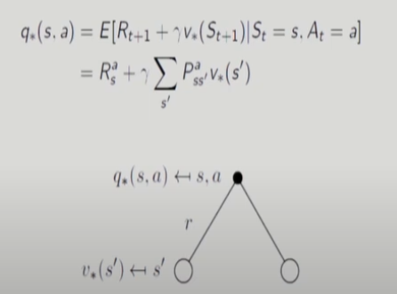

# 4강 Markov Decision Process(3) : 서울대학교 이정우 교수님

## value function
Def. The state-value function v(s) of an MDP is the expected return starting from state s, and then following policy &pi;  
v&pi;(s) = E&pi;[Gt | St = s]  
- value function for MRP와의 차이는 policy &pi;에 dependent하다는 것이다. 즉, MDP에서 expectation을 취할 때 random variable은 state와 action 두개이다.

## action-value function : MDP에서는 새로운 function이 추가적으로 정의한다.
Def. The action-value function q(s,a) is the expected return starting from state s, taking action a, and then following policy &pi;
q&pi;(s,a) = E&pi;[Gt | St = s, At = a]  
- conditional variable에 action이 추가되었다는 것이 value function과의 유일한 차이다.

## Bellman Expectation Equation for V&pi;
- policy &pi;는 주어져 있다.

- 마지막 줄이 Bellman Equation이다.
- value function의 본래 정의에 대해서는 전체 미래를 다 알아야 하는데 bellman equation을 사용하면 다음 state만 알면 된다.
- 반면 q를 v로 표현하는 방법은 아래와 같다.

-model을 정확히 안다고 가정하면 아래처럼 구할 수 있다. : model을 안다는 의미는 P(transition probability)와 R(reward)을 정확히 아는 것이다.

- 단 바둑이나 장기 같은 다차원의 state의 경우는 계산이 불가능하다.

## optimal value Function
- 모든 state s에 대해서 취할 수 있는 모든 가능한 policy중에 최대화 되는 것을 optimal value Function이라고 함.
- 모든 state s와 action a에 대해서 취할 수 있는 모든 가능한 policy 중에서 최대화 되는 것을 optimal action value function이라고 함.

- optimal value function을 찾는다는 것은 optimal policy를 찾는 것이고 이는 강화학습 문제를 푸는 것이다.

- policy는 정책이지 숫자는 아니지만 위와 같은 식으로 쓸 수 있다고 할때를 나타내는 식이다.  
위의 증명을 통해서 아래가 성립한다.
- there is always a deterministic optimal policy for any MDP : 이제는 stochastic policy를 다룰 필요가 없다. random하게 정의할 필요가 없다. 
-> 단 deterministic 이 unique하다는 것은 아니다. : optimal policy는 전혀 unique 할 필요는 없다.
- if we kow q*(s,a), we immediately have the optimal policy  
- An optimal policy can be found by maximizing over q*(s,a),  

- V&pi; -> &pi;*  = &Sigma; &pi;(a|s) q&pi; -> &pi;*(s,a) = Ea[q]  &leq; maxa[q]
- pi가 stochastic의 경우에는 반드시 sub optimal일 수 밖에 없다. : max보다 무조건 작기 때문이다.
- 즉, 위의 식에 의해 &pi; 가 없데이트 될 때 q를 최대로 하도록 하는 action만 1로 업데이트 하고 나머지는 0으로 업데이트된다. 

## Relationship between v*  and q* 

- 선 두개 사이 호가 의미하는 것이 max를 취해라는 의미이다.

