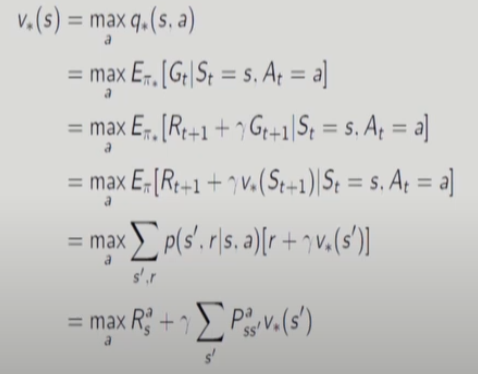
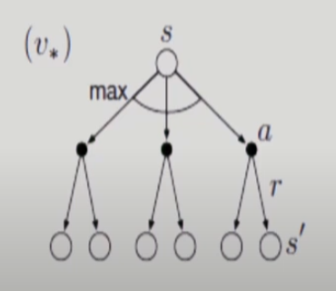
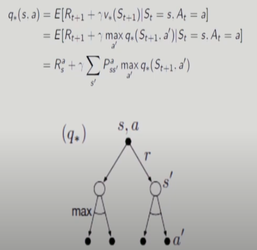
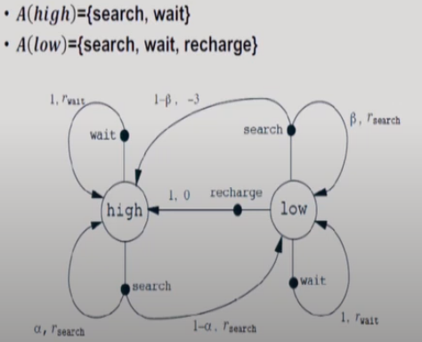
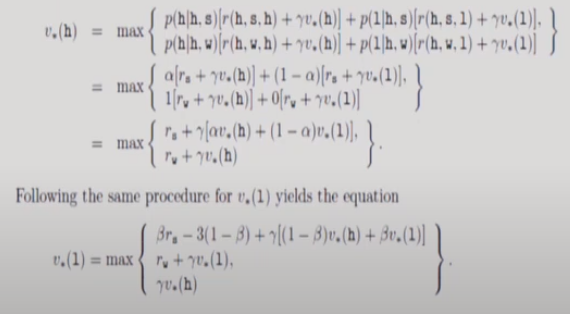
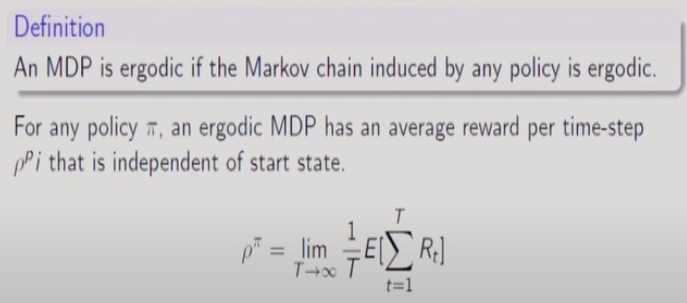
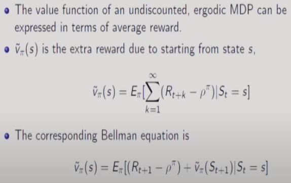
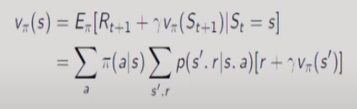
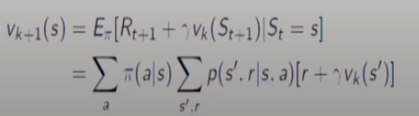

# 5강 Markov Decision Process(4), Dynamic Programming : 서울대학교 이정우 교수님

모든 가능한 policy의 갯수 : |A||s| -> 이중에 optimal policy를 찾는 것이다.

- max가 붙어서 nonlinear 해져서 그냥 풀기는 어렵다.    

## example : recycling robot

- 두번째 식에서 1번째 줄은 search, 2번째 줄은 wait을 나타낸다.
- 위의 식을 보면 그냥 풀기가 매우 어렵다는 것을 알 수 있다. : nonlinear하기 때문에

## Optimization
- Bellman Optimality Equation is non-linear -> No closed form solution(in general)
- Many iterative solution methods (Value iteration, Policy iteration, Q-learning, Sarsa)
- Except for small problems, Bellman optimality equation is prohibitive. : Due to limited computation resources per step and memory
- Approximations needed in practice : put more effort into learning to make good decisions for frequently encountered states. 

## Extensions to MDPs (이런게 있다)
- infinite and continuous MDPs : 드론에서 사용
- Partially observable MDPs : bellman equation에서 두번째 항에서 다음 상태의 value function을 모르는 문제를 풀기위한 이론

## infinite MDPs
- Countably infinite state and/ or action spaces: straightforward
- Continuous state and/or action spaces : quantization
- Continuous time 
- - Requires partial differential equations
- - Hamilton-Jacobi-Bellman(HJB) equation
- - Limiting case of Bellman equation as time-step -> 0

## Ergodic Markov Process
Def . An ergoic Markov process is
- Recurrent : each state is visited an infinite number of times : 모든 state을 무한번 재방문 하게 되는 것 
- Aperiodic : each state is visited without any systematic period : periodic을 제외한 것  
- - periodic은 ABAB ... 무한번 반복되어 주기성이 있다는 것
- 위의 의미는 통계적 확률이 time sample n이 무한대로 갈 때 같아진다는 것으로 증명할 수 있다고 한다.
Theorem : An ergodic Markov process has a limiting stationary distribution d(s) with the property  
d(s) = &Sigma;s' d(s') Ps's
- 위 식의 의미는 Markov process가 초기에 어떻게 시작했든 transition을 시키면 time step에 따라 어느 state에 있을지 확률 분포가 일정한 값으로 수렴한다는 의미이다. 

## Average Reward Value Function (이런게 있다 끝)

- 평균치를 빼주는 것은 나중에 배울 policy gradient에서 bias term의 역할과 유사하다.

## Dynamic Programming : model이 모두 알려져 있을 때이다.
모든 강화학습 알고리즘의 기본이 된다. 모델이 모두 알려져 있기 때문에 강화학습이라고는 할 수 없다. 단지 전통적인 제어이론중하나다.
- Dynamic : sequential
- programming : optimizing a policy(program)
- Key idea : divide and conquer : 잘게 쪼개서 다 풀고 전체를 정복하자.
- Classical DP
- - Assumption : a perfect model -> planning
- - High computational complexity, but still theoretically important
- DP in rein forcemnet learning : approximate methods to classical DP without a perfect model

## Properties of DP : MDP 문제에 해당
전체의 optimal solution은 부분의 optimal solution으로 구할 수 있다.
- Optimal substructure
- - principle of optimality applies
- - optimal solution can be decomposed into subproblems
- Overlapping subproblems
- - Subproblems recur many times
- - Solution can be cached and reused

## Planning by DP
Planning : assuming full knowledge of model(MDP)
- prediction : computing value function v&pi;for MDP or MRP
- - Based on Bellman expectation equation
- Control : computing optimal policy &pi;* for MDP
- - Based on Bellman optimality equation

## policy evaluation : value function을 구하는 방법론 = predication
- problem : evaluate a given policy &pi;
- Solution : iterative application of Bellman expectation
- v1 -> v2 -> ... v&pi;
- convergence : can be proven by Banach fixed point theorem
- Bellman expectation equation

- Update rule(assignment) for iterative policy evaluation

