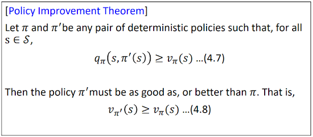

# 6강 Dynamic Programming(2) : 서울대학교 이정우 교수님
## policy evaluation : value function을 구하는 방법론 = predication
- problem : evaluate a given policy &pi;
- Solution : iterative application of Bellman expectation
- v1 -> v2 -> ... v&pi;
- convergence : can be proven by Banach fixed point theorem : 원하는 결과로 찾아간다.
- Bellman expectation equation  

- 대체로 Rt+1 은 현재 state가 주어지면 fix되어 보통 밖으로 튀어나감. 단 두번째 St+1은 어디로 튈지 모르기 때문에 random variable이다. 
- Update rule(assignment) for iterative policy evaluation
  
- v(s)의 시작은 all zeros vector에서 시작해도 된다.  

Full back- up property of policy evaluation
  
- 보통 &theta; 값은 10-3 혹은 10-6이면 충분하다.

Policy Evaluation Backup Diagram
 
- 이전에는 old version v(s)와 new version v(s) 구분 없이 같았지만 policy evaluation update에서는 구분된다. 
- old version v(s)를 저장하는 memory와 new version v(s)를 저장하는 memory가 필요하므로 v(s)보다 2배 큰 memory가 할당되어야 한다.

## policy improvement
- 현재 어떤 policy가 있는데 이 policy 보다 더 좋은 policy를 항상 만들 수 있다. 단, value function이 주어져 있을떄.
- Consider a new a deterministic policy &pi;' which improves over &pi; for a given value function v&pi;(s), where &pi;'(s)=a $\neq$ &pi;(s) 
- one way is to use a greedy policy &pi;(s) = argmaxaq&pi;(s,a) for s of current time slot, thereafter following the existing policy &pi;, where  
 

## policy improvement Theorem
- 단 한순간(step)만 좋게 선택한 것이 전체적인 value function에 대해서도 더 좋다는 것

- 증명

- 두번째 줄에서 세번째 줄로 내려가는 것이 의미가 현재 action만은 다르게 취하겠다는 의미이고 이를 나타내는 것이 새로운 policy &pi;'이다. 그 다음부터는 &pi;를 따르겠다는 의미이다.
- 4번째 줄(부등호)에서는 가정을 이용해서 전개된 수식이다. 
- 이 theorem에 근거해서 optimal policy를 찾을 수 있기 때문에 매우 중요한 theorem이다. 
- 따라서 현재 상태에서 greedy한 policy를 구하는 것이 중요하다.  
