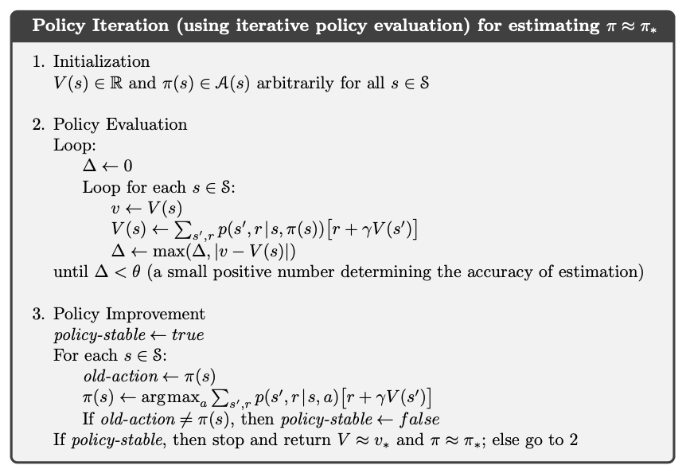
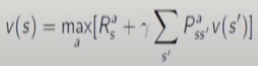

# 7강 Dynamic Programming(3) : 서울대학교 이정우 교수님

## Convergence of Policy Improvement
- For a greedy policy, we have   

- Suppose &pi;' stops improving over &pi;(V&pi;'(s)=V&pi;(s))  
  
which is the Bellman optimality equation.
Then &pi;' and &pi; must be optimal policies. V&pi;'(s)=V&pi;(s)=V*;(s)

## Policy iteration
- Repetition of policy evaluation and policy improvement  
  
  
- policy evaluation : iterative evaluation of v&pi;
- policy improvement : greedy policy update
  
- When converged, q&pi;(s,&pi;'(s)) = maxa q&pi;(s,a) = q&pi;(s,&pi;(s)) = v&pi;(s)
- policy evaluation part do not have to converge -> it may stop after k iterations
- it can even stop with k=1 -> Value iteration

## Generalized policy iteration (GPI)
- policy evaluation : general(partial) evaluation of v&pi;
- policy improvement : greedy policy update
- value function stabilizes when it is consistent with the current policy.
- policy stabilizes when it is greedy to the current value function.
- policy evaluation and policy iteration both compete and collaborate with each other.  
  
- 빨간색이 의미하는 것이 generalized policy iteration으로 즉 다시 말해 evaluation을 완벽하게 하지 않고 improvement를 한다는 것이다.

## Value iteration 
GPI의 극단적인 경우 1번만 evaluation하고 improvement을 진행
- Truncated policy evaluation + (greedy) policy improvement
- A special case of GPI : only one sweep (backup) used for Policy Evaluation 
 
- another view : iterative algorithm of Bellman optimality equation : converge하면 위의 식과 아래 식이 같아진다. 
 
- Unlike policy iteration, there is no explicit policy : 중간에 얻어지는 value function은 특정 policy의 value function이라고 볼 수 없다.( 한번만 evaluation하기 때문에)
- Intermediate value funcations may not correspond to any policy  
 

## Summary
Dynamic programming (DP) summary
- policy evaluation : Bellman Expectation Equation
- Policy iteration : Bellman Expectation Equation + Greedy Update of Policy
- Value iteration : Bellman Optimality Equation

Computational complexity
- For m actions and n states
- O(mn2) for v(s) per iteration
- O(m2n2) for q(s,a) per iteration
- 현대 과학에서 위의 그대로 사용하기에는 계산량이 너무 많다.
- 단, 모델이 주어졌을 때 위의 방법보다 좋은 방법은 없다. 

## Asynchronous Dynamic Programming
- DP methods described so far used synchronous backups
- Asynchronous DP backs up states individually, in any order
- Guaranteed to converge if all states are visited infinitely many times
- in place DP : 
- - synchronous DP uses two copies of v(s) : vold(s) and vnew(s)  
 
- - 여태 배운 건 이전 value function을 가지고 새로운 value function을 구하는 것이었다. 이 두개는 아래 따로 메모리에 저장되어 있다. 한 번 backup할 때마다 업데이트해 나간다. synchronous의 핵심은 old와 new의 value function이 따로 따로 논다는 것이다.
- - Asynchronous DP uses only one copy of v(s) : in place DP  
 
- - 한번 backup하는 중간에 new를 old로 업데이트 한다. 이때는 한 메모리만 사용한다. 반박자 빠른 업데이트라고 생각할 수 있다. 
- Real- time DP : in place DP를 좀 더 일반화 시킨것
- - iterative DP algorithm at the same time that an agent is actually experiencing the MDP
- - Focus the DP algorithm's backups onto parts of the state set that are most relevant to the agent
- - Recurring theme of modern RL
- - 즉 policy 구할 때 필요없는 state의 value function은 구하지 말자는 것. 실제 환경에서 사용하는 state만을 업데이트하도록 제안한 알고리즘으로 현대 매우 중요하다. DQN 같은 현대적인 방법론은 이 방법을 따른다.

## Sample Backup
핵심 아이디어 : 주사위의 확률을 알 때 1/6이라는 것을 알지만 단순 무식하게 실제로 던져서 count하는 방법을 사용할 수 있다. 이처럼 모든 가능한 transitions에 대한 평균 비를 보지 말고 한 번(or 한번은 너무 작으니 1000번의 평균) 주사위를 던져서 거기에 나온 결과값을 사용하자
- in subsequent chapters, we will consider sample backups
- Using sample rewards and sample transitions <S,A,R,S'> Instead of reward function R and transition dynamics P
- Advantages: 
- - Model-free: no advance knowledge of MDP required
- - Breaks the curse of dimensionality through sampling
- - Cost of backup is constant, independent of n = |S|
- 이를 이용해서 현대적 문제를 접근할 수 있는 실마리를 얻을 수 있었다. 왜냐하면 현대 문제에서 가능한 case가 많아서 모든 transition을 계산하는 것은 불가능하므로 그냥 model을 모른다고 치고 실제 sample을 얻어 평균을 취해 model을 대신하는 방법론을 사용할 수 있다.
- 이 역시 앞으로 배울 DQN 등 현대적 강화학습 방법론에 일부 사용된다.
- 단점은 게임이 끝날 때까지(sample을 얻기위해) 끝까지 던져봐야(계속 시행을 해야 하므로) 되므로 한번 iteration하는데 시간이 걸린다.