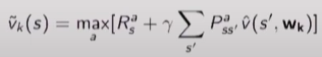
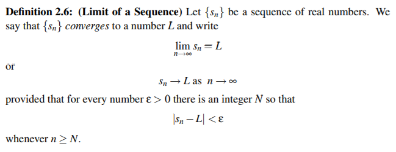
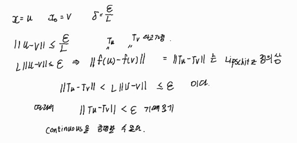
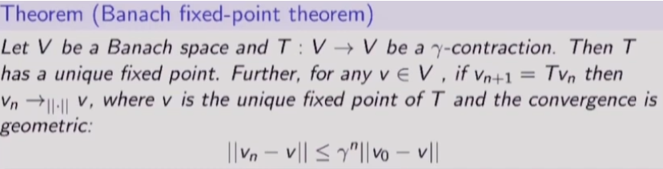
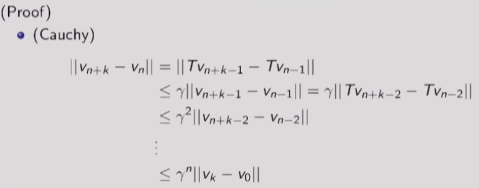
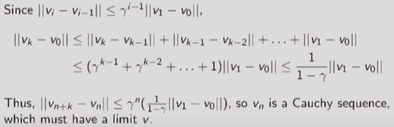
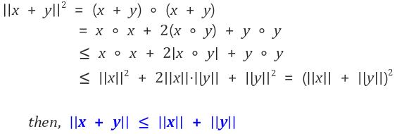
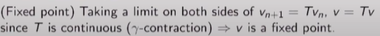
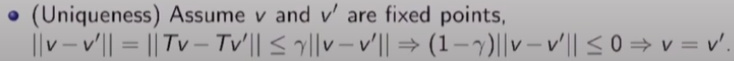
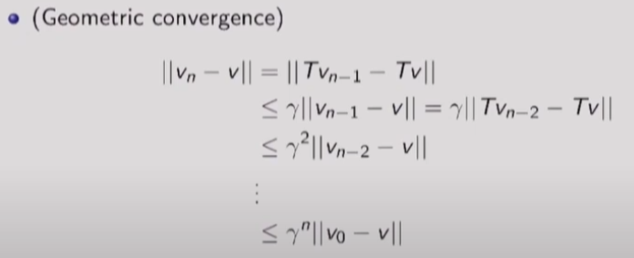

# 8강 Dynamic Programming(4) : 서울대학교 이정우 교수님

## Approximate Value Function - based DP
- Approximate the value function using a function approximator $\widehat{v}$(s,w)
- Apply dynamic programming to $\widehat{v}$(s,w)
- s가 수십개 수백개는 계산 가능하지만 더 넘어가면 굉장히 계산량이 많아져서 v(s)에서 state는 매우 중요한 문제이다. 이를 해결하기 위해 정확히 계산하는 거(tabular method)를 할 수 없는 continuous 경우나 |S|가 굉장히 클 때는 value function approximation이 필요하다. : deep neural network를 도입한다. ->  $\widehat{v}$(s,w)
- e.g. Fitted Value iteration repeats at each iteration k,
- - Sample states $\widetilde{S}$ $\subset$ $S$
- - For each state s &in; $\widetilde{S}$, estimate target value using Bellman optimality equation,  
 
- - Train next value function $\widehat{v}(s,w_{k+1})$ using training sets of { < s,$\widetilde{v}_k(s)$> }
- - input과 output의 train dataset에 해당하는 것 : $\widetilde{v}_k(s)$ 따라서 위의 정의대로 모든 state에서 계산되는 것이 아니라 일부 가능한 state에 대해서만 tilde를 구할 수 있다.
- - 최종적으로 모든 state에 대해 approximate하게 구하는 deep neural network로 학습시키는 것 : $\widehat{v}(s,w_{k+1})$ -> 이걸 구하는 것이 최종 목표이다.

## Backgrounds for Convergence Proof : 해석학과 관련 
수렴성은 아래처럼 표현할 수 있다.  ( limit of a sequence)  
$\displaystyle \lim_{n \to \infty } v_n = v $  
이를 좀더 엄밀히 표현하자면  
$\forall\varepsilon >0 , \exists N~~s.t~~|v_n - v|<\epsilon~~for~~\forall n > N$, $ v_n$ &in; $R$  
위의 식에서 중요한 것이 수렴하는 v를 미리 알아야 한다는 것이다. 근데 이는 상황에 따라 매우 어려운 문제일 수도 있다. 즉 $v_n$만 주어지고 이 값이 수렴하는지 않하는지를 판단해야 하는 경우가 많은데 이 때 사용하는 것이 cauchy sequence이다.   
 

## cauchy sequence
Let $v_n$(n &geq; 0) be a sequence of vectors of a normed vector space V = (V,||.||). Then $v_n$ is called a Cauchy-sequence if   
$\displaystyle \lim_{ n\to \infty } \underset{m \geq n}{sup} ||v_n - v_m || =0$  
이를 간략히 나타내면 아래와 같다.  
$\forall\varepsilon >0 , \exists N~~s.t~~|v_n - v_m|<\epsilon~~for~~ m,n > N$  
위 식의 의미는 어느순간 이상 지나가면 이후의 임의의 sequence 사이가 점점 줄어들면 cauchy sequence라고 한다. 해석학에서 이미 실수 공간 모든 cauchy sequence는 converge한다는 게 증명되어 있다.(아래 링크에 증명이 있다.) 이를 이제 vector공간이고 norm이 있도록 확장했을 때 이얘기는 항상 성립하지는 않는다.  
  
https://www.youtube.com/watch?v=QNecfhHa_qY

## norm : distance에 해당
아래 세가지로 정의를 내린다.  
def notation ||v||
1. ||v|| = 0 -> v=0
2. ||&lambda;v|| = |&lambda;|x||v||
3. ||u+v|| &leq; ||u|| + ||v||  
위의 세가지 성질을 만족하면 norm이라고 부른다.

## vector space
vector들의 집합인데 vector 합에 대해 닫혀있고 scalar multiple에 닫혀있어야 한다. 

##  Complete
A normed vector space V= (V,||.||) is called complete if every Cauchy sequence in V is convergent in the norm of the vector space.

## Banach Space
A complete, normed vector space is called a Banach space.

## convergence of normed vector 
실수 일때 : $v_n$ -> v : $\lim v_n = v $  
normed vector 일 때 : $v_n \rightarrow_{||.||}{v}$  
$\forall\varepsilon >0 , \exists N~~s.t~~||v_n - v||<\epsilon~~for~~ n > N$  
실수에서는 절댓값이었지만 vector에서는 norm이다.

## Lipschitz
Let V = (V,||.||) be a normed vector space. A mapping T : V -> V is called L-Lipschitz if for any u,v &in; V,
$$||Tu-Tv|| \leq L||u-v|| $$
- 여기서 T는 operator을 의미한다.
- if L<1 , T is called L-contraction or simply a contraction
- if T is Lipschitz, T is continuous 
- - continuous의 정의 
$$\forall\varepsilon >0 , \exists \delta,~~||x-x_0||<\delta \Rightarrow ||f(x) - f(x_0)||<\epsilon$$  
- - 따라서 위의 식을 증명하기 위해서는 $\delta = \frac{\epsilon }{L}$ 이라고 두면 증명할 수 있다.  
  
- - sequence 관점에서 본다면 $v_n \rightarrow  v \Rightarrow Tv_n \rightarrow Tv $ (T가 continuous 할 때) 
- - 어떤 함수가 continuous 하면 lim가 함수 안으로 들어갈 수 있다. $\lim~T(v_n) = T(\lim~v_n)$

## Fixed Point
Let T : V $\rightarrow$ V be some mapping. The vector v &in; V is called a fixed point of T if Tv=v : mapping을 하나 안하나 변하지 않는 vector을 fixed point라고 한다.
- policy iteration, value iteration의 convergence를 증명하는데 사용된다.

## Fixed point theorem
  
- fixed point가 반드시 존재하면서 unique 하다는 증명이다.
- L-contraction을 &gamma;-contraction으로 치환되어 있다. 
- 만약 $v_{n+1} =Tv_n$ 처럼 점화식으로 표현되면 반드시 fixed point로 수렴을 한다는 의미이다.
- converge 속도도 지수함수 꼴로 빠르게 수렴한다.
- banach를 가정하기 때문에 cauchy인지 증명하면 무조건 수렴하게 되어있다.
  
- - n+k는 m을 나타낸다.
- 이제 ||$v_k - v_0$||가 유한한 값이라고 한다면 수렴한다는 것을 확인할 수 있다.  
  
- $v_k -v_0$ = $ v_k - v_{k-1}+ v_{k-1} -v_{k-2} + v_{k-2} - ... -v_1 +v_1 - v_0 $
- 위에 식에서 삼각 부등식의 vector 버전을 도입  
  
- $(r^{k-1}+r^{k-2}+...+1)=\frac{1-r^k}{1-r}\leq \frac{1}{1-r}$
- 즉 이제는 ||$v_k-v_0$|| 식이 유한하다는 것을 알 수 있다.
- fixed point : $v_{n+1} = Tv_n$ 에 $\lim$ 을 쓴 것이다. 즉 $\lim v_{n+1} =v$ 이고 $\lim Tv_{n} =T\lim v_n = Tv$ 로 나타내지는 것이다. 이 의미는 정의상 v가 fixed point라는 것을 나타낸다.
  
- uniqueness : 다음 볼 거는 유일성이다. 유일성 증명은 만약 유일하지 않다고 가정하고 모순을 밝히면 된다.  
  
- geometric convergence  
  
- - 이 증명은 geometic한 속도로 수렴한다는 것을 보이는 것이다. 
- - $v_n = Tv_{n=1}$과  v=Tv 라는 것을 사용하였다.