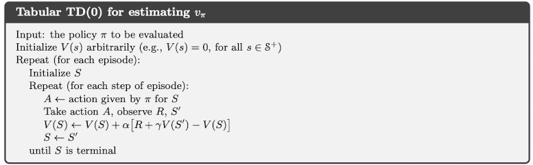
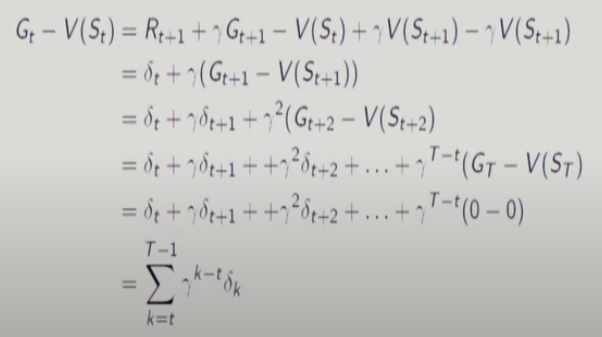
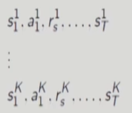
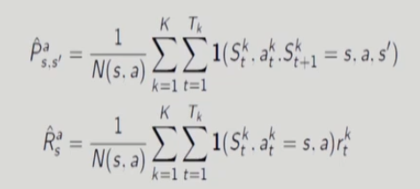

# 11강 Model-Free Prediction :- Monte Carlo and Temporal Difference Methods(3) : 서울대학교 이정우 교수님

## Temporal Difference Method
- Temporal Difference (TD) : most central and novel idea in RL
- TD : combination of Monte Carlo(MC) and Dynamic Programming(DP)
- Model-free method: directly learn from experience as in MC
- Update estimates based in part on other learned estimates(boostrapping) as in DP
- Incremental MC update : constant &alpha; MC algorithm
$$ V(S_t) \leftarrow V(S_t) + \alpha(G_t+V(S_t))$$
- 기본적으로 MC algorithm은 $G_t$ 때문에 offline algorithm이다.(한개의 episode가 끝나야만 value function을 update 할수있다.)
- Replace MC target $G_t$ with $R_{t+1}+\gamma V(S_{t+1})$.
$$V(S_t) \leftarrow V(S_t)+\alpha(R_{t+1}+\gamma V(S_{t+1})-V(S_t))$$
- This is called TD(0) or one - step TD.

- 현재 시점에서 딱 한번만 해보는게 TD(0)이다.

## MC error vs TD error
- TD error : $\delta_t = R_{t+1} +\gamma V(S_{t+1})-V(S_t) $
- Relationship between MC error and TD error

## MC vs TD (1)
- TD can learn before knowing the final outcome
- - TD learn a guess from a guess : boostrap
- - TD can learn online after every step
- - MC must wait until end of episode before return is known
- TD can learn without the final outcome : 영원히 지속되는 경우에도 적용가능하다는 의미
- - TD can learn from incomplete sequences
- - MC can only learn from complete sequence
- - TD works in continuing (non-terminating) environments
- - MC only works for episodic(terminating) environments

## MC vs TD (2)
- MC has high variance, zero bias
- - Good convergence properties
- - Not very sensitive to initial value
- - Very simple to understand and use
- TD has low variance
- - Usually more efficient than MC
- - TD(0) converges to $v_\pi$(s) in the mean for constant step-size
- - TD(0) converges to $v_\pi$(s) with probability 1 with variable step-size satisfying stochastic approximation conditions
$$\sum_{n=1}^{\infty}\alpha_n = \infty, \sum_{n=1}^{\infty}{\alpha_n}^2<\infty$$
- - * 이를 만족하는 &alpha;의 대표적으로는 1/k이 있다.
- - More sensitive to initial value
- Open question : Which method is better in terms of convergence speed?

## Batch Updating of MC and TD
공정하게 비교하기 위해 같은 조건으로 맞추어줌.
- Batch of training data(K episodes)  

- Batch updating : updates are made only after processing each complete batch of training data.
- TD(0) and constant-&alpha; MC under batch updating may converge to different limits
- - TD(0) works well for Markovian model(MDP)
- - Constant-&alpha; MC works well even for non-Markovian model
- 왜 서로 다른 값으로 converge가 일어날까? 아래를 배우면 이해할 수도 있다.
- - MC는 주어진 데이터만 보는 것이다.
- - TD는 MDP model이라는 전제조건으로 푸는 방법이다. 
- - 그러므로 두개의 수렴값은 다를 수 있다. 

## Certainty Equivalence Estimate : 다루는 환경이 MDP라는 것을 알고 있을때
- Certainty-equivalence estimate : for a given model, can compute the estimate of the value function that would be exactly correct if the model were exactly correct.
- It is equivalent to assuming that the estimate of the underlying process was known with certainty rather than being approximated.
- MC converges to solution with minimum mean-squared error : Best fit to the observed returns  
$\sum_{k=1}^{K}\sum_{t=1}^{T_k}({G_t}^k-V({S_t}^k))^2$
- TD(0) converges to solution of maximum likelihood Markov model: Solution to the MDP $<S,A,\hat{P},\hat{R},\gamma>$ that best fits the data  

