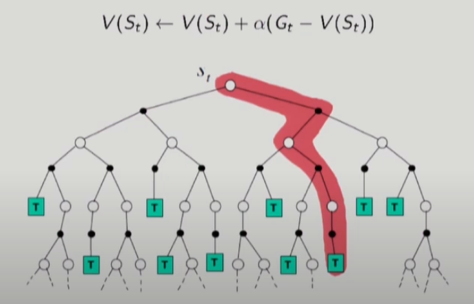
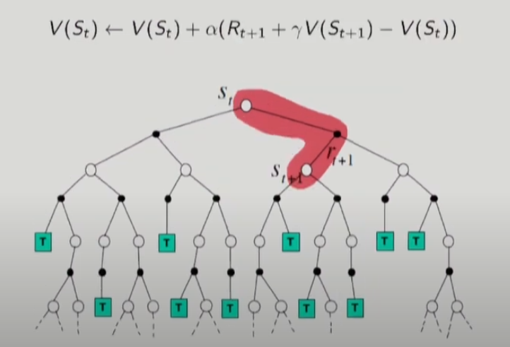
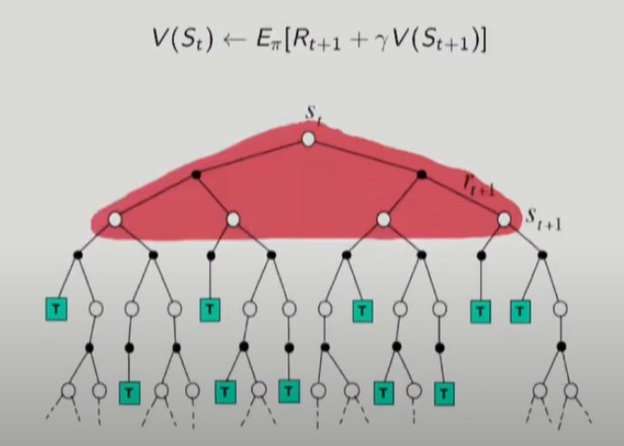
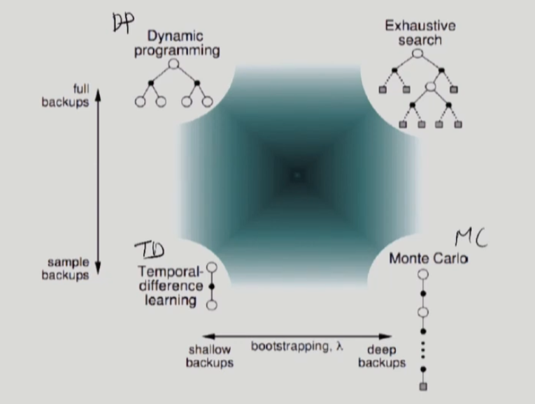
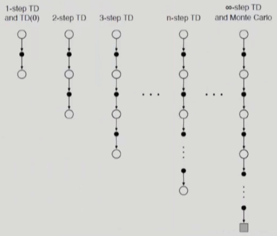
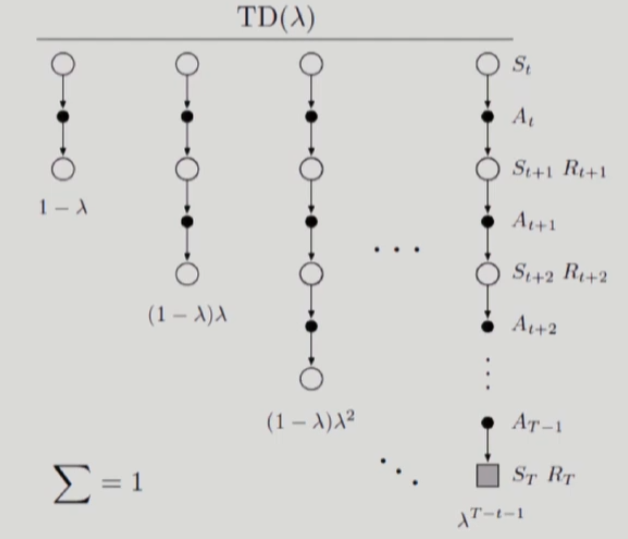
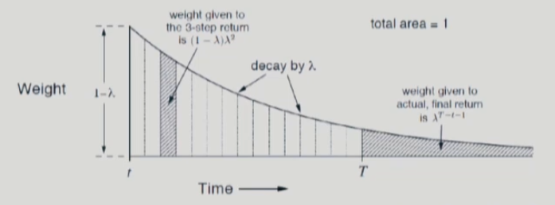
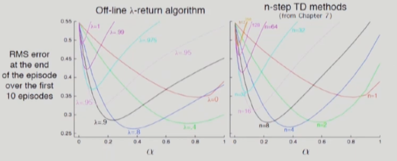
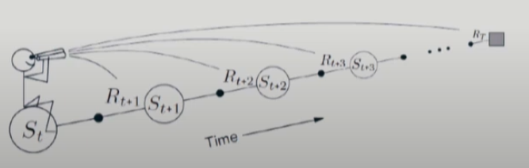

# 13강 Model-Free Prediction :- Monte Carlo and Temporal Difference Methods(4) : 서울대학교 이정우 교수님

## MC Backup : Constant &alpha; MC

## TD(0) Backup

- Bellman equation $V(S_t) = E[R_{t+1} + \gamma V(S_{t+1})]=E[G_t]$
- 위의 식에서 E은 model-free이기 때문에 구하기 어렵기 때문에 날려버렸다고 생각해라. 그래서 TD(0)식에서는 기댓값 항목이 들어있지 않다.

## DP Backup : full backup

- backup : 미래의 결과를 현재에 반영한다.

## Bootstrapping and Sampling
- Bootstrapping : update involves an estimate(guess from a guess where guess is V(S))
- 미래의 결과 현재 반영 + 미래 추정치를 현재에도 반영하는 철학
- - MC does not bootstrap
- - TD bootstrap
- - DP bootstrap
- Sampling : update samples and expectation
- - MC samples
- - TD samples 
- - DP dose not sample 
- - sample을 사용한다는 것은 model-free라는 의미와 동일하다. 
- - sample을 사용하지 않는다는 것은 model-based 라는 의미와 동일하다.

## RL categorization with bootstrapping and sampling

## n-step TD Prediction
- n-step TD methods
- - Temporal difference that extends over n-steps later.
- - it generalizes both MC and TD(0) at its extremes.  

- For n=1, one-step return 
$$G_{t:t+1} = R_{t+1} + \gamma V_t(S_{t+1})$$
- For n=2, two-step return
$$G_{t:t+2} = R_{t+1} + \gamma R_{t+2} + \gamma^2 V_{t+1}(S_{t+2})$$
- For general n, n-step return
$$G_{t:t+n} = R_{t+1} + \gamma R_{t+2} + ... + \gamma^{n-1} R_{t+n} + \gamma^n V_{t+n-1}(S_{t+n})$$
- n-step TD prediction algorithm
$$V_{t+n}(S_t)= V_{t+n-1}(S_t)+\alpha(G_{t:t+n} - V_{t+n-1}(S_t))$$
- - while $V_{t+n}(s) \neq V_{t+n-1}(s), \forall s =S_t$
- Error reduction property :  
$max_s|E_\pi[G_{t:t+n}|S_t=s]-v_\pi(s)|\leq \gamma^nmax_s|V_{t+n-1}(S_t)-v_\pi(s)|$  
여기서 의미하는 $v_\pi$(s)는 ideal value function을 의미한다.  

- - &tau;= t-(n-1) : 새로운 죄표축
- - 위로 바꾼 의미는 n-1까지는 데이터를 얻기만하고 실제 없데이트는 n-1부터한다는 의미이다.

## &lambda;-Return : 그럼 모든 n-step TD를 평균취하는 건 어떨까에 관한내용
- n-step return  
$$G_{t:t+n} = R_{t+1} + \gamma R_{t+2} + ... + \gamma^{n-1} R_{t+n} + \gamma^n V_{t+n-1}(S_{t+n})$$
- example : average the 2-step and 4-step returns
$$\frac{1}{2}G_{t:t+2} + \frac{1}{2}G_{t:t+4}$$
- One could even average experience-based updates with DP updates(combination of experience-based and model-based methods)
- One can average in an exponential manner

## TD(&lambda;)
- Compound average : a weighted average of multiple n-step returns
- A compound update can only be done when the longest of its component updates is complete
- &lambda;-Return : average with exponentially decaying weights
$${G_t}^\lambda=(1 - \lambda)\sum_{n=1}^{\infty}\lambda^{n-1}G_{t:t+n}$$
- - 1-step return given with (1-&lambda;) weight
- - 2-step return given with (1-&lambda;)&lambda; weight, and so on.
- - (1-&lambda;)는 전체적으로 가중평균이 잘 성립하도록 만들어주는 normalization factor이다.
- TD(&lambda;): temporal difference learning based on &lambda;-return
- Forward-view TD(&lambda;)
$$V(S_t) \leftarrow V(S_t)+ \alpha({G_t}^\lambda-V(S_t))$$

## TD(&lambda;) backup

- Terminal state만 주의할 필요가 있다.
- sum의 의미는 1-&lambda;, (1-&lambda;)&lambda; 등의 가중치를 모두 더하면 1이된다는 의미이다.

## TD(&lambda;) Weighting
- Without a terminal state, 
$${G_t}^\lambda = (1-\lambda)\sum_{n=1}^{\infty}\lambda^{n-1}G_{t:t+n}$$
- With a termial state, all the subsequent returns after it are equal to $G_t$
$${G_t}^\lambda = (1-\lambda)\sum_{n=1}^{\infty}\lambda^{n-1}G_{t:t+n}+ \lambda^{T-t-1}G_t$$

## TD(&lambda;) vs n-Step TD
- Offline(forward view) TD(&lambda;) and n-Step TD have similar behavior
- 19=step Random Walk  

- &lambda;가 크면 곡선이 완만한 반면 &lambda;가 작으면 곡선이 급격해진다. 고로 &lambda;가 크면 먼 미래까지 바라보는 의미가 되고 &lambda;가 작으면 가까운 미래을 중심으로 살펴보겠다는 의미가 된다.

## Forward-view TD(&lambda;) : 먼 미래를 바라본다는 의미
- Forward-view(theoretical view) : for each state visited, look forward in time to all the future rewards
- Forward-view looks into the future to compute ${G_t}^\lambda$
- Like MC, can only be computed from complete episodes : intrinsically off-line method : 먼 미래까지 보기 때문에  : 성능은 좋아지지만 online이라는 장점을 잃어버려서 실용적이지 않아서 잘 쓰지 않음.  -> 이를 해결한 방법은 다음시간에 배움

