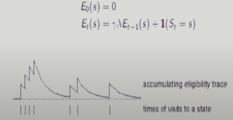
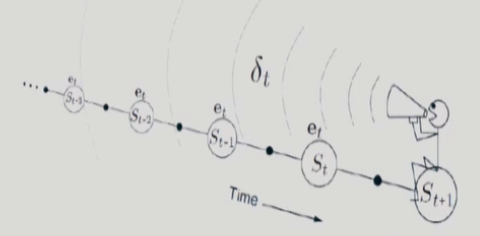
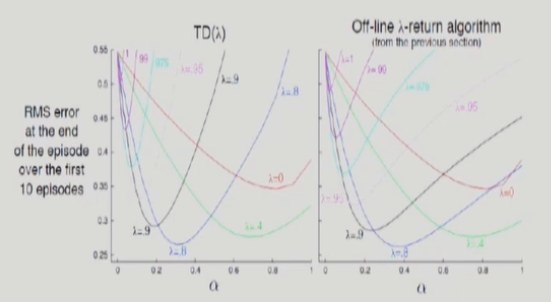
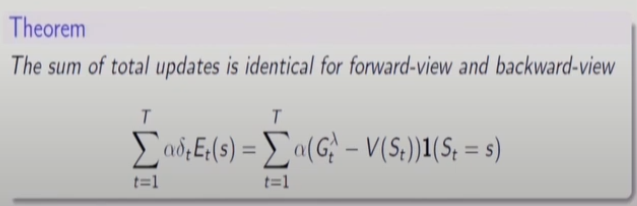
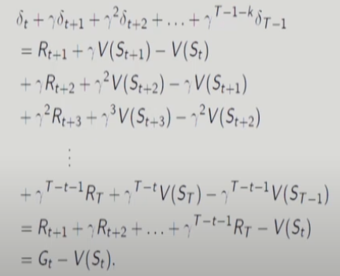
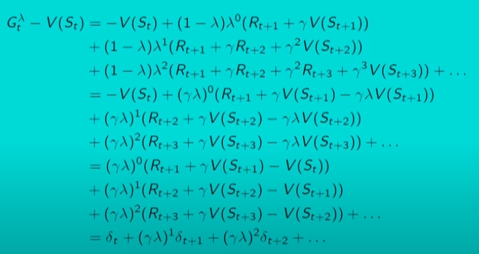

# 14강 Model-Free Prediction :- Monte Carlo and Temporal Difference Methods(5) : 서울대학교 이정우 교수님

## Eligibility Traces
- Eligibility traces : basic theory behind on-lined (practical, backward-view) TD(&lambda;)
- - One of the basic mechanisms of reinforcement learning.
- - Eligibility traces unify and generalize TD and Monte Carlo methods
- - Almost any temporal-difference (TD) method (ex., Q-learning of Sarsa) can be combined with eligibility traces
- - Eligibility traces also provide a way of implementing Monte Carlo methods online and on continuing problems without terminal states (매우 중요)
- - Only a single trace vector is required rather than a store of the last n feature vectors
- - Learning occurs continually and uniformly in time rather than being delayes to the end of the episode
- Forward-view : off-line methods(noncausal methods); it provides theory.
- - 미래의 데이터로 업데이트 하겠다는 의미
- Backward-view : on-line methods based on eligibility traces(causal methods) ; it provides a practical algorithm (mechanism).
- - Can be shown that the two views are identical in term of updates
- - 과거의 결과로 현재를 업데이트 하겠다는 개념이 backward-view이다.

- Credit assignment problem : Example (A,A,A,B,Reward=+1) : 이상황에서 A에서 reward가 얻어진 건지 B에서 reward가 얻어진건지 판단해보자(MDP가 아닐때 MDP면 B일 것이다) 
- - Frequency heuristic : assign credit to most frequent states -> 더 많이 발생한 것을 중시
- - Recency heuristic : assign credit to most recent states -> 더 최근에 발생한 것을 중시
- - Eligibility traces combine both heuristics  
  
- - 여기서 &lambda;는 TD(&lambda;)의 &lambda;을 의미한다. : 이전에서는 &gamma;로만 discount 시켰다면 이제는 &lambda;도 함께 discount factor로써 곱해지는 형태이다.
- -  1($S_t=s$)가 의미하는 것은 indicator로 괄호안이 참이면 1 거짓이면 0을 출력한다.
- - 이 간단한 성질로 non-causal을 causal로 전환할 수 있는 성질이 있다. 

## Backward View of TD(&lambda;)
- keep an eligibility trace for every state s
- update value V(s) for every state s
- in proportion to TD-error 
 $$\delta_t = R_{t+1} + \gamma V(S_{t+1})-V(S_t)$$
 $$V(S_t) \leftarrow V(S_t) + \alpha \delta_t E_t(s)$$  
- Can be extanded to parametrized value function approximation
  
- &delta;를 위해 1step만 미래를 봄.
- In backward view, earlier states are given less credit for the TD error

- In eligibility traces, the kth earlier step needs to be discounted by $\gamma^k \lambda^k$
- The backward view TD(1) is a way of implementing MC
- - Backward view(online) TD(1) can be performed incrementally and on-line unlike MC
- - If something unusually good of bad happens during previous steps, online TD(1) can learn immediately and alter their behavior at the current step.
## Online (Backward -view) TD($\lambda$) vs Offline (Forward-view) TD($\lambda$)
- The two algorithms perform virtually identically if $\alpha$ is selected optimally for it or smaller.
- - if $\alpha$ chosen larger, however, online TD(&lambda;) is much worse than offline (forward-view) TD(&lambda;)
- - Offline (forward-view) TD(&lambda;) is also called &lambda; -return algorithm.  
  
- - 거의 비슷한데 약간씩은 다르다.

## Backward View TD(&lambda;) and TD(0)
- When &lambda;=0, only current state is updated in eligibility traces.
$$E_t(s) = 1(S_t=s)$$
$$V(S_t) \leftarrow V(S_t) + \alpha \delta_t E_t(s)$$
- This is identical to TD(0)
$$ V(S_t) \leftarrow V(S_t)+ \alpha \delta_t $$

## Backward View TD(&lambda;=1) and MC
- When &lambda; =1 , credit is deferred until end of episode
- Consider episodic environments with offline updates
- Over the course of an episode, total update for TD(1) is the same as total update for MC
 
- Consider an episode where s is visited once at time-step k,
- TD(1) eligibility trace discounts time since visit,  
$$ E_t(s) = \gamma E_{t-1}(s) + 1(S_t=s) $$
$$ =\begin{cases}
0 & \text{ if } t<k \\
\gamma^{t-k} & \text{ if } t \geq k 
\end{cases} $$
- - t=k일때만 s가 발생한다는 의미
- TD(1) updates accumulate error online 
$$\sum_{t=1}^{T}\alpha \delta_t E_t(s) = \alpha \sum_{t=k}^{T} \gamma^{t-k} \delta_t = \alpha(G_t - V(S_k)$$
- (Proof) By end of episode it accumulates total error
$$ \delta_k + \gamma \delta_{k+1} + ... + \gamma^{T-1-k} \delta_{T-1} $$
- When &lambda;=1 , sum of TD errors telescopes into MC error,  
 
- where we used $V(S_T)=0$
- TD(1) is roughly equivalent to every-visit Monte-Carlo
- Error is accumulated online, step-by-step
- if value function is only updated offline at end of episode, then total update is exactly the same as MC

## Proof of Backward and Forward Views
For general &lambda; , TD errors also telescope to &lambda;-error, ${G_t}^\lambda - V(S_t)$
 
- where we used $V(S_T) =0 $

- Consider an episode where s is visited once at time-step k,
- Backward TD(&lambda;) eligibility trace discounts time since visit,  
$$ E_t(s) = \gamma \lambda E_{t-1}(s) + 1(S_t=s) $$
$$ =\begin{cases}
0 & \text{ if } t<k \\
(\gamma \lambda)^{t-k} & \text{ if } t \geq k 
\end{cases} $$
- Backward TD(&lambda;) updates accumulate error online
$$\sum_{t=1}^{T}\alpha \delta_t E_t(s) = \alpha \sum_{t=k}^{T} (\gamma \lambda)^{t-k} \delta_t = \alpha({G_k}^\lambda - V(S_k))$$
- By end of episode it accumulates total error $\lambda$-return
- For multiple visits to s, $E_t(s)$ accumulates many errors

## Equivalence between Backward and Forward TD(&lambda;)
- Offline updates : 
- - Updates are accumulated within episode, but applied in batch at the end of episode
- - Forward and backward views are equivalent (proven earlier)
- Online updates :
- - Bacward TD(&lambda;) updates are applied online at each step within episode
- - Forward and backward-view TD(&lambda;) are slightly different
- Exact online updates: (Sutton and von Seigen, ICML 2014)
- - Exact equivalence can be achieved by using a new TD error and a new def. of eligibility traces 
$$ \delta_t = R_{t+1} + \gamma V_t(S_{t+1}) - V_{t-1}(S_t)$$
- - instead of
$$ \delta_t = R_{t+1} + \gamma V_t(S_{t+1}) - V_{t}(S_t)$$