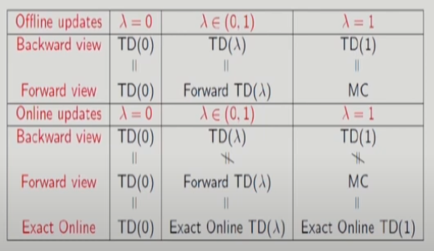
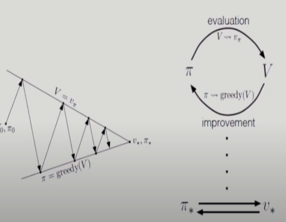

# 15강 Model-Free Prediction(6), Model-Free Control(1) : 서울대학교 이정우 교수님

## Equivalence Summary
  
 
## Model-Free Contil : MC Control, Sarsa, and Q-learning

### Review of Generalized Policy Iteration(GPI)
  

### Monte Carlo Control
- Two ideal assumption :
- - Exploring starts
- - Policy evaluation with infinite number of episodes
- Monte Carlo with Exploration Starts(ES)
- - One cycle of policy evaluation and improvement on an episode-by-episode basis
- - After each episode, the observed returns are used for policy evaluation, and then the policy is improved at all the states visited in the episode.

### Monte Carlo Control with Q function
- Greedy policy improvement over V(s) requires model of MDP
$$\pi'(s)= argmax_a[{R_s}^a + \gamma\sum_{s'}^{}{P_{ss'}}^aV(s')]$$
- - P가 있으므로 이건 모델을 알아야만 구할 수 있기 때문에 Mote Carlo의 이용에 모순이 생긴다.
- Greedy polciy improvement over Q(s,a) is model-free: desirable
$$\pi'(s) = argmax_aQ(s,a)$$
