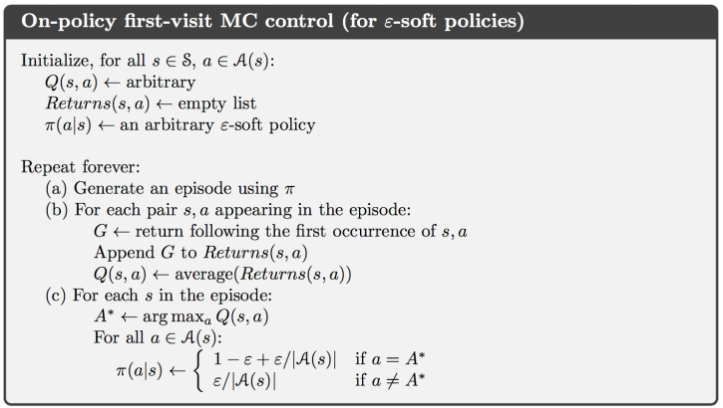
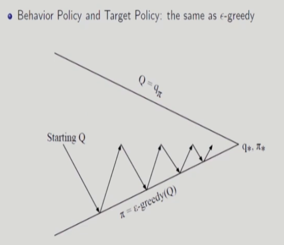
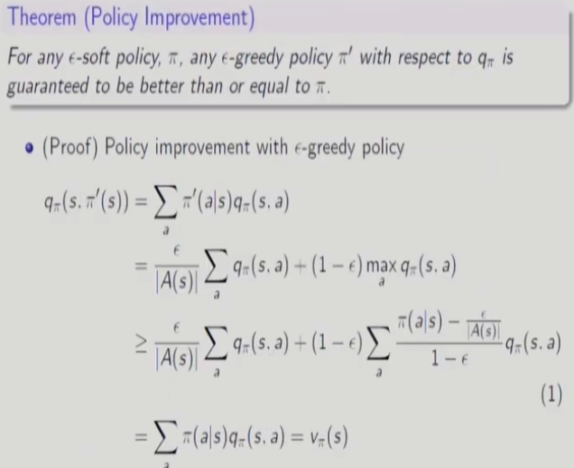

# 15강 Model-Free Prediction(6), Model-Free Control(1) : 서울대학교 이정우 교수님

## Equivalence Summary
  

## Model-Free Contil : MC Control, Sarsa, and Q-learning
### Review of Generalized Policy Iteration(GPI)
  

### Monte Carlo Control
- Two ideal assumption :
- - Exploring starts
- - Policy evaluation with infinite number of episodes
- Monte Carlo with Exploration Starts(ES)
- - One cycle of policy evaluation and improvement on an episode-by-episode basis
- - After each episode, the observed returns are used for policy evaluation, and then the policy is improved at all the states visited in the episode.
- - It is intuitive that this converges, but it has not been proven mathematically yet.(open problem)

### Monte Carlo Control with Q function
MC 로 value function을 구할 때 v를 구하든 q를 구하든 별 차이가 없는데 control할 때는 큰 차이가 있어서 policy를 구할 때는 q를 반드시 써야 한다. 아래는 안되는 이유를 설명하고 있다. 
- Greedy policy improvement over V(s) requires model of MDP
$$\pi'(s)= argmax_a[{R_s}^a + \gamma\sum_{s'}^{}{P_{ss'}}^aV(s')]$$
- - 하 step 후의 값인 P가 있으므로 이건 모델을 알아야만 구할 수 있기 때문에 Mote Carlo의 이용에 모순이 생긴다.
- Greedy policy improvement over Q(s,a) is model-free: desirable
$$\pi'(s) = argmax_aQ(s,a)$$

### Monte Carlo ES 
  

### Greedy in the Limit with Infinite Exploration(GLIE)
ES with start에서 start를 중간으로 옮겨놓은 개념이다.
Def. GLIE 
- All state-action pairs are explored infinitely may times,
$$ \lim_{k \rightarrow \infty} N_k(s,a) = \infty $$
- The policy converges on a greedy policy.
$$ \lim_{k \rightarrow \infty} \pi_k(a|s) = 1(a=\underset{a'}{argmax}Q(s,a')) $$
- for example, &epsilon;-greedy is GLIE if &epsilon; reduces to zero at $\epsilon_k=\frac{1}{k}$

### GLIE MC Control 
- Sample the kth episode using &pi; : {$S_1, A_1, R_2, ..., S_T$}&pi;
- For each state $S_t$ and action $A_t$ in the episode,
$$ N(S_t,A_t) \leftarrow N(S_t,A_t)+1$$
$$ Q(S_t,A_t) \leftarrow Q(S_t,A_t) + \frac{1}{N(S_t,A_t)}(G_t-Q(S_t,A_t))$$
- improve policy based on new action-value function
$$ \epsilon \leftarrow \frac{1}{k}$$
$$ \pi \leftarrow \epsilon - greedy(Q)$$
- GLIE Monte-Carlo control converges to the optimal action-value function, Q(s,a) $\rightarrow q_*(s,a)$

### Monte Carlo Control without ES
- Two approaches :
- - On-policy method
- - off-policy method
- Soft policies : $\pi(a|s) \geq 0$ : 어떤 행동도 일어날 가능성이 있다. <- stochastic policy의 부분집합
- $\epsilon$-soft policy : $\pi$(a|s) $\geq$ $\frac{\epsilon}{|A(S)|}$ <- soft policy의 부분 집합 
- $\epsilon$-greedy policy  : <- $\epsilon$-soft policy의 부분집합 : deterministic고 stochastic을 같이 가지고 있다.
- - Greedy action with 1-$\epsilon$ + $\frac{\epsilon}{|A(S)|}$ probability
- - Non-greedy action with $\frac{\epsilon}{|A(S)|}$ probability

### On and Off-Policy COntrol
- On-policy control
- - Learn on the job
- - Learn about policy &pi; from experience sampled from &pi;
- Off-policy control
- - Look over someone's shoulder
- - Learn about policy &mu; from experience sampled from &mu;

### On-policy Monte Carlo Control
- Still based on GPI with first-visit MC
- Cannot do greedy policy improvement because exploration stops.
- Instead, use &epsilon;-greedy policy improvement  

   

- 최종적인 optimal policy는 deterministic policy이다. 하지만 탐험을 위해서는 deterministic policy를 포기해 optimal policy를 포기해 비슷한 놈을 찾겠다는 것이다. (&epsilon;에 해당하는 error는 포기하겠다)

   

- 점점 나아지는 것을 확인해보자.

   

   
