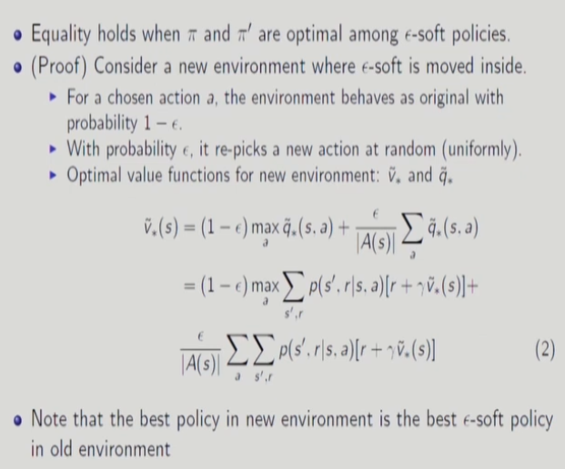
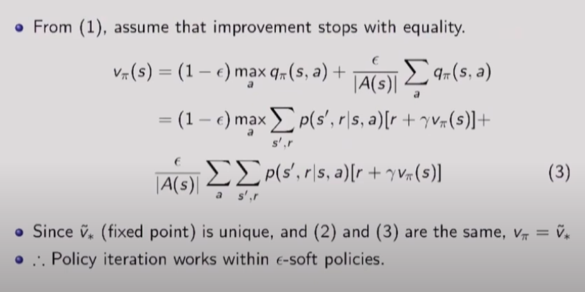
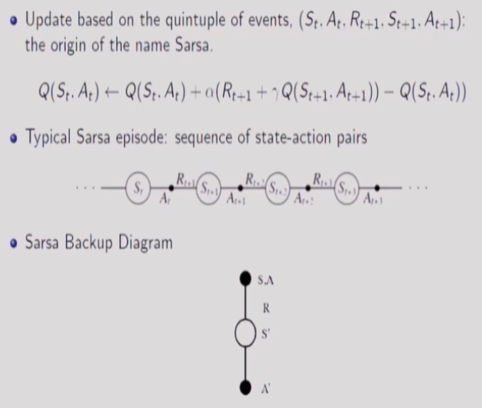
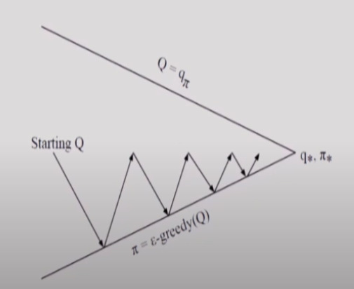
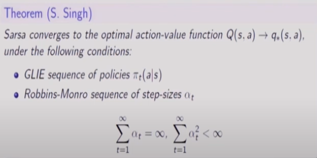

# 16강 Model-Free Control : MC Control, SARSA, and Q-Learning(2) : 서울대학교 이정우 교수님

## On-policy Monte Carlo Control
   

- 현재 &epsilon;-soft가 문제가 되니 이걸 환경에 포함시켜 새로운 환경을 만든다.
- 환경안에서 agent가 선택한 행동을 다른 행동으로 랜덤하게 바뀐다.

   

## Off-policy Monte Carlo Control
- Behavior policy : generate behavior, and need to be soft to explore all possibilities
- Target policy : policy to be evaluated and improved (it can be deterministic)
- Off-policy MC control
- - GPI with weighted importance sampling
- - Target policy : greedy w.r.t. $q_\pi$.
- - Behavior policy : &epsilon;-soft policy to quarantee infinitely many visits to each pair of state and action
- - A potential problem is that this method learns only from the tails of episodes
- - If non-greedy actions are common, then learning will be slow, particularly for states appearing in the early portions of long episodes.  
   
- 맞는데 까지 업데이트하고 아닌거는 버린다. , episode 뒷부분만 학습할 수 있다.

## MC vs TD control
- TD learning has several advantages over MC
- - Lower variance
- - online
- - Incomplete sequences
- Natural idea : use TD instead of MC in our control loop
- - Apply TD to Q(S,A)
- - Use &epsilon;-greedy policy improvement
- - Update every time-step

## SARSA : On-policy TD Control
   

   

- Behavior Policy and Target Policy : the same as &epsilon;-greedy  

   

## SARSA Convergence
   
