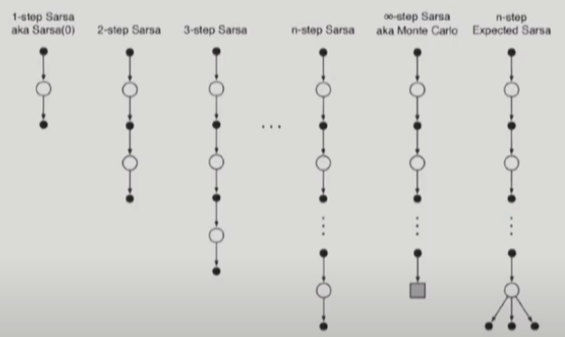
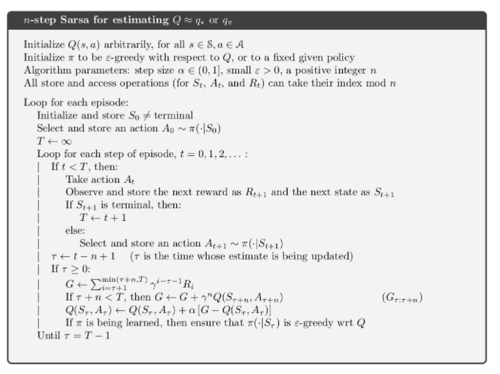
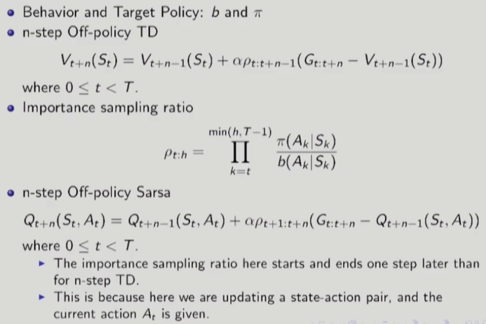
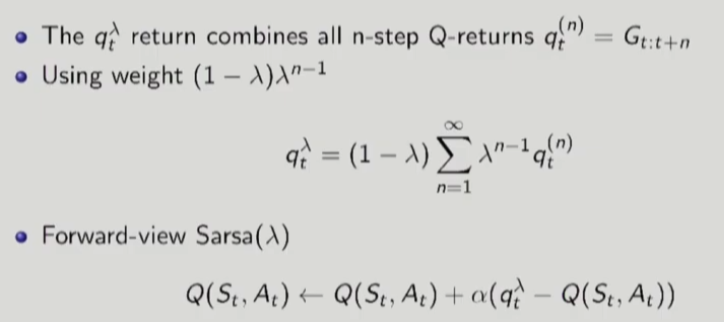
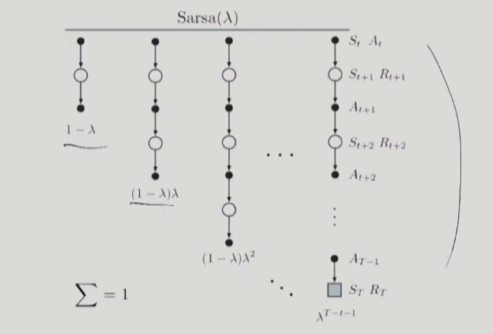

# 17강 Model-Free Control : MC Control, SARSA, and Q-Learning(3) : 서울대학교 이정우 교수님

## n-step Sarsa
- Need to generalize one-step Sarsa of Sarsa(0) to multiple steps.
- n-step Return in terms of action value(Q)
$$ G_{t:t+n} = R_{t+1} + \gamma R_{t+2} + ... + \gamma^{n-1}R_{t+n} + \gamma^n Q_{t+n-1}(S_{t+n},A_{t+n})$$
- - where n $\geq$ 1, $0\leq t < T-n$.
- n-step Sarsa algorithm
$$ Q_{t+n}(S_t,A_t) = Q_{t+n-1}(S_t,A_t) + \alpha(G_{t:t+n}- Q_{t+n-1}(S_t,A_t))$$
- - where 0 $\leq t < T$  

   

- n-step Return for expected Sarsa
$$ G_{t:t+n} = R_{t+1} + \gamma R_{t+2} + ... + \gamma^{n-1}R_{t+n} + \gamma^n \tilde{V}_{t+n-1}(S_{t+n})$$
- - where $\tilde{V}_{t+n-1}(S_{t+n})=\Sigma_a \pi(a|S_{t+n})Q_{t+n-1}(S_{t+n},a), t+n < T $

## n-step Sarsa Algorithm
   

## n-step Off-policy Learning
   
    

- Expected Sarsa : the importance sampling ratio would have one less factor in it ( $\rho_{t+1:t+n} \rightarrow \rho_{t+1:t+n-1} $)

## Forward- view Sarsa($\lambda$)
    
    

