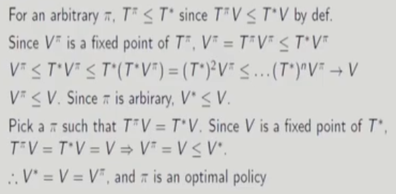
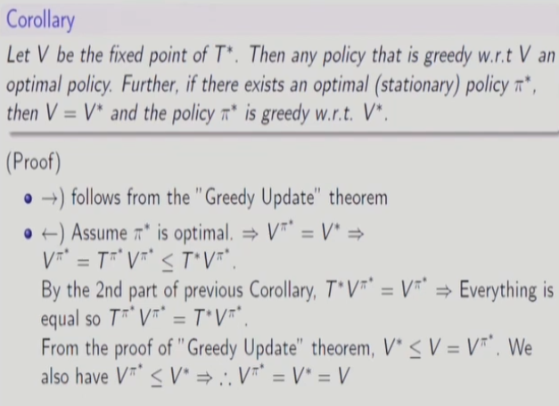

# 9강 Dynamic Programming(5) : 서울대학교 이정우 교수님

## Applications to Dynamic Programming
- optimal value function: $V^*(x)=sup_{\pi \in \Pi} V^{\pi}(x)$ where $\Pi$ is a set of all(stationary) policies.
- Vector space of bounded functions B(X) = V : X $\rightarrow$ R||V||$\infty$< $\infty$
- (B(X),$||.||_{\infty}$) : Banach space
- Bellman expectation operator $T^{\pi}$ : B(X) $\rightarrow$ B(X) defined by
$$(T^\pi V)(x)= r(x,\pi(x))+\gamma \sum_{\gamma}^{}P(y|x,\pi(x))V(y), \forall x \in \chi$$
- From Bellman expectation equation, $V^\pi$ is a fixed point for $T^\pi$ : $T^\pi V^\pi = V^\pi $
- $T^\pi$ is a &gamma;-contraction.
$||T^\pi U -T^\pi V||_\infty = $  
$\gamma\underset{x}{sup}|\sum_{y}^{}P(y|x,\pi(x))(U(y)-V(y))| $  
$\leq \gamma\underset{x}{sup}\sum_{y}^{}P(y|x,\pi(x))||U-V||_\infty $  
$= \gamma||U-V||_\infty$  

- Policy evaluation : $(T^\pi)^n V_0 \rightarrow V^\pi$ with geometric rate
- Bellman optimality operator $T^*$ : B($\chi$)-> B($\chi$) defined by
$$(T^* V)(x)= \underset{a}{sup}[r(x,a)+\gamma \sum_{\gamma}^{}P(y|x,a)V(y)], \forall x \in \chi$$
- $T^*$ is a $\gamma$-contraction  
$||T^* U -T^* V||_\infty $  
$\leq \gamma\underset{x,a}{sup}\sum_{y}^{}P(y|x,a)|U(y)-V(y)| $  
$\leq \gamma\underset{x,a}{sup}\sum_{y}^{}P(y|x,a)||U-V||_\infty $  
$= \gamma||U-V||_\infty$  

- 정의상 $||U||_\infty \leq \underset{s}{max}|U(s)|$ 을 만족한다.

## Greedy update to $V_*$ is sufficient for optimality
 fixed point를 update하는 것이 optimal하다.
 Theorem(Greedy update)
 - Let V be the fixed point of $T^*$, and assume that there is a policy $\pi$ which is greedy w.r.(with respect to) V : $T^\pi$ V = $T^*$ V. Then V=$V^*$ and $\pi$ is an optimal policy.
 - proof :  양뱡향으로 부등식을 증명하여 같다고 주장할 거다.  
 

 ## Policy improvement Theorem
 fixed point가 아니라 임의의 value function을 update할 때 policy가 더 나아진다.
 
- 특정 state에 하나라도 정말로 더 커질 경우 그 state에 대한 value function도 더 커진다.
- 나중에 fixed point에 해당하는 policy가 optimal policy인걸 증명할 때 쓰임.

## Policy Iteration
- policy iteration : produces a sequence of policy $\pi_1$,$\pi_2$,..., where $\pi_i$,is greedy w.r.t $V^{\pi_{i-1}}$.
- The policy improvement theorem applies to each segment of  $V^{\pi_{i-1}}~\rightarrow\pi_i~\rightarrow V^{\pi_{i}}$ in policy iteration procedure.  
 

## Greedy Update to $V_* \leftrightarrow $ Optimal
 
