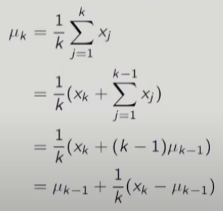

# 11강 Model-Free Prediction :- Monte Carlo and Temporal Difference Methods(2) : 서울대학교 이정우 교수님

## importance sampling Off-Policy Prediction
- Learning control dilemma : one seeks to learn action values conditional on subsequent optimal behavior, but one needs to behave non-optimally in order to explore all actions
- On-policy methods : a compromise since it learns action values not for the optimal policy, but for a near-optimal policy that still explores.
- Off-policy methods : use two policies, one that is learned about and that becomes the optimal policy, and one that is more exploratory and is used to generate behavior.
- - Target policy : the policy being learned about
- - Behavior policy : the policy used to generate behavior
- Off-policy policy advantage
- - More powerful and general, but with higher variance and slower convergence
- - Application : learning from data generated by a conventional non-learning controller, or from a human expert.
- soft policy : &pi;(a|s)>0, $\forall s$ $\leftarrow$ stochastic policy의 special한 경우

### 왜 off-policy는 variance가 심할까?
- coverage assumption : every action taken under target policy &pi; is also taken, at least occasionally, under behavior policy b. 
$$ \pi(a|s)>0 ~~~~ implies ~~~~~ b(a|s)>0$$
- importance sampling : a general technique for estimating expected values under one distribution given samples from another
- - $$E_p[x] = \Sigma~p(x)x = \Sigma~q(x)[\frac{p(x)}{q(x)}]x = E_q[\frac{p(x)}{q(x)}x] $$
- - 더 쉬운 분포로 expectation 취할 수 있는 방법이 있다.
- - 적용하는 방법은 q를 behavior policy로 보는 거고 p를 target policy로 보는 거임.
- Probability of a path(trajectory=episode) $\tau A_t,S_{t+1},A_{t+1},...,S_T $ given $S_t$  
Pr[$\tau|S_t, A_{t:T} \sim \pi$]    
= Pr[$A_t,S_{t+1},A_{t+1},...,S_T | S_t,A_{t:T} \sim \pi$]    
= $\pi(A_t|S_t)p(S_{t+1}|S_t,A_t)\pi(A_{t+1}|S_{t+1})...p(S_T|S_{T-1},A_{T-1})$  (MDP이기 때문에 이렇게 됨)  
= $\prod_{k=t}^{T-1}\pi(A_k|S_k)p(S_{k+1}|S_k,A_k)$  
= $\prod_{k=t}^{T-1}p(S_{k+1},A_k|S_k)$
- Importance sampling ratio : the relative probability of the trajectory under the target and behavior policies
$$\rho_{t:T-1} = \frac{\prod_{k=t}^{T-1}\pi(A_k|S_k)p(S_{k+1}|S_k,A_k)}{\prod_{k=t}^{T-1}b(A_k|S_k)p(S_{k+1}|S_k,A_k)} = \prod_{k=t}^{T-1}\frac{\pi(A_k|S_k)}{b(A_k|S_k)}$$
- Notations  
T(s): the set of all time steps in which state s is visited  
T(t): the first time of termination following time t
- Ordinary importance sampling (unbiased, higher variance)
$$V(s)=\frac{\sum_{t \in T(s)}^{}\rho_{t:T(t)-1}G_t}{|T(s)|}$$
- 수학적으로는 ideal하게 converge하지만 b가 매우 작은 수고 &pi;가 매우 큰 수면 값이 매우 큰 것을 $G_t$ 에 곱하기 때문에 variance가 심해질 수 있다. 그래서 아랫방법이 나왔다.
- Weighted importance sampling (biased, lower variance) : 수학적으로 ideal하지는 않음
$$V(s)=\frac{\sum_{t \in T(s)}^{}\rho_{t:T(t)-1}G_t}{\sum_{t \in T(s)}^{}\rho_{t:T(t)-1}}$$

## incremental Mean
- incremental update of mean for a sequence $x_1,x_2,...,$.  
 
- k-1개의 sample로 구한 평균값이 있고 sample 1개가 더 추가되었을 때 어떻게 평균값을 update할 수 있는가에 관한 내용

## Incremental MC Updates
- Update V(s) incrementally after episode $S_1,A_1,R_2,...,S_T$.
- For each state $S_t$ with return $G_t$
$$N(S_t) \leftarrow N(S_t)+1$$
$$V(S_t) \leftarrow V(S_t) + \frac{1}{N(S_t)}(G_t-V(S_t))$$
- In non-stationary problems, it can be useful to track a running mean(similar to IIR filter)
$$V(S_t) \leftarrow V(S_t) + \alpha(G_t-V(S_t))$$

## Incremental Updates for Weighted Importance Sampling
- Weighted Importance Sampling
$$V(s)=\frac{\sum_{k=1}^{n-1}W_kG_t}{\sum_{n-1}^{k=1}W_k}$$
where $W_k = \rho_{k:T(k)-1} $.
- incremental update rule: (n $\geq$1)
$$V_{n+1} = V_n + \frac{W_n}{C_n}(G_n-V_n)$$
$$C_{n+1} = C_n +W_{n+1}$$  
- - where $C_0=0$.